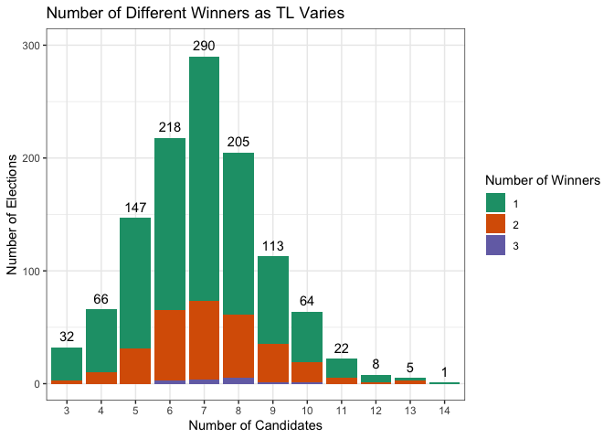
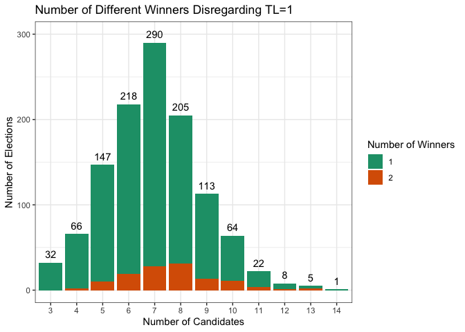

## Truncated Voting Project

In this project we posed and answered the following questions using our election data:


1. For a fixed truncation level $TL$, what percentage of elections satisfying $TL < n-1$ have the property that the RCV winner when using $TL$ is different from the RCV winner when preferences are not truncated?
2. For $1 \leq k \leq n-1$, what percentage of elections have $k$ different winners as we increase $TL$ from $1$ to $n-1$?
3. As we increase the truncation level, does the likelihood of electing the Condorcet winner increase?

### Preliminaries

We analyzed 1183 elections.

* 105 were American elections
* 1078 were Scottish government elections.


```r
files <- list.files("ElectionFiles/", pattern = ".(txt|csv|blt)", recursive = TRUE)
election <- "ElectionFiles/"
files <- str_c(election, files)
AmericanFiles <- files[c(1,5)]
ScottishFiles <- files[2:4]
```

All of the American election files have the following format:

* The ballot column is the voter's ballot which gives their preferences. 
* The Count column is the number of voters who voted with the given preferences.
* The number of candidates in the election is given in the first row of the Num Cands column.
* The candidates are listed in the first row of the Cand List column.  All of these files have candidates listed simply as A, B, C, D, etc.


```r
files[[1]]
```

```
## [1] "ElectionFiles/2014 Berkeley City Council D8.csv"
```

```r
American1 <- read_csv(files[[1]])
head(American1)
```

```
## # A tibble: 6 × 5
##    ...1 ballot Count `Num Cands` `Cand List`
##   <dbl> <chr>  <dbl>       <dbl> <chr>      
## 1     0 ABC       70           4 ABCD       
## 2     1 ABD       69          NA <NA>       
## 3     2 AB        32          NA <NA>       
## 4     3 ACB      129          NA <NA>       
## 5     4 ACD      217          NA <NA>       
## 6     5 AC       105          NA <NA>
```

```r
tail(American1)
```

```
## # A tibble: 6 × 5
##    ...1 ballot Count `Num Cands` `Cand List`
##   <dbl> <chr>  <dbl>       <dbl> <chr>      
## 1    56 B          2          NA <NA>       
## 2    57 C          4          NA <NA>       
## 3    58 D          3          NA <NA>       
## 4    59 B          3          NA <NA>       
## 5    60 C          1          NA <NA>       
## 6    61 D          1          NA <NA>
```

All of the Scottish election files have the following format:

* The first line gives the number of candidates and the number of seats being filled in the election
* The next lines until the last few lines give the Count and the voter preferences in order where 1 is the first candidate, 2 is the second candidate, etc.  Thus the line 9 5 4 3 0 means 9 voters ranked candidate 5 first, candidate 4 second, and candidate 3 third.  Each of the lines end in a 0.
* The last few lines list the names of the candidates and the election.


```r
files[[2]]
```

```
## [1] "ElectionFiles/Argyll Bute by-election Isle of Bute 2021.csv"
```

```r
Scottish1 <- read_csv(files[[2]], col_names = FALSE)
head(Scottish1)
```

```
## # A tibble: 6 × 1
##   X1           
##   <chr>        
## 1 5 1          
## 2 315 1 0      
## 3 47 1 2 0     
## 4 15 1 2 3 0   
## 5 2 1 2 3 4 0  
## 6 7 1 2 3 4 5 0
```

```r
tail(Scottish1, n=12)
```

```
## # A tibble: 12 × 1
##    X1                   
##    <chr>                
##  1 8 5 4 2 3 1 0        
##  2 9 5 4 3 0            
##  3 2 5 4 3 1 2 0        
##  4 2 5 4 3 2 0          
##  5 6 5 4 3 2 1 0        
##  6 0                    
##  7 Kim FINDLAY          
##  8 Fraser GILLIES       
##  9 Dawn MACDONALD       
## 10 Liz MCCABE           
## 11 Peter WALLACE        
## 12 Ward 8 - Isle of Bute
```

We used the `Fix_data_function()` to get the Scottish election files in a format we could use.


```r
Fix_data_function <- function(file) {
  my_data <- read_lines(file) %>%
    str_subset(".+") # get rid of any empty lines
  #head(my_data)
  #Some of the data files have a line at the end with " ", so if it is there, we need to remove it.
  if (my_data[[length(my_data)]] == " ") { 
    my_data <- my_data[- length(my_data)]
  }
    
  ## remove first and last lines
  first_line <- my_data[[1]] %>%
    str_subset(".+") %>%
    str_split("\\s")
  #first_line
  
  ## Read in the file and get the number of lines for the data and number of seats
  Remove_Lines <- strtoi(first_line[[1]][[1]]) + 2
  ###Num_seats <- strtoi(first_line[[1]][[2]])
  Num_Cands <- Remove_Lines - 2
  
  ## remove first and last few lines in the file.
  my_x <- my_data[-1]
  
  for (i in 1:Remove_Lines) {
    my_x <- my_x[-length(my_x)]
  }
  
  #head(my_x)
  
  ## Remove "" 
  my_x_noBlank <- str_subset(my_x, ".+") %>%
    str_trim()
  
  
  ## Make it into a tibble and separate into vote (int) and ballot columns
  my_df <- as_tibble_col(my_x_noBlank) %>%
    mutate(votes = strtoi(str_trim(str_extract(value, "\\d+\\s"))), # get vote column (integer)
           ballot = str_remove(value, "\\d+\\s"), # get ballot column
           ballot = str_sub(ballot, end = -3), # remove 0 and space at the end of ballot
           newballot = str_replace_all(ballot, "26", LETTERS[26]),
           newballot = str_replace_all(newballot, "25", LETTERS[25]),
           newballot = str_replace_all(newballot, "24", LETTERS[24]),
           newballot = str_replace_all(newballot, "23", LETTERS[23]),
           newballot = str_replace_all(newballot, "22", LETTERS[22]),
           newballot = str_replace_all(newballot, "21", LETTERS[21]),
           newballot = str_replace_all(newballot, "20", LETTERS[20]),
           newballot = str_replace_all(newballot, "19", LETTERS[19]),
           newballot = str_replace_all(newballot, "18", LETTERS[18]),
           newballot = str_replace_all(newballot, "17", LETTERS[17]),
           newballot = str_replace_all(newballot, "16", LETTERS[16]),
           newballot = str_replace_all(newballot, "15", LETTERS[15]),
           newballot = str_replace_all(newballot, "14", LETTERS[14]),
           newballot = str_replace_all(newballot, "13", LETTERS[13]),
           newballot = str_replace_all(newballot, "12", LETTERS[12]),
           newballot = str_replace_all(newballot, "11", LETTERS[11]),
           newballot = str_replace_all(newballot, "10", LETTERS[10]),
           newballot = str_replace_all(newballot, "9", LETTERS[9]),
           newballot = str_replace_all(newballot, "8", LETTERS[8]),
           newballot = str_replace_all(newballot, "7", LETTERS[7]),
           newballot = str_replace_all(newballot, "6", LETTERS[6]),
           newballot = str_replace_all(newballot, "5", LETTERS[5]),
           newballot = str_replace_all(newballot, "4", LETTERS[4]),
           newballot = str_replace_all(newballot, "3", LETTERS[3]),
           newballot = str_replace_all(newballot, "2", LETTERS[2]),
           newballot = str_replace_all(newballot, "1", LETTERS[1]),
           newballot = str_remove_all(newballot, " ")) %>%
    select(votes, newballot) %>%
    transmute(ballot = newballot, Count = votes)
  return(list(my_df, Num_Cands))
}
```

Then we started building the table of results so we could eventually answer the questions.


```r
candidate_count <- function(file_number) {
  file_tidy <- Fix_data_function(ScottishFiles[[file_number]])
  return(as.integer(file_tidy[[2]]))
}

cand_count <-  map_int(1:3, candidate_count)
scottish_results <- tibble(ScottishFiles, cand_count)
scottish_results
```

```
## # A tibble: 3 × 2
##   ScottishFiles                                                       cand_count
##   <chr>                                                                    <int>
## 1 ElectionFiles/Argyll Bute by-election Isle of Bute 2021.csv                  5
## 2 ElectionFiles/Glasgow by-election 2021 Ward 23 Partick East-Kelvin…          6
## 3 ElectionFiles/n-ayrshire12-03.blt                                           11
```

We created the `IRV()` function and the `final_function()` which gives us the winner of the election. 


```r
IRV <- function(ranking, eliminate) { 
  ranking <- ranking %>%
    mutate(ballot = str_remove(ballot, eliminate)) %>%
    mutate(first_ranked = substr(ballot, 1,1))
  IRV <- ranking %>%
    group_by(first_ranked) %>%
    filter(first_ranked != "") %>%
    summarize(first_rank_count = sum(Count)) %>%
    mutate(total_count = sum(first_rank_count)) %>%
    mutate(majority_percent = first_rank_count / total_count * 100) %>%
    arrange(first_rank_count)
  w <- max(IRV$majority_percent)
  winner <- tail(IRV, n = 1)[[1]][[1]]
  eliminate <- IRV[[1]][[1]]
  return(list(w, winner, eliminate, ranking))
}
```


```r
final_function <- function(file_number) {
  clean <-  Fix_data_function(ScottishFiles[[file_number]]) #Fix_data_function(files[[file_number]])
  file_tidy <- clean[[1]]    #read_csv(csv_files[[file_number]], col_select = c(ballot, Count))
  ranking <- file_tidy %>%
  mutate(first_ranked = substr(ballot, 1,1))
  IRV <- ranking %>%
    group_by(first_ranked) %>%
    summarize(first_rank_count = sum(Count)) %>%
    filter(first_ranked != "") %>%
    mutate(total_count = sum(first_rank_count)) %>%
    mutate(majority_percent = first_rank_count / total_count * 100) %>%
    arrange(first_rank_count)
  w <- max(IRV$majority_percent)
  winner <- tail(IRV, n = 1)[[1]][[1]]
  not_first_ranked <- setdiff(LETTERS, IRV$first_ranked)
  for (i in not_first_ranked) {
     ranking <- ranking %>%
      mutate(ballot = str_remove(ballot, i))
  }
  ranking <- ranking %>%
    mutate(first_ranked = substr(ballot, 1,1))
  eliminate <- IRV[[1]][[1]]

if (w <= 50) {
  output <- IRV(ranking, eliminate)
  w <- output[[1]]
  winner <- output[[2]]
  eliminate <- output[[3]]
  ranking <- output[[4]]

  while (w <= 50) { 
    output <- IRV(ranking, eliminate)
    w <- output[[1]]
    winner <- output[[2]]
    eliminate <- output[[3]]
    ranking <- output[[4]]
    }}
  return(winner) 
  }
```

At this point we could add the winner for each election to our data table.


```r
winner <- map_chr(1:3, final_function)
voting_dt <- tibble(ScottishFiles, winner) %>%
  left_join(scottish_results) %>%
  select(ScottishFiles, cand_count, winner)
kable(voting_dt)
```


|ScottishFiles                                                              | cand_count|winner |
|:--------------------------------------------------------------------------|----------:|:------|
|ElectionFiles/Argyll Bute by-election Isle of Bute 2021.csv                |          5|D      |
|ElectionFiles/Glasgow by-election 2021 Ward 23 Partick East-Kelvindale.csv |          6|D      |
|ElectionFiles/n-ayrshire12-03.blt                                          |         11|B      |

Next we modified that function to get the `trc_function()` so we could get the winner of the truncated ballot.  We would alter the function for each truncation level, so if we wanted TL=3, we would modify the line `mutate(ballot = str_sub(ballot, end = 4))` and have replace the 4 with 3.  We also had to determine the usable elections for the truncation levels, so we would need to specify the Tlist for each TL.  An election is usable at $TL=n$ if the election has at least $n+2$ candidates.


```r
head(voting_dt)
```

```
## # A tibble: 3 × 3
##   ScottishFiles                                                cand_count winner
##   <chr>                                                             <int> <chr> 
## 1 ElectionFiles/Argyll Bute by-election Isle of Bute 2021.csv           5 D     
## 2 ElectionFiles/Glasgow by-election 2021 Ward 23 Partick East…          6 D     
## 3 ElectionFiles/n-ayrshire12-03.blt                                    11 B
```

```r
Tlist <- voting_dt %>%
  filter(cand_count >= 6) %>%
  select(ScottishFiles)
Tlist <- Tlist[[1]]

trc_function <- function(file_number) {
  clean <- Fix_data_function(Tlist[[file_number]]) #T9list[[file#]]
  file_tidy <- clean[[1]] #read_csv(file, col_select = c(ballot, Count))
  ranking <- file_tidy %>%
    mutate(ballot = str_sub(ballot, end = 4)) %>%
    mutate(first_ranked = substr(ballot, 1,1))
  IRV <- ranking %>%
    group_by(first_ranked) %>%
    summarize(first_rank_count = sum(Count)) %>%
    filter(first_ranked != "") %>%
    mutate(total_count = sum(first_rank_count)) %>%
    mutate(majority_percent = first_rank_count / total_count * 100) %>%
    arrange(first_rank_count)
  w <- max(IRV$majority_percent)
  winner <- tail(IRV, n = 1)[[1]][[1]]
  not_first_ranked <- setdiff(LETTERS, IRV$first_ranked)
  for (i in not_first_ranked) {
     ranking <- ranking %>%
      mutate(ballot = str_remove(ballot, i))
  }
  ranking <- ranking %>%
    mutate(first_ranked = substr(ballot, 1,1))
  eliminate <- IRV[[1]][[1]]

if (w <= 50) {
  output <- IRV(ranking, eliminate)
  w <- output[[1]]
  winner <- output[[2]]
  eliminate <- output[[3]]
  ranking <- output[[4]]

  while (w <= 50) {
    output <- IRV(ranking, eliminate)
    w <- output[[1]]
    winner <- output[[2]]
    eliminate <- output[[3]]
    ranking <- output[[4]]
    }}
    return(winner) 
}
```


```r
T4_winners <- map_chr(1:2, trc_function)
T4table1 <- tibble(Tlist, T4_winners) %>%
  mutate(ScottishFiles = Tlist) %>%
  select(-Tlist)
voting_dt_4a <- left_join(voting_dt, T4table1)
kable(voting_dt_4a)
```


|ScottishFiles                                                              | cand_count|winner |T4_winners |
|:--------------------------------------------------------------------------|----------:|:------|:----------|
|ElectionFiles/Argyll Bute by-election Isle of Bute 2021.csv                |          5|D      |NA         |
|ElectionFiles/Glasgow by-election 2021 Ward 23 Partick East-Kelvindale.csv |          6|D      |D          |
|ElectionFiles/n-ayrshire12-03.blt                                          |         11|B      |B          |

We did this for all of the Scottish and American election files and all the truncation levels.

### Results

Here are all of the election files with the winners at each of the truncation levels.


```r
AmericanFiles <- read_csv("Results/FinalAmericanFiles.csv")
FinalScottishVoting <- read_csv("Results/FinalScottishFiles.csv")

ALLVotingFiles <- bind_rows(AmericanFiles, FinalScottishVoting)
datatable(ALLVotingFiles)
```

```{=html}
<div id="htmlwidget-7f12aab81a0d4fb75e69" style="width:100%;height:auto;" class="datatables html-widget"></div>
<script type="application/json" data-for="htmlwidget-7f12aab81a0d4fb75e69">{"x":{"filter":"none","data":[["1","2","3","4","5","6","7","8","9","10","11","12","13","14","15","16","17","18","19","20","21","22","23","24","25","26","27","28","29","30","31","32","33","34","35","36","37","38","39","40","41","42","43","44","45","46","47","48","49","50","51","52","53","54","55","56","57","58","59","60","61","62","63","64","65","66","67","68","69","70","71","72","73","74","75","76","77","78","79","80","81","82","83","84","85","86","87","88","89","90","91","92","93","94","95","96","97","98","99","100","101","102","103","104","105","106","107","108","109","110","111","112","113","114","115","116","117","118","119","120","121","122","123","124","125","126","127","128","129","130","131","132","133","134","135","136","137","138","139","140","141","142","143","144","145","146","147","148","149","150","151","152","153","154","155","156","157","158","159","160","161","162","163","164","165","166","167","168","169","170","171","172","173","174","175","176","177","178","179","180","181","182","183","184","185","186","187","188","189","190","191","192","193","194","195","196","197","198","199","200","201","202","203","204","205","206","207","208","209","210","211","212","213","214","215","216","217","218","219","220","221","222","223","224","225","226","227","228","229","230","231","232","233","234","235","236","237","238","239","240","241","242","243","244","245","246","247","248","249","250","251","252","253","254","255","256","257","258","259","260","261","262","263","264","265","266","267","268","269","270","271","272","273","274","275","276","277","278","279","280","281","282","283","284","285","286","287","288","289","290","291","292","293","294","295","296","297","298","299","300","301","302","303","304","305","306","307","308","309","310","311","312","313","314","315","316","317","318","319","320","321","322","323","324","325","326","327","328","329","330","331","332","333","334","335","336","337","338","339","340","341","342","343","344","345","346","347","348","349","350","351","352","353","354","355","356","357","358","359","360","361","362","363","364","365","366","367","368","369","370","371","372","373","374","375","376","377","378","379","380","381","382","383","384","385","386","387","388","389","390","391","392","393","394","395","396","397","398","399","400","401","402","403","404","405","406","407","408","409","410","411","412","413","414","415","416","417","418","419","420","421","422","423","424","425","426","427","428","429","430","431","432","433","434","435","436","437","438","439","440","441","442","443","444","445","446","447","448","449","450","451","452","453","454","455","456","457","458","459","460","461","462","463","464","465","466","467","468","469","470","471","472","473","474","475","476","477","478","479","480","481","482","483","484","485","486","487","488","489","490","491","492","493","494","495","496","497","498","499","500","501","502","503","504","505","506","507","508","509","510","511","512","513","514","515","516","517","518","519","520","521","522","523","524","525","526","527","528","529","530","531","532","533","534","535","536","537","538","539","540","541","542","543","544","545","546","547","548","549","550","551","552","553","554","555","556","557","558","559","560","561","562","563","564","565","566","567","568","569","570","571","572","573","574","575","576","577","578","579","580","581","582","583","584","585","586","587","588","589","590","591","592","593","594","595","596","597","598","599","600","601","602","603","604","605","606","607","608","609","610","611","612","613","614","615","616","617","618","619","620","621","622","623","624","625","626","627","628","629","630","631","632","633","634","635","636","637","638","639","640","641","642","643","644","645","646","647","648","649","650","651","652","653","654","655","656","657","658","659","660","661","662","663","664","665","666","667","668","669","670","671","672","673","674","675","676","677","678","679","680","681","682","683","684","685","686","687","688","689","690","691","692","693","694","695","696","697","698","699","700","701","702","703","704","705","706","707","708","709","710","711","712","713","714","715","716","717","718","719","720","721","722","723","724","725","726","727","728","729","730","731","732","733","734","735","736","737","738","739","740","741","742","743","744","745","746","747","748","749","750","751","752","753","754","755","756","757","758","759","760","761","762","763","764","765","766","767","768","769","770","771","772","773","774","775","776","777","778","779","780","781","782","783","784","785","786","787","788","789","790","791","792","793","794","795","796","797","798","799","800","801","802","803","804","805","806","807","808","809","810","811","812","813","814","815","816","817","818","819","820","821","822","823","824","825","826","827","828","829","830","831","832","833","834","835","836","837","838","839","840","841","842","843","844","845","846","847","848","849","850","851","852","853","854","855","856","857","858","859","860","861","862","863","864","865","866","867","868","869","870","871","872","873","874","875","876","877","878","879","880","881","882","883","884","885","886","887","888","889","890","891","892","893","894","895","896","897","898","899","900","901","902","903","904","905","906","907","908","909","910","911","912","913","914","915","916","917","918","919","920","921","922","923","924","925","926","927","928","929","930","931","932","933","934","935","936","937","938","939","940","941","942","943","944","945","946","947","948","949","950","951","952","953","954","955","956","957","958","959","960","961","962","963","964","965","966","967","968","969","970","971","972","973","974","975","976","977","978","979","980","981","982","983","984","985","986","987","988","989","990","991","992","993","994","995","996","997","998","999","1000","1001","1002","1003","1004","1005","1006","1007","1008","1009","1010","1011","1012","1013","1014","1015","1016","1017","1018","1019","1020","1021","1022","1023","1024","1025","1026","1027","1028","1029","1030","1031","1032","1033","1034","1035","1036","1037","1038","1039","1040","1041","1042","1043","1044","1045","1046","1047","1048","1049","1050","1051","1052","1053","1054","1055","1056","1057","1058","1059","1060","1061","1062","1063","1064","1065","1066","1067","1068","1069","1070","1071","1072","1073","1074","1075","1076","1077","1078","1079","1080","1081","1082","1083","1084","1085","1086","1087","1088","1089","1090","1091","1092","1093","1094","1095","1096","1097","1098","1099","1100","1101","1102","1103","1104","1105","1106","1107","1108","1109","1110","1111","1112","1113","1114","1115","1116","1117","1118","1119","1120","1121","1122","1123","1124","1125","1126","1127","1128","1129","1130","1131","1132","1133","1134","1135","1136","1137","1138","1139","1140","1141","1142","1143","1144","1145","1146","1147","1148","1149","1150","1151","1152","1153","1154","1155","1156","1157","1158","1159","1160","1161","1162","1163","1164","1165","1166","1167","1168","1169","1170","1171","1172","1173","1174","1175","1176","1177","1178","1179","1180","1181","1182","1183","1184"],["2006Burlingtonmayor.csv","2008_Pierce_City_Council_D2.csv","2008_Pierce_County_Executive.csv","2009-Minneapolis-Council-Ward-4.csv","2009 Aspen CO city council.csv","2009 Aspen Mayor.csv","2009 Burlington mayor.csv","2009_Pierce_County_Auditor.csv","2010 Berkeley City Council D7.csv","2010 SF BoS D8.csv","2011_SF_Sheriff.csv","2012 Oakland City Council D5.csv","2012 Oakland School Director D3.csv","2012 San Leandro City Council D2.csv","2012 San Leandro City Council D4.csv","2013-Minneapolis-Council-Ward-5.csv","2014 Berkeley City Council D8.csv","2014 San Leandro City Council D1.csv","2014 San Leandro Mayor.csv","2015 Telluride CO Mayor.csv","2016 Berkeley City Council D2.csv","2016 Oakland School Director D5.csv","2017-Minneapolis-Council-Ward-5.csv","2017-Minneapolis-Park-Board-District-1.csv","2017-Minneapolis-Park-District-3.csv","2017-Minneapolis-Park-District-6.csv","2017-Minneapolis-Ward-1.csv","2017-Minneapolis-Ward-11.csv","2017-Minneapolis-Ward-3.csv","2017-Minneapolis-Ward-4.csv","2017-Minneapolis-Ward-9.csv","2018 Santa Fe Councilor D4.csv","2018 Santa Fe Mayor.csv","2018 SF BoS D2.csv","2018_Maine_Dem_CD2_primary.csv","2018_Maine_Dem_gov_primary.csv","2018_Maine_House_rep_CD2.csv","2019 Payson Utah City Council seat 1.csv","2019 SF D5.csv","2019 SF DA.csv","2019 St Louis Park, City Council at-large A.csv","2019 Vineyard Utah City Council seat 1.csv","2020 SF BoS D1.csv","2020 SF BoS D11.csv","2020 SF BoS D7.csv","2020_Maine_D11_Dem_Primary.csv","2020_Maine_D41_Dem_Primary.csv","2020_Maine_D47_Dem_Primary.csv","2020_Maine_D49_Dem_Primary.csv","2020_Maine_D90_Dem_Primary.csv","2020_ME_CongressRep_D2_R.csv","2021-Minneapolis-Park-2.csv","2021-Minneapolis-Park-6.csv","2021-Minneapolis-Ward-1.csv","2021-Minneapolis-Ward-3.csv","2021 St. Louis Park Ward 3.csv","APA 1998.csv","APA 1999.csv","APA 2000.csv","APA 2001.csv","APA 2002.csv","APA 2003.csv","APA 2004.csv","APA 2005.csv","APA 2006.csv","APA 2007.csv","APA 2008.csv","APA 2009.csv","APA 2017 BOD race1.csv","APA 2017 BOD race2.csv","APA 2017 President.csv","APA 2018 BOD race2.csv","APA 2018 President.csv","APA 2019 BOD race2.csv","APA 2019 President.csv","APA 2020 BOD race2.csv","APA 2020 President.csv","APA 2021 BOD race1.csv","APA 2021 President.csv","Dem Borough President Bronx.csv","Dem Borough President Queens.csv","Dem Borough President Richmond.csv","Dem city council D12.csv","Dem city council D14.csv","Dem city council D19.csv","Dem city council D22.csv","Dem city council D3.csv","Dem city council D32.csv","Dem city council D36.csv","Dem city council D37.csv","Dem city council D38.csv","Dem city council D42.csv","Dem city council D47.csv","Dem city council D48.csv","Rep Borough President Richmond.csv","Rep city council D50.csv","2022 SF DAstreamlined.csv","Berkeley_11032020_MemberCityCouncilDist2BerkeleyRCVstreamlined.csv","LasCruces_11052019_MAYORCITYOFLASCRUCESstreamlined.csv","Oakland_11032020_MemberCityCouncilDist3OaklandRCVstreamlined.csv","Oakland_11032020_MemberCityCouncilDist7OaklandRCVstreamlined.csv","Oakland_11032020_SchoolDirectorDist3OaklandRCVstreamlined.csv","Oakland_11032020_SchoolDirectorDist5OaklandRCVstreamlined.csv","Oakland_11032020_SchoolDirectorDist7OaklandRCVstreamlined.csv","Portland_06142022_Schoolboarddistrict5streamlined.csv",null,null,null,null,null,null,null,null,null,null,null,null,null,null,null,null,null,null,null,null,null,null,null,null,null,null,null,null,null,null,null,null,null,null,null,null,null,null,null,null,null,null,null,null,null,null,null,null,null,null,null,null,null,null,null,null,null,null,null,null,null,null,null,null,null,null,null,null,null,null,null,null,null,null,null,null,null,null,null,null,null,null,null,null,null,null,null,null,null,null,null,null,null,null,null,null,null,null,null,null,null,null,null,null,null,null,null,null,null,null,null,null,null,null,null,null,null,null,null,null,null,null,null,null,null,null,null,null,null,null,null,null,null,null,null,null,null,null,null,null,null,null,null,null,null,null,null,null,null,null,null,null,null,null,null,null,null,null,null,null,null,null,null,null,null,null,null,null,null,null,null,null,null,null,null,null,null,null,null,null,null,null,null,null,null,null,null,null,null,null,null,null,null,null,null,null,null,null,null,null,null,null,null,null,null,null,null,null,null,null,null,null,null,null,null,null,null,null,null,null,null,null,null,null,null,null,null,null,null,null,null,null,null,null,null,null,null,null,null,null,null,null,null,null,null,null,null,null,null,null,null,null,null,null,null,null,null,null,null,null,null,null,null,null,null,null,null,null,null,null,null,null,null,null,null,null,null,null,null,null,null,null,null,null,null,null,null,null,null,null,null,null,null,null,null,null,null,null,null,null,null,null,null,null,null,null,null,null,null,null,null,null,null,null,null,null,null,null,null,null,null,null,null,null,null,null,null,null,null,null,null,null,null,null,null,null,null,null,null,null,null,null,null,null,null,null,null,null,null,null,null,null,null,null,null,null,null,null,null,null,null,null,null,null,null,null,null,null,null,null,null,null,null,null,null,null,null,null,null,null,null,null,null,null,null,null,null,null,null,null,null,null,null,null,null,null,null,null,null,null,null,null,null,null,null,null,null,null,null,null,null,null,null,null,null,null,null,null,null,null,null,null,null,null,null,null,null,null,null,null,null,null,null,null,null,null,null,null,null,null,null,null,null,null,null,null,null,null,null,null,null,null,null,null,null,null,null,null,null,null,null,null,null,null,null,null,null,null,null,null,null,null,null,null,null,null,null,null,null,null,null,null,null,null,null,null,null,null,null,null,null,null,null,null,null,null,null,null,null,null,null,null,null,null,null,null,null,null,null,null,null,null,null,null,null,null,null,null,null,null,null,null,null,null,null,null,null,null,null,null,null,null,null,null,null,null,null,null,null,null,null,null,null,null,null,null,null,null,null,null,null,null,null,null,null,null,null,null,null,null,null,null,null,null,null,null,null,null,null,null,null,null,null,null,null,null,null,null,null,null,null,null,null,null,null,null,null,null,null,null,null,null,null,null,null,null,null,null,null,null,null,null,null,null,null,null,null,null,null,null,null,null,null,null,null,null,null,null,null,null,null,null,null,null,null,null,null,null,null,null,null,null,null,null,null,null,null,null,null,null,null,null,null,null,null,null,null,null,null,null,null,null,null,null,null,null,null,null,null,null,null,null,null,null,null,null,null,null,null,null,null,null,null,null,null,null,null,null,null,null,null,null,null,null,null,null,null,null,null,null,null,null,null,null,null,null,null,null,null,null,null,null,null,null,null,null,null,null,null,null,null,null,null,null,null,null,null,null,null,null,null,null,null,null,null,null,null,null,null,null,null,null,null,null,null,null,null,null,null,null,null,null,null,null,null,null,null,null,null,null,null,null,null,null,null,null,null,null,null,null,null,null,null,null,null,null,null,null,null,null,null,null,null,null,null,null,null,null,null,null,null,null,null,null,null,null,null,null,null,null,null,null,null,null,null,null,null,null,null,null,null,null,null,null,null,null,null,null,null,null,null,null,null,null,null,null,null,null,null,null,null,null,null,null,null,null,null,null,null,null,null,null,null,null,null,null,null,null,null,null,null,null,null,null,null,null,null,null,null,null,null,null,null,null,null,null,null,null,null,null,null,null,null,null,null,null,null,null,null,null,null,null,null,null,null,null,null,null,null,null,null,null,null,null,null,null,null,null,null,null,null,null,null,null,null,null,null,null,null,null,null,null,null,null,null,null,null,null,null,null,null,null,null,null,null,null,null,null,null,null,null,null,null,null,null,null,null,null,null,null,null,null,null,null,null,null,null,null,null,null,null,null,null,null,null,null,null,null,null,null,null,null,null,null,null,null,null,null,null,null,null,null,null,null,null,null,null,null,null,null,null,null,null,null,null,null,null,null,null,null,null,null,null,null,null,null,null,null,null,null,null,null,null,null,null,null,null,null,null,null,null,null,null,null,null,null,null,null,null,null,null,null,null,null,null,null,null,null,null,null,null,null,null,null,null,null,null,null,null,null,null,null,null,null,null,null,null,null,null,null,null,null,null,null,null,null,null,null,null,null,null,null,null,null,null,null,null,null,null,null,null,null,null,null,null,null,null,null,null,null,null,null,null,null,null,null,null,null,null],[5,3,4,4,9,4,5,3,4,4,4,4,3,3,4,4,4,4,3,3,3,4,4,3,3,4,3,3,4,4,4,3,5,4,4,7,4,5,4,4,3,7,7,3,7,3,3,3,3,3,3,3,4,4,4,3,5,5,5,5,5,5,5,5,5,5,5,5,3,3,5,3,5,3,5,3,5,3,5,5,3,5,3,6,6,6,6,6,5,6,6,4,4,5,4,5,4,4,10,6,5,5,4,5,5,null,null,null,null,null,null,null,null,null,null,null,null,null,null,null,null,null,null,null,null,null,null,null,null,null,null,null,null,null,null,null,null,null,null,null,null,null,null,null,null,null,null,null,null,null,null,null,null,null,null,null,null,null,null,null,null,null,null,null,null,null,null,null,null,null,null,null,null,null,null,null,null,null,null,null,null,null,null,null,null,null,null,null,null,null,null,null,null,null,null,null,null,null,null,null,null,null,null,null,null,null,null,null,null,null,null,null,null,null,null,null,null,null,null,null,null,null,null,null,null,null,null,null,null,null,null,null,null,null,null,null,null,null,null,null,null,null,null,null,null,null,null,null,null,null,null,null,null,null,null,null,null,null,null,null,null,null,null,null,null,null,null,null,null,null,null,null,null,null,null,null,null,null,null,null,null,null,null,null,null,null,null,null,null,null,null,null,null,null,null,null,null,null,null,null,null,null,null,null,null,null,null,null,null,null,null,null,null,null,null,null,null,null,null,null,null,null,null,null,null,null,null,null,null,null,null,null,null,null,null,null,null,null,null,null,null,null,null,null,null,null,null,null,null,null,null,null,null,null,null,null,null,null,null,null,null,null,null,null,null,null,null,null,null,null,null,null,null,null,null,null,null,null,null,null,null,null,null,null,null,null,null,null,null,null,null,null,null,null,null,null,null,null,null,null,null,null,null,null,null,null,null,null,null,null,null,null,null,null,null,null,null,null,null,null,null,null,null,null,null,null,null,null,null,null,null,null,null,null,null,null,null,null,null,null,null,null,null,null,null,null,null,null,null,null,null,null,null,null,null,null,null,null,null,null,null,null,null,null,null,null,null,null,null,null,null,null,null,null,null,null,null,null,null,null,null,null,null,null,null,null,null,null,null,null,null,null,null,null,null,null,null,null,null,null,null,null,null,null,null,null,null,null,null,null,null,null,null,null,null,null,null,null,null,null,null,null,null,null,null,null,null,null,null,null,null,null,null,null,null,null,null,null,null,null,null,null,null,null,null,null,null,null,null,null,null,null,null,null,null,null,null,null,null,null,null,null,null,null,null,null,null,null,null,null,null,null,null,null,null,null,null,null,null,null,null,null,null,null,null,null,null,null,null,null,null,null,null,null,null,null,null,null,null,null,null,null,null,null,null,null,null,null,null,null,null,null,null,null,null,null,null,null,null,null,null,null,null,null,null,null,null,null,null,null,null,null,null,null,null,null,null,null,null,null,null,null,null,null,null,null,null,null,null,null,null,null,null,null,null,null,null,null,null,null,null,null,null,null,null,null,null,null,null,null,null,null,null,null,null,null,null,null,null,null,null,null,null,null,null,null,null,null,null,null,null,null,null,null,null,null,null,null,null,null,null,null,null,null,null,null,null,null,null,null,null,null,null,null,null,null,null,null,null,null,null,null,null,null,null,null,null,null,null,null,null,null,null,null,null,null,null,null,null,null,null,null,null,null,null,null,null,null,null,null,null,null,null,null,null,null,null,null,null,null,null,null,null,null,null,null,null,null,null,null,null,null,null,null,null,null,null,null,null,null,null,null,null,null,null,null,null,null,null,null,null,null,null,null,null,null,null,null,null,null,null,null,null,null,null,null,null,null,null,null,null,null,null,null,null,null,null,null,null,null,null,null,null,null,null,null,null,null,null,null,null,null,null,null,null,null,null,null,null,null,null,null,null,null,null,null,null,null,null,null,null,null,null,null,null,null,null,null,null,null,null,null,null,null,null,null,null,null,null,null,null,null,null,null,null,null,null,null,null,null,null,null,null,null,null,null,null,null,null,null,null,null,null,null,null,null,null,null,null,null,null,null,null,null,null,null,null,null,null,null,null,null,null,null,null,null,null,null,null,null,null,null,null,null,null,null,null,null,null,null,null,null,null,null,null,null,null,null,null,null,null,null,null,null,null,null,null,null,null,null,null,null,null,null,null,null,null,null,null,null,null,null,null,null,null,null,null,null,null,null,null,null,null,null,null,null,null,null,null,null,null,null,null,null,null,null,null,null,null,null,null,null,null,null,null,null,null,null,null,null,null,null,null,null,null,null,null,null,null,null,null,null,null,null,null,null,null,null,null,null,null,null,null,null,null,null,null,null,null,null,null,null,null,null,null,null,null,null,null,null,null,null,null,null,null,null,null,null,null,null,null,null,null,null,null,null,null,null,null,null,null,null,null,null,null,null,null,null,null,null,null,null,null,null,null,null,null,null,null,null,null,null,null,null,null,null,null,null,null,null,null,null,null,null,null,null,null,null,null,null,null,null,null,null,null,null,null,null,null,null,null,null,null,null,null,null,null,null,null,null,null,null,null,null,null,null,null,null,null,null,null,null,null,null,null,null,null,null,null,null,null,null,null,null,null,null,null,null,null,null,null,null,null,null,null,null,null,null,null,null,null,null,null,null,null,null,null,null,null,null,null,null,null,null,null,null,null,null,null,null,null,null,null,null],["A","C","C","D","H","B","D","B","C","C","D","A","C","C","C","C","D","A","B","B","A","A","A","B","A","D","A","C","D","A","C","C","B","C","C","C","C","C","B","D","B","E","G","C","C","C","B","A","C","B","C","A","A","D","B","A","B","A","C","C","C","A","A","E","B","E","E","C","B","B","E","B","D","B","E","B","E","C","B","A","B","A","A","D","A","C","F","E","D","C","C","A","A","E","C","C","B","B","H","F","D","B","D","D","E","E","F","B","B","A","C","A","F","B","G","F","A","B","D","A","C","A","A","F","A","A","A","F","D","B","E","A","C","E","B","F","B","C","B","A","F","B","D","B","A","F","I","C","A","E","A","D","C","B","F","D","B","E","E","C","A","A","B","C","B","D","A","B","C","E","B","D","B","B","C","D","B","C","D","E","A","B","G","C","F","F","C","B","B","A","D","I","C","E","H","B","D","E","D","E","F","B","B","C","C","C","C","F","E","E","C","B","A","B","C","E","G","A","C","G","D","B","B","D","C","E","C","D","I","I","F","D","B","B","B","F","A","F","F","H","E","C","E","F","D","D","C","D","E","C","H","H","G","A","B","D","A","C","B","D","D","B","D","D","C","E","D","A","B","A","B","B","D","A","B","H","A","C","C","A","D","C","C","E","F","F","D","B","A","A","A","A","A","G","B","B","A","C","E","D","A","C","C","B","B","B","B","D","A","A","D","D","B","C","F","C","D","A","I","D","B","E","E","A","G","A","G","H","C","G","D","B","C","D","A","C","B","B","B","B","H","C","E","A","E","A","E","G","A","C","B","B","A","C","C","E","A","A","A","B","C","A","D","C","E","C","B","D","B","B","C","B","F","C","A","D","A","F","A","E","A","A","E","D","C","D","B","D","D","B","D","A","A","C","C","D","H","A","G","A","D","C","B","A","E","G","D","E","C","I","G","H","E","A","B","C","C","G","D","F","B","D","B","F","F","B","F","F","A","E","G","B","A","B","D","A","A","A","F","B","B","E","A","D","B","H","C","A","A","A","D","F","E","G","I","F","A","D","A","A","D","A","D","I","A","B","A","G","I","D","A","F","C","G","F","E","E","F","G","A","D","C","H","C","A","C","B","B","C","F","C","A","D","G","D","B","F","D","B","A","B","C","B","F","A","D","B","B","A","A","F","D","F","A","B","B","A","F","A","C","G","B","C","C","F","A","D","F","D","B","B","A","A","A","C","B","F","B","A","D","D","E","B","A","B","G","H","G","G","C","C","A","A","A","A","C","E","C","I","E","A","C","G","B","B","F","B","F","D","A","C","A","G","F","G","E","A","G","G","A","D","A","E","A","A","C","B","G","B","C","B","B","A","C","D","I","I","C","A","D","A","B","F","E","C","C","B","B","B","G","C","E","D","D","C","A","F","B","A","G","B","D","A","D","B","F","A","I","A","E","A","D","B","B","F","C","A","A","G","A","D","E","D","A","E","A","B","C","A","D","B","F","B","A","B","F","C","C","E","C","A","H","C","J","B","C","B","C","H","A","B","B","A","F","D","A","A","D","G","E","D","B","I","D","F","A","B","B","D","D","E","A","C","A","E","E","F","B","D","F","D","F","B","D","C","B","C","B","B","A","D","E","B","C","D","C","B","F","B","C","A","E","A","C","E","E","C","A","A","D","B","E","E","A","D","B","A","D","E","A","B","A","C","E","F","C","F","D","C","D","C","D","C","E","B","F","A","C","E","C","E","B","A","D","C","C","E","A","B","D","C","C","C","C","A","F","C","B","C","J","B","E","B","A","B","C","A","A","A","H","C","A","E","C","E","E","B","A","G","A","E","F","A","A","G","B","B","A","C","A","C","D","B","B","A","C","E","A","A","B","B","E","A","D","D","B","E","C","E","F","B","E","F","C","A","C","B","C","B","D","D","C","B","G","C","C","A","C","B","A","E","D","C","E","A","B","B","F","C","B","A","A","D","C","B","B","A","A","G","F","D","E","B","D","E","A","B","E","B","E","E","D","C","E","E","C","A","D","C","B","C","I","A","H","C","B","C","C","F","A","C","A","E","F","B","H","C","A","A","A","D","C","F","I","H","D","A","A","F","C","F","C","F","C","A","E","G","B","B","A","B","A","E","A","E","E","D","B","C","B","A","D","I","A","A","E","C","D","E","D","A","B","A","B","B","B","C","C","B","A","A","A","B","A","C","D","D","A","A","E","C","C","B","C","C","A","A","D","B","B","B","C","A","B","D","F","B","E","D","B","A","B","C","F","A","D","A","A","F","A","C","A","A","A","C","A","D","A","B","H","A","F","C","G","B","C","C","D","A","A","E","F","B","E","C","D","A","B","D","B","A","C","C","A","A","D","D","B","A","A","C","C","D","B","H","B","F","D","H","B","D","B","F","A","D","H","B","C","A","B","D","E","G","G","A","D","B","C","E","C","F","E","B","C","C","A","A","D","D","D","F","H","D","H","A","D","D","B","B","A","E","C","A","C","B","A","C","A","D","F","C","E","F","D","A","B","G","E","D","E","D","A","E","A","B","B","D","C","C","G","C","C","C","C","A","B","A","E","D","A","E","E","A","E","D","C","B","E","D","E","C","D","F","D","A","F","B","C","C","C","C","D","G","C","B","A","C","B","B","B","B","E","A","G","I","A","D","A","C","A","E","D","F","C","A","E","A","C","G","F","G","E","B","A"],["A","C","A","D","H","B","A","B","C","C","D","A","C","C","C","C","D","A","B","C","C","C","A","B","A","D","A","C","A","D","C","C","B","C","C","C","B","C","B","D","B","E","G","C","E","C","B","A","C","B","C","A","D","D","B","A","B","A","C","C","C","A","A","D","B","E","E","C","B","B","E","B","D","B","E","A","E","C","B","A","B","A","A","D","A","C","F","E","D","C","C","A","A","E","C","A","B","B","H","F","D","B","D","D","E","A","F","B","B","A","C","C","F","B","G","F","A","F","E","C","C","A","A","D","F","A","A","F","D","C","E","A","C","E","B","F","B","C","B","A","F","B","D","B","A","F","I","C","A","E","A","D","C","B","F","D","C","A","E","C","A","A","B","C","B","D","A","B","C","E","B","D","B","B","C","D","B","C","D","F","A","B","B","C","F","C","E","B","F","A","D","I","C","A","H","G","D","E","D","B","F","D","B","C","A","C","C","D","E","E","D","C","A","D","C","F","G","A","C","B","B","F","F","D","E","E","C","D","B","I","A","D","B","B","B","F","B","F","F","H","A","C","E","F","D","D","C","F","E","D","H","H","G","A","B","B","A","C","B","D","D","A","C","B","C","E","D","A","B","A","A","D","D","A","A","H","A","C","D","A","B","C","A","B","C","F","D","B","B","A","A","B","A","E","B","B","A","C","B","F","A","C","D","B","B","B","A","D","A","A","D","D","B","C","F","C","E","A","I","D","B","E","E","A","G","A","G","H","C","E","D","B","C","F","A","C","B","B","C","E","H","C","E","A","B","A","E","G","A","C","B","E","A","C","C","E","A","B","A","B","C","A","D","C","E","C","B","D","E","B","E","D","B","H","A","B","A","C","A","D","C","C","E","A","C","D","B","D","B","B","D","G","A","E","C","D","H","A","G","F","F","B","B","A","D","G","D","E","C","F","G","H","E","A","B","C","B","G","C","F","B","D","A","F","F","B","G","E","C","E","G","B","A","B","D","A","A","B","E","A","C","E","B","A","C","G","C","F","E","A","D","F","G","H","I","F","D","D","A","A","A","A","D","I","A","G","A","A","I","D","A","C","G","G","F","A","E","F","G","A","D","B","H","E","A","C","B","B","C","F","C","A","J","G","D","B","F","D","B","A","B","C","B","F","A","D","D","B","A","A","F","D","F","A","B","B","A","F","A","C","G","B","D","C","F","B","D","F","D","B","B","A","A","A","C","C","F","B","B","E","D","E","B","A","B","B","A","F","E","C","C","A","D","A","D","A","E","C","I","E","A","C","F","B","B","F","B","F","A","A","C","A","G","G","C","E","A","G","G","A","D","A","C","I","A","C","B","A","B","C","B","B","A","H","D","I","I","C","A","D","A","B","F","E","C","C","B","B","B","G","C","E","D","F","C","A","I","B","A","G","B","B","B","D","B","F","D","I","A","B","A","D","B","G","F","C","A","A","F","A","D","E","B","C","E","A","G","C","A","F","A","F","B","A","B","A","C","C","E","C","A","H","C","J","B","C","B","C","D","A","F","B","A","F","F","A","A","H","G","E","D","G","I","B","D","C","B","B","D","D","E","A","C","A","E","E","A","B","F","F","C","B","B","D","C","B","C","F","A","A","D","E","F","C","A","C","B","F","B","C","A","E","A","C","E","E","D","A","A","D","B","E","A","A","D","B","A","D","E","A","B","A","C","C","F","B","H","F","C","D","C","D","C","E","B","E","A","C","E","D","C","B","A","D","C","B","E","A","B","D","C","C","C","C","C","C","E","B","B","J","B","E","D","A","B","C","A","A","A","C","B","B","B","C","E","E","B","A","G","A","E","F","A","A","C","B","F","A","A","A","C","E","B","B","A","C","C","A","A","B","E","E","A","D","D","B","E","C","E","A","B","C","B","C","A","C","B","C","B","D","D","B","C","G","C","C","C","C","B","A","E","E","E","E","A","B","B","F","C","B","H","A","A","C","B","B","C","A","G","F","D","E","B","D","E","C","B","E","D","E","E","D","C","E","D","D","A","D","E","F","C","E","E","H","C","B","C","C","F","A","C","F","E","E","B","H","C","A","A","A","D","C","F","I","A","D","E","A","H","B","F","F","F","C","A","A","G","B","B","D","B","F","E","F","E","E","D","G","C","B","E","D","I","A","A","E","C","D","E","D","E","A","A","B","D","B","C","C","B","A","A","A","B","D","C","D","D","A","A","E","B","C","B","C","C","A","A","D","B","B","B","C","A","A","D","E","B","E","D","B","A","B","C","F","A","D","A","A","C","A","F","A","A","A","C","A","D","E","B","H","A","F","C","F","A","F","H","D","A","D","E","F","B","A","C","D","A","D","D","B","E","C","C","A","A","D","D","B","A","A","A","C","D","B","H","B","F","D","A","B","D","B","F","A","D","H","E","C","A","F","D","E","C","G","A","D","B","C","E","C","F","E","B","C","C","A","A","A","D","D","F","H","C","H","A","D","C","B","B","F","E","C","A","E","B","F","C","A","D","F","C","E","F","D","A","B","G","D","D","E","D","A","B","A","B","B","D","C","B","A","C","G","C","F","C","B","A","E","E","A","E","E","A","B","C","C","A","E","D","E","C","D","F","D","A","A","B","C","C","C","C","B","C","A","B","A","C","D","B","B","B","E","A","G","H","A","D","A","A","A","E","D","F","C","A","D","A","C","G","F","B","A","B","A"],["A",null,"C","D","H","B","D",null,"C","C","D","A",null,null,"C","C","D","A",null,null,null,"A","A",null,null,"D",null,null,"D","A","C",null,"B","C","C","C","C","C","B","D",null,"E","G",null,"C",null,null,null,null,null,null,null,"A","D","B",null,"B","A","C","C","C","A","A","E","B","E","E","C",null,null,"E",null,"D",null,"E",null,"E",null,"B","A",null,"A",null,"D","A","C","F","E","D","C","C","A","A","E","C","A","B","B","H","F","D","B","D","D","E","E","F","B","B","A","C","A","F","B","G","F","A","B","D","A","C","A","A","F","A","A","A","F","D","B","E","A","C","E","B","F","B","C","B","A","F","B","D","B","A","F","I","C","A","E","A","D","C","B","F","D","C","E","E","C","A","A","C","C","B","D","A","B","C","E","B","D","B","B","C","D","B","C","D","F","A","B","B","C","F","C","C","B","F","A","A","I","C","E","H","G","D","E","D","E","F","B","B","C","C","C","C","F","B","E","D","B","A","B","C","A","A","A","C","B","D","F","B","D","C","E","C","D","B","I","A","D","B","B","B","F","B","F","F","H","E","C","E","F","D","D","C","F","E","D","H","H","G","A","B","D","A","C","B","D","D","B","D","D","C","E","D","A","B","A","B","B","D","A","A","H","A","C","D","A","D","C","C","B","C","F","D","B","B","A","A","A","A","E","B","B","A","C","B","F","A","C","C","B","B","B","B","D","A","A","D","D","B","C","F","C","D","A","I","D","B","E","E","A","G","A","G","H","C","G","D","B","C","D","A","C","B","B","B","E","H","C","E","A","E","A","E","G","A","C","B","B","A","C","C","E","A","B","A","B","C","A","D","C","E","C","B","D","B","B","C","D","D","C","A","D","A","F","A","D","C","C","E","D","C","D","B","D","D","B","D","A","A","C","C","D","H","A","E","A","D","B","B","A","E","G","D","E","C","I","G","H","E","A","B","C","C","G","D","F","B","D","B","F","F","B","F","F","A","E","G","B","A","B","D","A","A","A","E","B","B","E","A","D","B","H","C","A","A","A","D","F","E","G","I","F","A","A","A","A","A","A","D","I","A","B","A","G","I","D","A","F","G","G","F","A","E","F","G","A","D","C","H","E","A","C",null,null,"C","F","C","A","D","G","D","B","F","D","B","A","B","C","B","F","A","D","B","B","A","A","F","D","F","A","B","B","A","F","A","C","G","B","C","C","F","A","D","F","D","B","B","A","A","A","C","C","F","B","A","D","D","E","D","A","B","C","C","G","G","C","C","A","A","A","A","C","E","C","I","E","A","C","G","B","B","F","B","F","B","A","C","A","G","F","G","E","A","G","G","A","D","C","B","A","A","C","B","G","B","C","B","B","A","C","D","I","I","C","A","E","I","B","F","E","C","C","B","B","B","E","C","E","B","D","C","A","I","B","A","A","B","B","B","D","B","F","D","I","A","E","A","D","B","B","F","C","A","A","G","B","D","E","D","C","E","A","B","C","A","D","A","B","B","A","D","A","C","C","E","C","A","H","C","J","B","C","B","C","D","A","A","B","A","F","F","A","D","D","G","E","D","C","I","D","D","C","B","B","D","D","E","A","C","B","E","E","F","B","D","F","C","F","B","D","C","B","C","B","A","A","D","E","B","C","D","C","B","F","B","C","A","E","A","C","E","E","C","A","A","D","B","E","E","A","D","B","A","D","E","A","B","A","C","D","F","C","F","F","C","D","C","D","C","E","B","F","A","C","E","D","E","B","A","D","B","B","E","A","B","D","C","C","C","C","A","F","C","B","B","J","B","E","D","A","B","C","A","A","A","C","C","C","B","C","E","E","B","A","C","A","E","F","A","A","G","B","C","A","C","A","C","E","B","B","A","C","E","A","A","B","B","E","A","D","D","B","E","C","E","F","B","C","F","C","A","C","B","C","B","D","D","G","C","G","C","C","A","C","B","A","E","D","C","E","A","B","B","F","C","B","H","A","A","C","B","B","C","A","G","F","D","E","B","D","E","A","B","E","B","E","E","D","C","E","E","C","A","D","C","B","C","I","A","H","C","B","C","C","F","A","C","F","E","E","B","H","C","A","A","A","D","C","F","I","H","D","A","A","F","C","F","C","F","C","A","E","G","B","B","A","B","F","E","A","E","E","D","B","C","B","A","D","I","A","A","E","C","D","E","D","A","B","G","B","B","B","C","C","B","A","A","A","B","A","C","D","D","A","A","E","B","C","B","C","C","A","A","D","B","B","B","C","A","B","D","F","B","E","D","B","A","B","C","F","A","D","A","A","F","A","C","A","A","A","C","A","D","A","B","A","A","F","C","C","A","F","C","D","A","A","E","F","B","E","C","D","A","B","D","B","A","C","C","A","A","D","D","B","A","A","C","C","D","B","H","B","F","D","H","B","D","B","F","A","D","H","B","C","A","F","D","E","C","G","A","D","B","C","G","C","F","E","B",null,"C","A","A","A","D","D","F","H","C","H","A","D","C","B","B","A","E","C","A","C","B","A","C","A","D","F","C","E","F","D","A","B","G","E","D","E","D","A","E","A","B","B","D","C","C","G","C","G","C","E","A","B","A","E","D","A","E","E","A","B","C","C","A","E","D","E","C","D","F","D","A","A","B","C","C","C","C","B","C","C","B","A","C","B","B","B","B","E","A","G","H","A","D","A","C","A","E","D","F","C","A","E","A","C","G","F","G","E","B","A"],["A",null,null,null,"H",null,"D",null,null,null,null,null,null,null,null,null,null,null,null,null,null,null,null,null,null,null,null,null,null,null,null,null,"B",null,null,"C",null,"C",null,null,null,"E","G",null,"C",null,null,null,null,null,null,null,null,null,null,null,"B","A","C","C","C","A","A","E","B","E","E","C",null,null,"E",null,"D",null,"E",null,"E",null,"B","A",null,"A",null,"D","A","C","F","E","D","C","C",null,null,"E",null,"C",null,null,"H","F","D","B",null,"D","E","E","F","B","B","A","C","A","F","B","G","F","A","B","D","A","C","A","A","F","A","A","A","F",null,"B","E","A","C","E","B","F","B","C","B","A","F","B","D","B","A","F","I","C","A","E","A","D","C","B","F","D","B","E","E","C","A","A","C",null,"B","D","A","B","C","E","B","D","B","B","C","D","B","C",null,"E","A","B","B","C","F","F","C","B","B","A","D","C","C","E","H","B",null,"E","D","E","F",null,"B","C","C","C","C","F","E","E","C","B","A","B","C","E","G","A","C","B","D","B","B","D","C","E","C","D","I","I","A","D","B","B",null,"F","A","F","F","H","E","C","E","F","D","D",null,"F","E","D","H","H","G","A","B","D","A","C","B","D","D",null,"D","D","C","E","D","A","B","A","B","B",null,null,"B","H","A","C","C","A","D","C","C","E","F","F","D","B","B","A","A","A","A","E","B","B","A","C","B","D","A","C","C","B","B","B","B","D","A","A","D","D","B","C","F","C","D","A","I","D","B","E","E","A","G","A","G","H","C","G","D","B","C","D",null,"C","B","B","B","B","H","C","E","A","E","A","E","G","A","C","B","B","A","C","C","E","A","B","A","B",null,"A","D","C","E","C",null,"D","B","B","C","D","F","C","A","D","A","F","A","E","A","A","E","D","C","D","B","D","D","B","D","A","A","C","C","D","H","A","G","A","D","C","B","A","E","G","D","E","C","I","G","H","E","A","B","C","C","G","D","F","B","D","B","F","F","B","F","F","A","E","G","B","A","B","D","A","A","A","E","B","B","E","A","D","B","H","C","A","A","A","D","F","E","G","I","F","A","D","A","A","A","A","D","I","A","B","A","G","I","D",null,"F","C","G","F","E","E","F","G","A",null,"C","H","C","A","C",null,null,null,"F","C","A","D","G","D","B","F","D","B","A","B",null,"B","F","A","D","B","B","A",null,"F","D","F","A","B","B","A","F","A","C","G","B","C","C","F","A","D","F","D","B","B","A","A","A","C","B","F","B","A","D","D","E","B","A","B","G","H","G","G","C","C","A","A","A","A","C","E","C","I","E","A","C","G","B","B","F","B","F","B","A","C","A","G","F","G","E","A","G","G","A","D","A","B","A","A","C","B","G","B","C","B","B","A","C","D","I","I","C","A","D","A","B","F","E","C","C","B","B","B","G","C","E","D","D","C","A","F","B","A","A","B","D","A","D","B","F","A","I","A","E","A","D","B","B","F","C","A","A","G","A","D","E","D","A","E","A","B","C","A","D","B","B","B","A","B","F","C","C","E","C","A","H","C","J","B","C","B","C","H","A","A","B","A","F","D","A","D","D","G","E","D","B","I","D","F","A","B","B","D","D","E","A","C","A","E","E","F","B","D","F","C","F","B","D","C","B","C","B",null,"A","D","E","B","C","D","C","B","F","B","C","A","E","A","C","E","E","C","A","A","D","B","E","E","A","D","B","A","D","E","A","B","A","C","E","F","C","F","D","C","D",null,"D","C","E","B","F","A","C","E","C","E",null,"A",null,"C",null,"E","A","B",null,"C","C","C","C","A","F","C","B","C","J","B","E","B","A","B","C","A","A","A","H","C","A","E","C","E","E","B","A","G","A","E","F","A","A","G","B","C","A","C","A","C","D","B",null,"A","C","E",null,"A","B","B","E","A","D","D","B","E","C","E","F","B","E","F","C","A","C","B","C","B","D","D","G","B","G","C","C","A","C","B","A","E","D","C","E","A","B","B","F","C","B","A","A","A","C","B","B","A","A","G","F","D","E",null,"D","E","A","B","E","B","E","E","D","C","E","E","C","A","D","C","B","C","I","A","H","C","B","C","C","F","A","C","F","E","E","B","H","C","A","A","A","D","C","F","I","H","D","A","A","F","C","F","C","F","C","A","E","G","B","B","A","B","F","E","A","E","E","D","B","C","B","A","D","I","A","A","E","C","D","E","D","A","B","A","B","B","B","C","C",null,"A",null,"A","B","A","C","D",null,"A","A","E","B","C","B","C","C","A","A","D","B","B","B","C","A","B","D","F","B","E","D","B","A","B",null,"F","A","D","A","A","F","A","C","A","A","A","C","A","D","A","B","H","A","F","C","G","A","C","C","D","A","A","E","F","B","E","C","D","A","B","D","B","A","C","C","A","A","D","D","B","A","A","C","C","D","B","H","B","F","D","H","B","D","B","F","A","D","H","B","C",null,"B","D","E","G","G","A","D","B","C","G","C","F","E","B",null,null,"A",null,"A","D","D","F","H","D","H","A",null,"D","B","B","A","E","C","A","C","B","A","C","A","D","F","C","E","F","D",null,"B","G","E",null,"E","D",null,"E","A","B","B","D","C","C","G","C","G",null,"C","A","B","A","E","D","A","E","E","A","E","C","C","A","E","D","E","C","D","F","D","A","F","B","C","C","C","C","D","G","C","B","A","C","B","B","B","B","E","A","G","I","A","D","A","C","A","E","D","F","C","A","E","A","C","G","F","G","E","B","A"],[null,null,null,null,"H",null,null,null,null,null,null,null,null,null,null,null,null,null,null,null,null,null,null,null,null,null,null,null,null,null,null,null,null,null,null,"C",null,null,null,null,null,"E","G",null,"C",null,null,null,null,null,null,null,null,null,null,null,null,null,null,null,null,null,null,null,null,null,null,null,null,null,null,null,null,null,null,null,null,null,null,null,null,null,null,"D","A","C","F","E",null,"C","C",null,null,null,null,null,null,null,"H","F",null,null,null,null,null,"E","F","B","B","A","C","A","F","B","G","F","A","B","D","A","C","A","A","F","A","A","A","F",null,"B","E","A","C",null,"B","F","B","C","B","A","F","B","D","B",null,"F","I","C","A","E","A","D","C",null,"F","D",null,"E",null,null,"A","A","B",null,"B","D",null,"B","C",null,"B",null,"B","B","C","D","B",null,null,"E","A","B","G","C","F","F","C","B","B","A","D","I",null,"E","H","B",null,"E","D","E","F",null,"B","C","C","C","C","F","E","E","C","B",null,"B",null,"E","G","A",null,"B","D","B","B","D","C","E","C","D","I","I","F","D","B","B",null,"F","A","F","F","H","E","C","E","F",null,"D",null,"D",null,"D","H","H","G","A","B","D","A","C","B","D",null,null,"D","D","C","E","D","A","B","A","B","B",null,null,"B","H","A","C",null,"A",null,"C","C","E","F","F","D","B","A","A","A",null,"A","G","B",null,"A","C","E","D","A",null,"C","B",null,null,null,null,"A","A","D","D","B","C","F","C","D","A","I","D","B","E","E","A","G","A","G","H","C","G","D","B","C","D",null,"C",null,null,null,"B","H","C","E",null,"E","A",null,"G","A","C","B","B","A","C","C","E",null,"A","A","B",null,"A","D",null,null,"C",null,"D","B","B","C","D","F","C","A","D","A","F","A","E","A",null,"E",null,"C","D","B","D","D","B","D","A","A","C","C","D","H","A","G","A","D","C","B",null,null,"G","D","E","C","I","G","H","E","A","B","C","C","G","D","F","B","D","B","F","F","B","F","F","A","E","G","B","A","B","D","A",null,"A","F","B","B","E","A","D","B","H",null,"A",null,"A","D","F","E","G","I","F","A",null,"A","A","D","A","D","I","A","B","A","G","I","D",null,"F","C","G","F",null,"E","F","G","A",null,"C","H",null,"A","C",null,null,null,"F","C",null,"D","G",null,"B","F",null,"B",null,"B",null,null,"F","A","D","B","B","A",null,"F","D","F","A","B","B","A","F","A","C","G","B",null,"C","F","A","D","F","D",null,"B","A","A","A","C","B","B","B",null,"D","D",null,"B","A","B","G","H","G","G","C","C","A","A","A","A","C","E","C","I","E","A","C","G","B","B","F","B","F","D","A","C","A","G","F","G","E","A","G","G","A","D","A","B","A","A","C","B","G","B","C","B","B","A","C","D","I","I","C","A","D","A","B","F","E","C","C","B","B","B","G","C","E","D","D","C","A","F","B","A","A","B","D","A","D","B","F","A","I","A","E","A","D","B","B","F","C","A","A","G","A","D","E","D","A","E","A","B","C","A","D","B","F","B","A","B","F","C",null,"E","C","A","H","C","J","B","C","B","C","H","A","B","B","A","F","D","A","A","D","G","E","D","B","I","D","F","A","B","B","D","D","E","A","C","A","E","E","F","B","D","F","C","F","B","D",null,"B",null,"B",null,"A","D","E","B","C",null,"C",null,"F",null,"C","A","E","A","C",null,"E","C","A","A","D","B","E","E","A","D","B",null,"D","E","A","B","A",null,"E","F","C","F","D","C","D",null,"D","C","E","B","F",null,null,null,"C",null,null,"A",null,null,null,"E","A","B",null,"C",null,null,null,"A","F","C","B","C","J","B","E","B","A","B","C","A","A","A","H","C","A","E","C","E","E","B","A","G","A","E","F","A","A","G","B","B","A","C","A","C","D","B",null,null,"C","E",null,"A","B",null,"E","A","D","D","B","E","C","E","F","B","E","F","C",null,"C","B","C",null,"D",null,"C","B","G","C","C","A","C","B",null,"E",null,"C","E","A","B","B","F","C",null,"A","A","D","C","B","B","A","A","G","F","D","E",null,"D","E","A",null,"E",null,"E","E","D",null,null,null,"C",null,"D",null,"B",null,"I","A","H","C","B","C","C","F","A","C","A","E","E","B","H","C","A","A","A","D","C","F","I","H",null,"A","A","F","C","F","C","F","C","A","E","G","B","B","A","B","A","E","A","E","E","D","B","C","B","A",null,"I",null,null,"E",null,"D","E","D","A","B","A","B","B",null,"C","C",null,null,null,"A","B","A",null,"D",null,null,"A","E","B","C","B","C","C","A","A","D","B","B","B","C","A","B","D","F","B","E","D","B","A","B",null,"F","A","D","A","A","F","A","C","A","A","A","C","A","D","A","B","H","A","F","C","G","B","C","C","D","A","A","E","F","B","E","C","D","A",null,null,"B","A","C","C","A","A","D","D","B","A","A","C","C",null,"B","H","B","F","D","H",null,"D","B","F","A","D","H","B","C",null,"B","D","E","G","G","A","D","B","C","E","C","F",null,null,null,null,null,null,null,"D",null,"F","H","D","H",null,null,"D","B","B","A",null,null,null,"C","B","A","C","A","D","F",null,"E","F","D",null,"B","G",null,null,"E",null,null,null,"A","B",null,"D",null,"C","G","C","C",null,"C","A","B","A","E","D","A","E","E","A","B","D","C","B","E","D","E","C","D","F","D","A","F","B","C",null,"C","C",null,"G","C",null,null,"C","B","B","B","B","E","A","G","I",null,"D","A","C","A","E","D","F","C","A","E","A","C","G","F","G","E","B","A"],[null,null,null,null,"H",null,null,null,null,null,null,null,null,null,null,null,null,null,null,null,null,null,null,null,null,null,null,null,null,null,null,null,null,null,null,"C",null,null,null,null,null,"E","G",null,"C",null,null,null,null,null,null,null,null,null,null,null,null,null,null,null,null,null,null,null,null,null,null,null,null,null,null,null,null,null,null,null,null,null,null,null,null,null,null,null,null,null,null,null,null,null,null,null,null,null,null,null,null,null,"H",null,null,null,null,null,null,"E","F","B","B","A","C","A","F","B","G",null,"A","B","D","A","C","A","A","F","A","A","A",null,null,"B","E","A","C",null,"B","F","B","C","B","A","F",null,"D","B",null,"F","I","C","A",null,null,"D",null,null,"F",null,null,null,null,null,"A","A","B",null,null,"D",null,null,null,null,"B",null,null,null,null,"D",null,null,null,"E","A","B","G",null,null,"F","C",null,null,"A","D","I",null,"E","H","B",null,null,null,"E","F",null,null,"C",null,"C","C",null,null,null,"C","B",null,"B",null,"E","G","A",null,"G","D","B","B",null,"C","E","C",null,"I","I","F",null,"B",null,null,null,null,"F","F","H",null,"C","E","F",null,"D",null,"D",null,null,"H","H","G","A","B","D","A","C","B",null,null,null,"D","D",null,"E",null,"A","B","A","B","B",null,null,null,"H","A",null,null,null,null,"C","C","E","F","F","D","B",null,"A","A",null,"A","G","B",null,null,"C",null,"D","A",null,"C","B",null,null,null,null,"A","A","D","D","B","C","F","C",null,"A","I","D","B","E","E","A","G","A","G","H","C","G","D","B","C",null,null,null,null,null,null,null,"H",null,"E",null,null,"A",null,"G","A","C","B",null,null,"C",null,null,null,null,null,null,null,"A",null,null,null,null,null,"D",null,null,null,"B",null,"C","A",null,null,"F","A",null,null,null,"E",null,"C","D",null,null,null,"B","D","A",null,"C",null,"D","H","A","G","A","D","C","B",null,null,"G",null,"E","C","I","G","H","E","A","B","C","C","G","D","F","B","D",null,"F","F",null,"F",null,"A","E","G","B","A","B","D","A",null,"A","F","B","B",null,null,null,null,"H",null,"A",null,"A","D","F","E","G","I","F",null,null,"A","A","D","A","D","I","A","B","A","G","I",null,null,"F","C","G","F",null,null,"F","G","A",null,null,"H",null,null,null,null,null,null,"F",null,null,"D","G",null,"B","F",null,null,null,"B",null,null,null,null,"D","B",null,null,null,"F","D",null,"A","B","B",null,"F",null,"C","G","B",null,"C","F","A","D",null,null,null,"B","A",null,"A","C","B","F","B",null,"D",null,null,"B","A","B","G","H","G","G","C","C","A","A","A","A","C","E","C","I","E","A","C","G",null,"B","F","B","F","D","A",null,"A","G","F","G",null,"A","G","G","A","D","A","E","A","A","C","B","G","B","C","B","B","A","C","D","I","I","C","A","D","A","B","F","E","C","C","B","B","B","G","C","E","D","D","C","A","F","B","A","G","B","D","A","D","B","F","A","I","A","B","A","D","B","B",null,null,"A","A","G","A","D","E","D","A","E","A","B","C","A","D","B","F","B","A","B","F","C",null,"E","C","A","H","C","J","B","C","B","C","H","A","B",null,"A","F","D","A","A","D","G","E","D","B","I",null,"F","A","B","B","D","D","E",null,"C","A","E","E","F","B","D","F","D","F","B","D",null,"B",null,"B",null,"A","D","E","B","C",null,null,null,null,null,null,"A",null,"A","C",null,null,null,"A","A","D","B",null,null,"A","D",null,null,null,"E","A","B","A",null,null,"F","C","F",null,"C","D",null,"D","C",null,"B",null,null,null,null,"C",null,null,"A",null,null,null,"E","A",null,null,"C",null,null,null,null,null,null,null,"C","J","B","E","B","A","B",null,"A",null,"A","H","C","A","E",null,"E","E","B",null,"G","A","E","F",null,"A","G",null,"B","A",null,"A",null,"D",null,null,null,"C",null,null,null,null,null,"E","A",null,null,"B","E","C","E",null,"B","E","F","C",null,"C","B","C",null,"D",null,"C",null,"G","C","C","A",null,"B",null,"E",null,"C",null,null,null,"B","F","C",null,"A","A","D",null,"B","B",null,"A","G","F","D","E",null,"D","E","A",null,"E",null,"E",null,null,null,null,null,"C",null,"D",null,null,null,"I",null,"H","C","B",null,"C",null,null,"C","A","E","E",null,"H","C","A","A","A","D","C","F","I","H",null,null,null,"F",null,"F","C","F","C","A","E","G","B","B",null,"B","A","E","A","E","E","D","B","C","B","A",null,"I",null,null,null,null,"D","E","D","A",null,"A",null,null,null,"C","C",null,null,null,null,null,null,null,"D",null,null,null,"E","C","C","B",null,null,"A","A","D",null,null,null,"C","A",null,"D",null,null,null,"D",null,null,"B",null,"F","A","D",null,"A","F","A","C","A","A","A","C","A","D",null,"B","H","A","F",null,"G","B","C","C","D","A","A","E",null,"B","E",null,null,"A",null,null,"B","A","C","C","A","A","D","D",null,null,"A",null,null,null,"B","H","B","F","D","H",null,"D","B","F",null,"D","H","B",null,null,null,null,"E","G","G",null,"D","B","C","E","C","F",null,null,null,null,null,null,null,null,null,null,"H",null,"H",null,null,null,null,"B","A",null,null,null,null,"B",null,"C","A","D",null,null,"E","F",null,null,"B","G",null,null,null,null,null,null,"A",null,null,"D",null,null,"G",null,"C",null,null,"A","B","A","E","D",null,"E","E","A","E","D","C","B","E","D","E","C","D","F","D","A","F","B","C",null,"C","C",null,"G","C",null,null,"C",null,null,"B","B","E",null,"G","I",null,"D","A","C","A","E","D","F","C",null,null,"A","C","G","F","G","E","B","A"],[null,null,null,null,"H",null,null,null,null,null,null,null,null,null,null,null,null,null,null,null,null,null,null,null,null,null,null,null,null,null,null,null,null,null,null,null,null,null,null,null,null,null,null,null,null,null,null,null,null,null,null,null,null,null,null,null,null,null,null,null,null,null,null,null,null,null,null,null,null,null,null,null,null,null,null,null,null,null,null,null,null,null,null,null,null,null,null,null,null,null,null,null,null,null,null,null,null,null,"H",null,null,null,null,null,null,"E","F","B",null,"A","C",null,"F",null,"G",null,"A",null,null,"A",null,"A","A","F","A","A","A",null,null,"B","E","A",null,null,"B","F","B",null,"B",null,"F",null,null,null,null,"F","I","C","A",null,null,null,null,null,"F",null,null,null,null,null,null,"A",null,null,null,"D",null,null,null,null,null,null,null,null,null,null,null,null,null,null,null,"B","G",null,null,null,null,null,null,"A","D","I",null,null,"H","B",null,null,null,null,"F",null,null,null,null,null,"C",null,null,null,null,"B",null,null,null,"E",null,null,null,"G","D",null,"B",null,"C",null,null,null,"I","I","F",null,null,null,null,null,null,null,"F","H",null,"C",null,null,null,"D",null,null,null,null,"H","H","G",null,null,"D",null,null,"B",null,null,null,"D","D",null,null,null,null,"B",null,null,null,null,null,null,"H",null,null,null,null,null,"C",null,null,"F","F","D","B",null,null,null,null,"A","G",null,null,null,null,null,null,null,null,null,"B",null,null,null,null,null,"A","D",null,"B",null,"F",null,null,null,"I","D","B",null,"E","A","G","A","G","H","C","G",null,null,"C",null,null,null,null,null,null,null,"H",null,"E",null,null,null,null,"G",null,"C","B",null,null,null,null,null,null,null,null,null,null,"A",null,null,null,null,null,null,null,null,null,null,null,"C",null,null,null,null,"A",null,null,null,null,null,null,null,null,null,null,"B","D","A",null,null,null,"D","H","A","G","A",null,"C","B",null,null,null,null,"E","C","I","G","H","E","A",null,"C","C",null,null,"F","B",null,null,null,null,null,null,null,"A",null,"G","B","A","B","D",null,null,"A","F",null,"B",null,null,null,null,"H",null,"A",null,null,null,"F",null,"G","I","F",null,null,"A","A","D","A","D","I",null,"B",null,null,"I",null,null,null,null,null,"F",null,null,"F","G","A",null,null,"H",null,null,null,null,null,null,"F",null,null,"D",null,null,"B","F",null,null,null,null,null,null,null,null,"D",null,null,null,null,"F",null,null,"A",null,null,null,null,null,null,"G","B",null,null,null,"A",null,null,null,null,"B",null,null,null,"C","B",null,null,null,"D",null,null,"B","A","B",null,"H",null,"G",null,null,null,"A",null,"A","C","E","C","I",null,null,"C",null,null,"B","F","B","F",null,"A",null,"A","G",null,"G",null,"A","G","G","A","D","A","E","A","A","C","B","G","B","C","B","B","A","C","D","I","I","C","A","D","A","B","F","E","C","C","B","B","B","G",null,"E","D","D","C","A","F","B","A","G",null,"D","A",null,"B","F","A","I","A","E",null,null,"B","B",null,null,"A","A","G","A","D","E","D","A",null,"A",null,"C","A","D","B","F","B","A","B","F",null,null,"E",null,null,"H","C","J","B",null,"B","C","H",null,null,null,"A","F","D",null,"A","D","G","E",null,"B","I",null,null,null,"B",null,null,null,"E",null,null,"A","E","E","F",null,null,"F","D","F",null,null,null,"B",null,"B",null,null,null,"E","B",null,null,null,null,null,null,null,null,null,null,null,null,null,null,null,null,null,"B",null,null,"A",null,null,null,null,null,null,"B",null,null,null,null,null,"F",null,null,null,null,null,null,null,"B",null,null,null,null,null,null,null,"A",null,null,null,"E",null,null,null,null,null,null,null,null,null,null,null,"C","J","B","E","B",null,"B",null,null,null,null,"H",null,"A",null,null,null,null,null,null,"G",null,null,"F",null,"A","G",null,"B","A",null,null,null,null,null,null,null,"C",null,null,null,null,null,null,"A",null,null,null,"E","C","E",null,null,"E","F","C",null,"C","B",null,null,null,null,null,null,"G","C",null,null,null,null,null,null,null,null,null,null,null,"B","F",null,null,"A","A",null,null,"B","B",null,"A","G",null,"D",null,null,"D",null,null,null,"E",null,"E",null,null,null,null,null,null,null,null,null,null,null,"I",null,"H",null,"B",null,null,null,null,null,"A","E","F",null,"H","C","A","A",null,null,"C",null,"I","H",null,null,null,"F",null,null,null,null,"C","A",null,"G","B",null,null,null,"A",null,"A","E",null,"D",null,null,"B",null,null,"I",null,null,null,null,"D",null,"D",null,null,"A",null,null,null,null,null,null,null,null,null,null,null,null,null,null,null,null,"E","C","C","B",null,null,null,"A","D",null,null,null,"C","A",null,"D",null,null,null,null,null,null,"B",null,null,null,null,null,"A",null,"A","C","A","A",null,"C",null,"D",null,null,"H","A","F",null,"G",null,null,"C",null,null,null,null,null,"B",null,null,null,null,null,null,"B","A","C",null,"A","A",null,"D",null,null,null,null,null,null,null,"H",null,null,null,"H",null,"D","B",null,null,null,"H",null,null,null,null,null,null,null,"G",null,null,null,"C",null,null,null,null,null,null,null,null,null,null,null,null,null,"H",null,"H",null,null,null,null,null,null,null,null,null,null,null,null,null,null,null,null,null,null,null,null,null,null,null,null,null,null,null,null,null,"A",null,null,null,null,null,"G",null,"C",null,null,null,null,null,null,"D",null,null,null,"A","E","D",null,null,"E","D",null,null,"D",null,null,"A",null,"B",null,null,null,"C",null,"G","C",null,null,null,null,null,"B",null,null,null,"G","I",null,null,"A","C","A","E",null,null,"C",null,null,"A","C","G","F","G",null,"B",null],[null,null,null,null,"H",null,null,null,null,null,null,null,null,null,null,null,null,null,null,null,null,null,null,null,null,null,null,null,null,null,null,null,null,null,null,null,null,null,null,null,null,null,null,null,null,null,null,null,null,null,null,null,null,null,null,null,null,null,null,null,null,null,null,null,null,null,null,null,null,null,null,null,null,null,null,null,null,null,null,null,null,null,null,null,null,null,null,null,null,null,null,null,null,null,null,null,null,null,"H",null,null,null,null,null,null,"E","F","B",null,"A","C",null,"F",null,null,null,"A",null,null,"A",null,null,null,"F",null,"A",null,null,null,"B",null,null,null,null,"B",null,null,null,"B",null,"F",null,null,null,null,null,"I",null,"A",null,null,null,null,null,null,null,null,null,null,null,null,"A",null,null,null,"D",null,null,null,null,null,null,null,null,null,null,null,null,null,null,null,null,null,null,null,null,null,null,null,"A",null,"I",null,null,"H",null,null,null,null,null,null,null,null,null,null,null,null,null,null,null,null,null,null,null,null,null,null,null,null,null,null,null,"B",null,"C",null,null,null,"I","I","F",null,null,null,null,null,null,null,null,"H",null,"C",null,null,null,null,null,null,null,null,"H","H",null,null,null,"D",null,null,null,null,null,null,null,null,null,null,null,null,null,null,null,null,null,null,null,null,null,null,null,null,null,null,null,null,"F",null,"D","B",null,null,null,null,"A","G",null,null,null,null,null,null,null,null,null,null,null,null,null,null,null,"A","D",null,"B",null,null,null,null,null,"I","D","B",null,null,"A","G","A","G","H","C",null,null,null,"C",null,null,null,null,null,null,null,null,null,null,null,null,null,null,null,null,null,"B",null,null,null,null,null,null,null,null,null,null,null,null,null,null,null,null,null,null,null,null,null,null,null,null,null,null,null,null,null,null,null,null,null,null,null,null,null,null,"B",null,null,null,null,null,"D",null,"A",null,"A",null,"C",null,null,null,null,null,null,"C","I","G",null,null,null,null,"C","C",null,null,null,"B",null,null,null,null,null,null,null,"A",null,null,null,null,null,"D",null,null,null,null,null,"B",null,null,null,null,"H",null,null,null,null,null,"F",null,"G","I",null,null,null,"A","A","D",null,null,"I",null,null,null,null,"I",null,null,null,null,null,"F",null,null,null,null,"A",null,null,null,null,null,null,null,null,null,null,null,null,"D",null,null,null,null,null,null,null,null,null,null,null,null,"D",null,null,null,null,null,null,null,null,null,null,null,null,null,null,"G",null,null,null,null,null,null,null,null,null,"B",null,null,null,"C",null,null,null,null,"D",null,null,null,"A",null,null,"H",null,"G",null,null,null,"A",null,"A","C",null,"C","I",null,null,"C",null,null,null,"F","B",null,null,null,null,null,null,null,null,null,null,null,"G",null,null,"A","E","A",null,"C",null,"G","B","C","B","B","A",null,null,"I","I","C","A","D","A","B",null,"E","C","C","B","B","B","G",null,"E","D","D",null,"A","F","B","A",null,null,"D","A",null,"B","F","A","I","A",null,null,null,"B","B",null,null,null,"A",null,"A",null,"E",null,"A",null,null,null,"C","A","D","B","F","B","A","B","F",null,null,null,null,null,null,null,"J","B",null,null,null,null,null,null,null,"A",null,null,null,null,null,"G","E",null,null,"I",null,null,null,"B",null,null,null,null,null,null,null,"E",null,null,null,null,null,null,"F",null,null,null,"B",null,"B",null,null,null,"E",null,null,null,null,null,null,null,null,null,null,null,null,null,null,null,null,null,null,null,null,null,"A",null,null,null,null,null,null,"B",null,null,null,null,null,null,null,null,null,null,null,null,null,null,null,null,null,null,null,null,null,"A",null,null,null,null,null,null,null,null,null,null,null,null,null,null,null,"C","J","B",null,"B",null,null,null,null,null,null,null,null,null,null,null,null,null,null,null,"G",null,null,"F",null,"A",null,null,null,null,null,null,null,null,null,null,null,null,null,null,null,null,null,null,"A",null,null,null,"E","C",null,null,null,null,null,null,null,null,null,null,null,null,null,null,null,"G","C",null,null,null,null,null,null,null,null,null,null,null,null,null,null,null,"A",null,null,null,"B",null,null,null,"G",null,"D",null,null,null,null,null,null,null,null,null,null,null,null,null,null,null,null,null,null,null,null,"I",null,null,null,null,null,null,null,null,null,null,null,null,null,null,null,null,null,null,null,"C",null,"I",null,null,null,null,null,null,null,null,null,null,null,null,null,null,null,null,null,null,null,"A","E",null,"D",null,null,"B",null,null,"I",null,null,null,null,"D",null,"D",null,null,null,null,null,null,null,null,null,null,null,null,null,null,null,null,null,null,null,null,null,"C","B",null,null,null,null,"D",null,null,null,"C",null,null,null,null,null,null,null,null,null,"B",null,null,null,null,null,null,null,null,"C",null,null,null,null,null,null,null,null,null,null,null,null,null,null,null,"C",null,null,null,null,null,null,null,null,null,null,null,null,"B",null,null,null,"A","A",null,null,null,null,null,null,null,null,null,null,null,null,null,null,null,null,"B",null,null,null,null,null,null,null,null,null,null,null,"G",null,null,null,null,null,null,null,null,null,null,null,null,null,null,null,null,null,"H",null,"H",null,null,null,null,null,null,null,null,null,null,null,null,null,null,null,null,null,null,null,null,null,null,null,null,null,null,null,null,null,null,null,null,null,null,null,null,null,null,null,null,null,null,null,null,null,null,null,null,null,null,"D",null,null,null,null,null,null,"D",null,null,null,null,null,null,null,null,"C",null,null,"C",null,null,null,null,null,null,null,null,null,null,"I",null,null,"A",null,null,null,null,null,"C",null,null,"A",null,"G","F",null,null,null,null],[null,null,null,null,null,null,null,null,null,null,null,null,null,null,null,null,null,null,null,null,null,null,null,null,null,null,null,null,null,null,null,null,null,null,null,null,null,null,null,null,null,null,null,null,null,null,null,null,null,null,null,null,null,null,null,null,null,null,null,null,null,null,null,null,null,null,null,null,null,null,null,null,null,null,null,null,null,null,null,null,null,null,null,null,null,null,null,null,null,null,null,null,null,null,null,null,null,null,"H",null,null,null,null,null,null,null,null,null,null,"A",null,null,"F",null,null,null,"A",null,null,null,null,null,null,null,null,null,null,null,null,"B",null,null,null,null,"B",null,null,null,null,null,"F",null,null,null,null,null,"I",null,null,null,null,null,null,null,null,null,null,null,null,null,null,"A",null,null,null,"D",null,null,null,null,null,null,null,null,null,null,null,null,null,null,null,null,null,null,null,null,null,null,null,null,null,"I",null,null,"H",null,null,null,null,null,null,null,null,null,null,null,null,null,null,null,null,null,null,null,null,null,null,null,null,null,null,null,"B",null,null,null,null,null,null,"I",null,null,null,null,null,null,null,null,null,"H",null,"C",null,null,null,null,null,null,null,null,null,"H",null,null,null,null,null,null,null,null,null,null,null,null,null,null,null,null,null,null,null,null,null,null,null,null,null,null,null,null,null,null,null,null,null,null,null,null,null,null,null,null,null,"G",null,null,null,null,null,null,null,null,null,null,null,null,null,null,null,null,null,null,null,null,null,null,null,null,"I",null,"B",null,null,null,null,null,null,null,null,null,null,null,null,null,null,null,null,null,null,null,null,null,null,null,null,null,null,null,null,null,null,null,null,null,null,null,null,null,null,null,null,null,null,null,null,null,null,null,null,null,null,null,null,null,null,null,null,null,null,null,null,null,null,null,null,null,null,null,null,null,null,null,null,null,null,null,null,null,null,null,null,null,null,null,null,null,null,null,null,null,"G",null,null,null,null,"C",null,null,null,null,null,null,null,null,null,null,null,null,"A",null,null,null,null,null,"D",null,null,null,null,null,null,null,null,null,null,"H",null,null,null,null,null,null,null,"G","I",null,null,null,"A",null,null,null,null,"I",null,null,null,null,"I",null,null,null,null,null,"F",null,null,null,null,null,null,null,null,null,null,null,null,null,null,null,null,null,"D",null,null,null,null,null,null,null,null,null,null,null,null,"D",null,null,null,null,null,null,null,null,null,null,null,null,null,null,null,null,null,null,null,null,null,null,null,null,null,null,null,null,"C",null,null,null,null,null,null,null,null,null,null,null,null,null,null,null,null,null,"A",null,null,null,null,null,"I",null,null,"C",null,null,null,"F","B",null,null,null,null,null,null,null,null,null,null,null,null,null,null,null,"E",null,null,null,null,null,null,"C","B","B","A",null,null,"I","I","C","A","D","A","B",null,"E","C","C","B","B",null,"G",null,"E","D","D",null,null,"F",null,null,null,null,"D","A",null,"B","F",null,"I",null,null,null,null,null,"B",null,null,null,"A",null,"A",null,"E",null,"A",null,null,null,null,"A",null,"B","F",null,"A",null,null,null,null,null,null,null,null,null,"J","B",null,null,null,null,null,null,null,null,null,null,null,null,null,null,null,null,null,null,null,null,null,"B",null,null,null,null,null,null,null,"E",null,null,null,null,null,null,null,null,null,null,null,null,"B",null,null,null,null,null,null,null,null,null,null,null,null,null,null,null,null,null,null,null,null,null,null,null,null,null,null,null,null,null,null,null,null,null,null,null,null,null,null,null,null,null,null,null,null,null,null,null,null,null,null,null,null,null,null,"A",null,null,null,null,null,null,null,null,null,null,null,null,null,null,null,null,"J","B",null,"B",null,null,null,null,null,null,null,null,null,null,null,null,null,null,null,"G",null,null,"F",null,"A",null,null,null,null,null,null,null,null,null,null,null,null,null,null,null,null,null,null,null,null,null,null,"E",null,null,null,null,null,null,null,null,null,null,null,null,null,null,null,null,"G",null,null,null,null,null,null,null,null,null,null,null,null,null,null,null,null,null,null,null,null,null,null,null,null,"G",null,null,null,null,null,null,null,null,null,null,null,null,null,null,null,null,null,null,null,null,null,null,null,null,null,null,null,null,null,null,null,null,null,null,null,null,null,null,null,null,null,null,null,null,null,null,null,null,null,null,null,null,null,null,null,null,null,null,null,null,null,null,null,null,null,"E",null,null,null,null,"B",null,null,null,null,null,null,null,"D",null,null,null,null,null,null,null,null,null,null,null,null,null,null,null,null,null,null,null,null,null,null,null,null,null,null,null,null,null,null,null,null,null,"C",null,null,null,null,null,null,null,null,null,"B",null,null,null,null,null,null,null,null,null,null,null,null,null,null,null,null,null,null,null,null,null,null,null,null,null,null,null,null,null,null,null,null,null,null,null,null,null,null,null,null,null,null,null,null,null,null,null,null,null,null,null,null,null,null,null,null,null,null,null,null,null,null,null,null,null,null,null,null,null,null,null,null,null,null,null,null,null,null,null,null,null,null,null,null,null,null,null,null,null,"H",null,"H",null,null,null,null,null,null,null,null,null,null,null,null,null,null,null,null,null,null,null,null,null,null,null,null,null,null,null,null,null,null,null,null,null,null,null,null,null,null,null,null,null,null,null,null,null,null,null,null,null,null,"D",null,null,null,null,null,null,null,null,null,null,null,null,null,null,null,null,null,null,null,null,null,null,null,null,null,null,null,null,null,null,null,null,null,null,null,null,null,null,null,null,null,null,null,"G","F",null,null,null,null],[null,null,null,null,null,null,null,null,null,null,null,null,null,null,null,null,null,null,null,null,null,null,null,null,null,null,null,null,null,null,null,null,null,null,null,null,null,null,null,null,null,null,null,null,null,null,null,null,null,null,null,null,null,null,null,null,null,null,null,null,null,null,null,null,null,null,null,null,null,null,null,null,null,null,null,null,null,null,null,null,null,null,null,null,null,null,null,null,null,null,null,null,null,null,null,null,null,null,null,null,null,null,null,null,null,"aberdeen2012/aberdeen12-01.blt","aberdeen2012/aberdeen12-02.blt","aberdeen2012/aberdeen12-03.blt","aberdeen2012/aberdeen12-04.blt","aberdeen2012/aberdeen12-05.blt","aberdeen2012/aberdeen12-06.blt","aberdeen2012/aberdeen12-07.blt","aberdeen2012/aberdeen12-08.blt","aberdeen2012/aberdeen12-09.blt","aberdeen2012/aberdeen12-10.blt","aberdeen2012/aberdeen12-11.blt","aberdeen2012/aberdeen12-12.blt","aberdeen2012/aberdeen12-13.blt","aberdeen2017/aberdeen17-01.blt","aberdeen2017/aberdeen17-02.blt","aberdeen2017/aberdeen17-03.blt","aberdeen2017/aberdeen17-04.blt","aberdeen2017/aberdeen17-05.blt","aberdeen2017/aberdeen17-06.blt","aberdeen2017/aberdeen17-07.blt","aberdeen2017/aberdeen17-08.blt","aberdeen2017/aberdeen17-09.blt","aberdeen2017/aberdeen17-10.blt","aberdeen2017/aberdeen17-11.blt","aberdeen2017/aberdeen17-12.blt","aberdeen2017/aberdeen17-13.blt","aberdeen2022/Ward1.txt","aberdeen2022/Ward10.txt","aberdeen2022/Ward11.txt","aberdeen2022/Ward12.txt","aberdeen2022/Ward13.txt","aberdeen2022/Ward2.txt","aberdeen2022/Ward3.txt","aberdeen2022/Ward4.txt","aberdeen2022/Ward5.txt","aberdeen2022/Ward6.txt","aberdeen2022/Ward7.txt","aberdeen2022/Ward8.txt","aberdeen2022/Ward9.txt","aberdeenshire12-ballots/aberdeenshire12-01.blt","aberdeenshire12-ballots/aberdeenshire12-02.blt","aberdeenshire12-ballots/aberdeenshire12-03.blt","aberdeenshire12-ballots/aberdeenshire12-04.blt","aberdeenshire12-ballots/aberdeenshire12-05.blt","aberdeenshire12-ballots/aberdeenshire12-06.blt","aberdeenshire12-ballots/aberdeenshire12-07.blt","aberdeenshire12-ballots/aberdeenshire12-08.blt","aberdeenshire12-ballots/aberdeenshire12-09.blt","aberdeenshire12-ballots/aberdeenshire12-10.blt","aberdeenshire12-ballots/aberdeenshire12-11.blt","aberdeenshire12-ballots/aberdeenshire12-12.blt","aberdeenshire12-ballots/aberdeenshire12-13.blt","aberdeenshire12-ballots/aberdeenshire12-14.blt","aberdeenshire12-ballots/aberdeenshire12-15.blt","aberdeenshire12-ballots/aberdeenshire12-16.blt","aberdeenshire12-ballots/aberdeenshire12-17.blt","aberdeenshire12-ballots/aberdeenshire12-18.blt","aberdeenshire12-ballots/aberdeenshire12-19.blt","aberdeenshire17-ballots/aberdeenshire17-01.blt","aberdeenshire17-ballots/aberdeenshire17-02.blt","aberdeenshire17-ballots/aberdeenshire17-03.blt","aberdeenshire17-ballots/aberdeenshire17-04.blt","aberdeenshire17-ballots/aberdeenshire17-05.blt","aberdeenshire17-ballots/aberdeenshire17-06.blt","aberdeenshire17-ballots/aberdeenshire17-07.blt","aberdeenshire17-ballots/aberdeenshire17-08.blt","aberdeenshire17-ballots/aberdeenshire17-09.blt","aberdeenshire17-ballots/aberdeenshire17-10.blt","aberdeenshire17-ballots/aberdeenshire17-11.blt","aberdeenshire17-ballots/aberdeenshire17-12.blt","aberdeenshire17-ballots/aberdeenshire17-13.blt","aberdeenshire17-ballots/aberdeenshire17-14.blt","aberdeenshire17-ballots/aberdeenshire17-15.blt","aberdeenshire17-ballots/aberdeenshire17-16.blt","aberdeenshire17-ballots/aberdeenshire17-17.blt","aberdeenshire17-ballots/aberdeenshire17-18.blt","aberdeenshire17-ballots/aberdeenshire17-19.blt","aberdeenshire22/preferenceprofile_v0001_ward-10-west-garioch_06052022_172124.csv","aberdeenshire22/preferenceprofile_v0001_ward-11-inverurie-and-district_06052022_172124.csv","aberdeenshire22/preferenceprofile_v0001_ward-12-east-garioch_06052022_172124.csv","aberdeenshire22/preferenceprofile_v0001_ward-13-westhill-and-district_06052022_172124.csv","aberdeenshire22/preferenceprofile_v0001_ward-14-huntly-strathbogie-and-howe-of-alford_06052022_172124.csv","aberdeenshire22/preferenceprofile_v0001_ward-15-aboyne-upper-deeside-and-donside_06052022_172124.csv","aberdeenshire22/preferenceprofile_v0001_ward-16-banchory-and-mid-deeside_06052022_172124.csv","aberdeenshire22/preferenceprofile_v0001_ward-17-north-kincardine_06052022_172124.csv","aberdeenshire22/preferenceprofile_v0001_ward-18-stonehaven-and-lower-deeside_06052022_172124.csv","aberdeenshire22/preferenceprofile_v0001_ward-19-mearns_06052022_172124.csv","aberdeenshire22/preferenceprofile_v0001_ward-2-troup_06052022_172123.csv","aberdeenshire22/preferenceprofile_v0001_ward-3-fraserburgh-and-district_06052022_172124.csv","aberdeenshire22/preferenceprofile_v0001_ward-4-central-buchan_06052022_172124.csv","aberdeenshire22/preferenceprofile_v0001_ward-5-peterhead-north-and-rattray_06052022_172118.csv","aberdeenshire22/preferenceprofile_v0001_ward-6-peterhead-south-and-cruden_06052022_172115.csv","aberdeenshire22/preferenceprofile_v0001_ward-7-turriff-and-district_06052022_172118.csv","aberdeenshire22/preferenceprofile_v0001_ward-8-mid-formartine_06052022_172123.csv","aberdeenshire22/preferenceprofile_v0001_ward-9-ellon-and-district_06052022_172124.csv","aberdeenshire22/ward1.csv","angus12-ballots/angus12-01.blt","angus12-ballots/angus12-02.blt","angus12-ballots/angus12-03.blt","angus12-ballots/angus12-04.blt","angus12-ballots/angus12-05.blt","angus12-ballots/angus12-06.blt","angus12-ballots/angus12-07.blt","angus12-ballots/angus12-08.blt","angus17-ballots/angus17-01.blt","angus17-ballots/angus17-02.blt","angus17-ballots/angus17-03.blt","angus17-ballots/angus17-04.blt","angus17-ballots/angus17-05.blt","angus17-ballots/angus17-06.blt","angus17-ballots/angus17-07.blt","angus17-ballots/angus17-08.blt","angus22/ward1.txt","angus22/ward2.txt","angus22/ward3.txt","angus22/ward4.txt","angus22/ward5.txt","angus22/ward6.txt","angus22/ward7.txt","angus22/ward8.txt","argyll-bute12-ballots/argyll-bute12-01.blt","argyll-bute12-ballots/argyll-bute12-02.blt","argyll-bute12-ballots/argyll-bute12-03.blt","argyll-bute12-ballots/argyll-bute12-04.blt","argyll-bute12-ballots/argyll-bute12-05.blt","argyll-bute12-ballots/argyll-bute12-06.blt","argyll-bute12-ballots/argyll-bute12-08.blt","argyll-bute12-ballots/argyll-bute12-09.blt","argyll-bute12-ballots/argyll-bute12-10.blt","argyll-bute12-ballots/argyll-bute12-11.blt","argyll-bute12-ballots/argyll-bute120510-07.blt","argyll-bute17-ballots/argyll-bute17-02.blt","argyll-bute17-ballots/argyll-bute17-03.blt","argyll-bute17-ballots/argyll-bute17-04.blt","argyll-bute17-ballots/argyll-bute17-05.blt","argyll-bute17-ballots/argyll-bute17-06.blt","argyll-bute17-ballots/argyll-bute17-07.blt","argyll-bute17-ballots/argyll-bute17-08.blt","argyll-bute17-ballots/argyll-bute17-09.blt","argyll-bute17-ballots/argyll-bute17-10.blt","argyll-bute17-ballots/argyll-bute17-11.blt","argyll22/ward1.csv","argyll22/ward10.csv","argyll22/ward11.csv","argyll22/ward2.csv","argyll22/ward3.csv","argyll22/ward4.csv","argyll22/ward5.csv","argyll22/ward6.csv","argyll22/ward7.csv","argyll22/ward8.csv","argyll22/ward9.csv","clackmannanshire12-ballots/clacks12-01.blt","clackmannanshire12-ballots/clacks12-02.blt","clackmannanshire12-ballots/clacks12-03.blt","clackmannanshire12-ballots/clacks12-04.blt","clackmannanshire12-ballots/clacks12-05.blt","clackmannanshire17-ballots/clacks17-001.blt","clackmannanshire17-ballots/clacks17-002.blt","clackmannanshire17-ballots/clacks17-003.blt","clackmannanshire17-ballots/clacks17-004.blt","clackmannanshire17-ballots/clacks17-005.blt","clackmannanshire22/ward1.txt","clackmannanshire22/ward2.txt","clackmannanshire22/ward3.txt","clackmannanshire22/ward4.txt","clackmannanshire22/ward5.txt","dumgal12-ballots/dumgal12-01.blt","dumgal12-ballots/dumgal12-02.blt","dumgal12-ballots/dumgal12-03.blt","dumgal12-ballots/dumgal12-04.blt","dumgal12-ballots/dumgal12-05.blt","dumgal12-ballots/dumgal12-06.blt","dumgal12-ballots/dumgal12-07.blt","dumgal12-ballots/dumgal12-08.blt","dumgal12-ballots/dumgal12-09.blt","dumgal12-ballots/dumgal12-10.blt","dumgal12-ballots/dumgal12-11.blt","dumgal12-ballots/dumgal12-12.blt","dumgal12-ballots/dumgal12-13.blt","dumgal17-ballots/dumgal17-01.blt","dumgal17-ballots/dumgal17-02.blt","dumgal17-ballots/dumgal17-03.blt","dumgal17-ballots/dumgal17-04.blt","dumgal17-ballots/dumgal17-05.blt","dumgal17-ballots/dumgal17-06.blt","dumgal17-ballots/dumgal17-07.blt","dumgal17-ballots/dumgal17-08.blt","dumgal17-ballots/dumgal17-09.blt","dumgal17-ballots/dumgal17-10.blt","dumgal17-ballots/dumgal17-11.blt","dumgal17-ballots/dumgal17-12.blt","dumgal22/ward1.blt.docx","dumgal22/ward10.blt","dumgal22/ward11.blt","dumgal22/ward12.blt","dumgal22/ward2.blt","dumgal22/ward3.blt","dumgal22/ward4.blt","dumgal22/ward5.blt","dumgal22/ward6.blt","dumgal22/ward7.blt","dumgal22/ward8.blt","dumgal22/ward9.blt","dundee12-ballots/dundee12-01.blt","dundee12-ballots/dundee12-02.blt","dundee12-ballots/dundee12-03.blt","dundee12-ballots/dundee12-04.blt","dundee12-ballots/dundee12-05.blt","dundee12-ballots/dundee12-06.blt","dundee12-ballots/dundee12-07.blt","dundee12-ballots/dundee12-08.blt","dundee17-ballots/dundee17-01.blt","dundee17-ballots/dundee17-02.blt","dundee17-ballots/dundee17-03.blt","dundee17-ballots/dundee17-04.blt","dundee17-ballots/dundee17-05.blt","dundee17-ballots/dundee17-06.blt","dundee17-ballots/dundee17-07.blt","dundee17-ballots/dundee17-08.blt","dundee22/Ward1.blt","dundee22/Ward2.blt","dundee22/Ward3.blt","dundee22/Ward4.blt","dundee22/Ward5.blt","dundee22/Ward6.blt","dundee22/Ward7.blt","dundee22/Ward8.blt","e-ayrshire12-ballots/e-ayrshire12-01.csv","e-ayrshire12-ballots/e-ayrshire12-02.blt","e-ayrshire12-ballots/e-ayrshire12-03.blt","e-ayrshire12-ballots/e-ayrshire12-04.blt","e-ayrshire12-ballots/e-ayrshire12-05.blt","e-ayrshire12-ballots/e-ayrshire12-06.blt","e-ayrshire12-ballots/e-ayrshire12-07.blt","e-ayrshire12-ballots/e-ayrshire12-08.blt","e-ayrshire12-ballots/e-ayrshire12-09.blt","e-ayrshire17-ballots/e-ayrshire17-01.blt","e-ayrshire17-ballots/e-ayrshire17-02.blt","e-ayrshire17-ballots/e-ayrshire17-03.blt","e-ayrshire17-ballots/e-ayrshire17-04.blt","e-ayrshire17-ballots/e-ayrshire17-05.blt","e-ayrshire17-ballots/e-ayrshire17-06.blt","e-ayrshire17-ballots/e-ayrshire17-07.blt","e-ayrshire17-ballots/e-ayrshire17-08.blt","e-ayrshire17-ballots/e-ayrshire17-09.blt","e-ayrshire22 (pdfs)/Ward1.csv","e-ayrshire22 (pdfs)/Ward2.csv","e-ayrshire22 (pdfs)/Ward3.csv","e-ayrshire22 (pdfs)/Ward4.csv","e-ayrshire22 (pdfs)/Ward5.csv","e-ayrshire22 (pdfs)/Ward6.csv","e-ayrshire22 (pdfs)/Ward7.csv","e-ayrshire22 (pdfs)/Ward8.csv","e-ayrshire22 (pdfs)/Ward9.csv","e-duns12-ballots/e-duns12-01.blt","e-duns12-ballots/e-duns12-02.blt","e-duns12-ballots/e-duns12-03.blt","e-duns12-ballots/e-duns12-04.blt","e-duns12-ballots/e-duns12-05.blt","e-duns12-ballots/e-duns12-06.blt","e-duns12-ballots/e-duns12-07.blt","e-duns12-ballots/e-duns12-08.blt","e-duns17-ballots/e-duns17-01.blt","e-duns17-ballots/e-duns17-02.blt","e-duns17-ballots/e-duns17-03.blt","e-duns17-ballots/e-duns17-04.blt","e-duns17-ballots/e-duns17-05.blt","e-duns17-ballots/e-duns17-06.blt","e-duns17-ballots/e-duns17-07.blt","e-duns22-ballots/ward1.csv","e-duns22-ballots/ward2.csv","e-duns22-ballots/ward3.csv","e-duns22-ballots/ward4.csv","e-duns22-ballots/ward5.csv","e-duns22-ballots/ward6.csv","e-duns22-ballots/ward7.csv","e-lothian12-ballots/e-lothian12-01.blt","e-lothian12-ballots/e-lothian12-02.blt","e-lothian12-ballots/e-lothian12-03.blt","e-lothian12-ballots/e-lothian12-04.blt","e-lothian12-ballots/e-lothian12-05.blt","e-lothian12-ballots/e-lothian12-06.blt","e-lothian12-ballots/e-lothian12-07.blt","e-lothian17-ballots/e-lothian17-01.blt","e-lothian17-ballots/e-lothian17-02.blt","e-lothian17-ballots/e-lothian17-03.blt","e-lothian17-ballots/e-lothian17-04.blt","e-lothian17-ballots/e-lothian17-05.blt","e-lothian17-ballots/e-lothian17-06.blt","e-lothian22/Ward1.blt","e-lothian22/Ward2.blt","e-lothian22/Ward3.blt","e-lothian22/Ward4.blt","e-lothian22/Ward5.blt","e-lothian22/Ward6.blt","e-renfs12-ballots/e-renfs12-01.blt","e-renfs12-ballots/e-renfs12-02.blt","e-renfs12-ballots/e-renfs12-03.blt","e-renfs12-ballots/e-renfs12-04.blt","e-renfs12-ballots/e-renfs12-05.blt","e-renfs12-ballots/e-renfs12-06.blt","e-renfs17-ballots/e-renfs17-1.blt","e-renfs17-ballots/e-renfs17-2.blt","e-renfs17-ballots/e-renfs17-3.blt","e-renfs17-ballots/e-renfs17-4.blt","e-renfs17-ballots/e-renfs17-5.blt","e-renfs22 (pdfs)/ward1_copy.csv","e-renfs22 (pdfs)/ward2_copy.csv","e-renfs22 (pdfs)/ward3_copy.csv","e-renfs22 (pdfs)/ward4_copy.csv","e-renfs22 (pdfs)/ward5_copy.csv","edinburgh12-ballots/edinburgh12-01.blt","edinburgh12-ballots/edinburgh12-02.blt","edinburgh12-ballots/edinburgh12-03.blt","edinburgh12-ballots/edinburgh12-04.blt","edinburgh12-ballots/edinburgh12-05.blt","edinburgh12-ballots/edinburgh12-06.blt","edinburgh12-ballots/edinburgh12-07.blt","edinburgh12-ballots/edinburgh12-08.blt","edinburgh12-ballots/edinburgh12-09.blt","edinburgh12-ballots/edinburgh12-10.blt","edinburgh12-ballots/edinburgh12-11.blt","edinburgh12-ballots/edinburgh12-12.blt","edinburgh12-ballots/edinburgh12-13.blt","edinburgh12-ballots/edinburgh12-14.blt","edinburgh12-ballots/edinburgh12-15.blt","edinburgh12-ballots/edinburgh12-16.blt","edinburgh12-ballots/edinburgh12-17.blt","edinburgh17-ballots/edinburgh17-01.blt","edinburgh17-ballots/edinburgh17-02.blt","edinburgh17-ballots/edinburgh17-03.blt","edinburgh17-ballots/edinburgh17-04.blt","edinburgh17-ballots/edinburgh17-05.blt","edinburgh17-ballots/edinburgh17-06.blt","edinburgh17-ballots/edinburgh17-07.blt","edinburgh17-ballots/edinburgh17-08.blt","edinburgh17-ballots/edinburgh17-09.blt","edinburgh17-ballots/edinburgh17-10.blt","edinburgh17-ballots/edinburgh17-11.blt","edinburgh17-ballots/edinburgh17-12.blt","edinburgh17-ballots/edinburgh17-13.blt","edinburgh17-ballots/edinburgh17-14.blt","edinburgh17-ballots/edinburgh17-15.blt","edinburgh17-ballots/edinburgh17-16.blt","edinburgh17-ballots/edinburgh17-17.blt","edinburgh22/ward1.blt","edinburgh22/ward10.blt","edinburgh22/ward11.blt","edinburgh22/ward12.blt","edinburgh22/ward13.blt","edinburgh22/ward14.blt","edinburgh22/ward15.blt","edinburgh22/ward16.blt","edinburgh22/ward17.blt","edinburgh22/ward2.blt","edinburgh22/ward3.blt","edinburgh22/ward4.blt","edinburgh22/ward5.blt","edinburgh22/ward6.blt","edinburgh22/ward7.blt","edinburgh22/ward8.blt","edinburgh22/ward9.blt","eilean-siar12-ballots/eilean-siar12-01.blt","eilean-siar12-ballots/eilean-siar12-02.blt","eilean-siar12-ballots/eilean-siar12-03.blt","eilean-siar12-ballots/eilean-siar12-04.blt","eilean-siar12-ballots/eilean-siar12-05.blt","eilean-siar12-ballots/eilean-siar12-06.blt","eilean-siar12-ballots/eilean-siar12-07.blt","eilean-siar12-ballots/eilean-siar12-08.blt","eilean-siar12-ballots/eilean-siar12-09.blt","eilean-siar17-ballots/eilean-siar17-01.blt","eilean-siar17-ballots/eilean-siar17-02.blt","eilean-siar17-ballots/eilean-siar17-03.blt","eilean-siar17-ballots/eilean-siar17-04.blt","eilean-siar17-ballots/eilean-siar17-05.blt","eilean-siar17-ballots/eilean-siar17-06.blt","eilean-siar17-ballots/eilean-siar17-07.blt","eilean-siar17-ballots/eilean-siar17-08.blt","eilean-siar17-ballots/eilean-siar17-09.blt","eilean-siar22/ward_03_preferenceprofile.txt","eilean-siar22/ward_04_preferenceprofile.txt","eilean-siar22/ward_05_preferenceprofile.txt","eilean-siar22/ward02_preferenceprofile.txt","eilean-siar22/ward07_preferenceprofile.txt","eilean-siar22/ward08_preferenceprofile.txt","eilean-siar22/ward09_preferenceprofile.txt","eilean-siar22/ward10_preferenceprofile.txt","falkirk12-ballots/falkirk12-01.blt","falkirk12-ballots/falkirk12-02.blt","falkirk12-ballots/falkirk12-03.blt","falkirk12-ballots/falkirk12-04.blt","falkirk12-ballots/falkirk12-05.blt","falkirk12-ballots/falkirk12-06.blt","falkirk12-ballots/falkirk12-07.blt","falkirk12-ballots/falkirk12-08.blt","falkirk12-ballots/falkirk12-09.blt","falkirk17-ballots/falkirk17-01.blt","falkirk17-ballots/falkirk17-02.blt","falkirk17-ballots/falkirk17-03.blt","falkirk17-ballots/falkirk17-04.blt","falkirk17-ballots/falkirk17-05.blt","falkirk17-ballots/falkirk17-06.blt","falkirk17-ballots/falkirk17-07.blt","falkirk17-ballots/falkirk17-08.blt","falkirk17-ballots/falkirk17-09.blt","falkirk22/ward1.csv","falkirk22/ward2.csv","falkirk22/ward3.csv","falkirk22/ward4.csv","falkirk22/ward5.csv","falkirk22/ward6.csv","falkirk22/ward7.csv","falkirk22/ward8.csv","falkirk22/ward9.csv","fife12-ballots/fife12-01.blt","fife12-ballots/fife12-02.blt","fife12-ballots/fife12-03.blt","fife12-ballots/fife12-04.blt","fife12-ballots/fife12-05.blt","fife12-ballots/fife12-06.blt","fife12-ballots/fife12-07.blt","fife12-ballots/fife12-08.blt","fife12-ballots/fife12-09.blt","fife12-ballots/fife12-10.blt","fife12-ballots/fife12-11.blt","fife12-ballots/fife12-12.blt","fife12-ballots/fife12-13.blt","fife12-ballots/fife12-14.blt","fife12-ballots/fife12-15.blt","fife12-ballots/fife12-16.blt","fife12-ballots/fife12-17.blt","fife12-ballots/fife12-18.blt","fife12-ballots/fife12-19.blt","fife12-ballots/fife12-20.blt","fife12-ballots/fife12-21.blt","fife12-ballots/fife12-22.blt","fife12-ballots/fife12-23.blt","fife17-ballots/fife17-01.blt","fife17-ballots/fife17-02.blt","fife17-ballots/fife17-03.blt","fife17-ballots/fife17-04.blt","fife17-ballots/fife17-05.blt","fife17-ballots/fife17-06.blt","fife17-ballots/fife17-07.blt","fife17-ballots/fife17-08.blt","fife17-ballots/fife17-09.blt","fife17-ballots/fife17-10.blt","fife17-ballots/fife17-11.blt","fife17-ballots/fife17-12.blt","fife17-ballots/fife17-13.blt","fife17-ballots/fife17-14.blt","fife17-ballots/fife17-15.blt","fife17-ballots/fife17-16.blt","fife17-ballots/fife17-17.blt","fife17-ballots/fife17-18.blt","fife17-ballots/fife17-19.blt","fife17-ballots/fife17-20.blt","fife17-ballots/fife17-21.blt","fife17-ballots/fife17-22.blt","fife22/PreferenceProfile_V0001_Ward-1-West-Fife-and-Coastal-Villages_06052022_145537.blt","fife22/PreferenceProfile_V0001_Ward-10-Kirkcaldy-North_06052022_151928.blt","fife22/PreferenceProfile_V0001_Ward-11-Kirkcaldy-Central_06052022_145551.blt","fife22/PreferenceProfile_V0001_Ward-12-Kirkcaldy-East_06052022_151925.blt","fife22/PreferenceProfile_V0001_Ward-13-Glenrothes-West-and-Kinglassie_06052022_145551.blt","fife22/PreferenceProfile_V0001_Ward-14-Glenrothes-North-Leslie-and-Markinch_06052022_151925.blt","fife22/PreferenceProfile_V0001_Ward-15-Glenrothes-Central-and-Thornton_06052022_145551.blt","fife22/PreferenceProfile_V0001_Ward-16-Howe-Of-Fife-and-Tay-Coast_06052022_151928.blt","fife22/PreferenceProfile_V0001_Ward-17-Tay-Bridgehead_06052022_145551.blt","fife22/PreferenceProfile_V0001_Ward-18-St.-Andrews_06052022_151928.blt","fife22/PreferenceProfile_V0001_Ward-19-East-Neuk-and-Landward_06052022_145551.blt","fife22/PreferenceProfile_V0001_Ward-2-Dunfermline-North_06052022_151927.blt","fife22/PreferenceProfile_V0001_Ward-20-Cupar_06052022_151928.blt","fife22/PreferenceProfile_V0001_Ward-21-Leven-Kennoway-and-Largo_06052022_145552.blt","fife22/PreferenceProfile_V0001_Ward-22-Buckhaven-Methil-and-Wemyss-Villages_06052022_151928.blt","fife22/PreferenceProfile_V0001_Ward-3-Dunfermline-Central_06052022_145551.blt","fife22/PreferenceProfile_V0001_Ward-4-Dunfermline-South_06052022_151924.blt","fife22/PreferenceProfile_V0001_Ward-5-Rosyth_06052022_145544.blt","fife22/PreferenceProfile_V0001_Ward-6-Inverkeithing-and-Dalgety-Bay_06052022_151927.blt","fife22/PreferenceProfile_V0001_Ward-7-Cowdenbeath_06052022_145532.blt","fife22/PreferenceProfile_V0001_Ward-8-Lochgelly-Cardenden-and-Benarty_06052022_151928.blt","fife22/PreferenceProfile_V0001_Ward-9-Burntisland-Kinghorn-and-Western-Kirkcaldy_06052022_145551.blt","glasgow12/glasgow12-01.blt","glasgow12/glasgow12-02.blt","glasgow12/glasgow12-03.blt","glasgow12/glasgow12-04.blt","glasgow12/glasgow12-05.blt","glasgow12/glasgow12-06.blt","glasgow12/glasgow12-07-recalc.blt","glasgow12/glasgow12-08.blt","glasgow12/glasgow12-09.blt","glasgow12/glasgow12-10.blt","glasgow12/glasgow12-11.blt","glasgow12/glasgow12-12.blt","glasgow12/glasgow12-13.blt","glasgow12/glasgow12-14.blt","glasgow12/glasgow12-15.blt","glasgow12/glasgow12-16.blt","glasgow12/glasgow12-17.blt","glasgow12/glasgow12-18.blt","glasgow12/glasgow12-19.blt","glasgow12/glasgow12-20.blt","glasgow12/glasgow12-21.blt","glasgow17-ballots/glasgow17-001.blt","glasgow17-ballots/glasgow17-002.blt","glasgow17-ballots/glasgow17-003.blt","glasgow17-ballots/glasgow17-004.blt","glasgow17-ballots/glasgow17-005.blt","glasgow17-ballots/glasgow17-006.blt","glasgow17-ballots/glasgow17-007.blt","glasgow17-ballots/glasgow17-008.blt","glasgow17-ballots/glasgow17-009.blt","glasgow17-ballots/glasgow17-010.blt","glasgow17-ballots/glasgow17-011.blt","glasgow17-ballots/glasgow17-012.blt","glasgow17-ballots/glasgow17-013.blt","glasgow17-ballots/glasgow17-014.blt","glasgow17-ballots/glasgow17-015.blt","glasgow17-ballots/glasgow17-016.blt","glasgow17-ballots/glasgow17-017.blt","glasgow17-ballots/glasgow17-018.blt","glasgow17-ballots/glasgow17-019.blt","glasgow17-ballots/glasgow17-020.blt","glasgow17-ballots/glasgow17-021.blt","glasgow17-ballots/glasgow17-022.blt","glasgow17-ballots/glasgow17-023.blt","glasgow22/Ward1.blt","glasgow22/Ward10.blt","glasgow22/Ward11.blt","glasgow22/Ward12.blt","glasgow22/Ward13.blt","glasgow22/Ward14.blt","glasgow22/Ward15.blt","glasgow22/Ward16.blt","glasgow22/Ward17.blt","glasgow22/Ward18.blt","glasgow22/Ward19.blt","glasgow22/Ward2.blt","glasgow22/Ward20.blt","glasgow22/Ward21.blt","glasgow22/Ward22.blt","glasgow22/Ward23.blt","glasgow22/Ward3.blt","glasgow22/Ward4.blt","glasgow22/Ward5.blt","glasgow22/Ward6.blt","glasgow22/Ward7.blt","glasgow22/Ward8.blt","glasgow22/Ward9.blt","highland12-ballots/highland12-01.blt","highland12-ballots/highland12-02.blt","highland12-ballots/highland12-03.blt","highland12-ballots/highland12-04.blt","highland12-ballots/highland12-05.blt","highland12-ballots/highland12-06.blt","highland12-ballots/highland12-07.blt","highland12-ballots/highland12-08.blt","highland12-ballots/highland12-09.blt","highland12-ballots/highland12-10.blt","highland12-ballots/highland12-11.csv","highland12-ballots/highland12-12.blt","highland12-ballots/highland12-13.blt","highland12-ballots/highland12-14.blt","highland12-ballots/highland12-15.blt","highland12-ballots/highland12-16.blt","highland12-ballots/highland12-17.blt","highland12-ballots/highland12-18.blt","highland12-ballots/highland12-19.blt","highland12-ballots/highland12-20.blt","highland12-ballots/highland12-21.blt","highland12-ballots/highland12-22.blt","highland17-ballots/highland17-01.blt","highland17-ballots/highland17-02.blt","highland17-ballots/highland17-03.blt","highland17-ballots/highland17-04.blt","highland17-ballots/highland17-05.blt","highland17-ballots/highland17-06.blt","highland17-ballots/highland17-07.blt","highland17-ballots/highland17-08.blt","highland17-ballots/highland17-09.blt","highland17-ballots/highland17-10.blt","highland17-ballots/highland17-11.blt","highland17-ballots/highland17-12.blt","highland17-ballots/highland17-13.blt","highland17-ballots/highland17-14.blt","highland17-ballots/highland17-15.blt","highland17-ballots/highland17-16.blt","highland17-ballots/highland17-17.blt","highland17-ballots/highland17-18.blt","highland17-ballots/highland17-19.blt","highland17-ballots/highland17-20.blt","highland17-ballots/highland17-21.blt","highland22/PreferenceProfile_V0001_Aird_and_Loch_Ness_06052022_161539.blt","highland22/PreferenceProfile_V0001_Badenoch_and_Strathspey_06052022_161540.blt","highland22/PreferenceProfile_V0001_Black_Isle_06052022_161539.blt","highland22/PreferenceProfile_V0001_Cromarty_Firth_06052022_161538.blt","highland22/PreferenceProfile_V0001_Culloden_and_Ardersier_06052022_161539.blt","highland22/PreferenceProfile_V0001_Dingwall_and_Seaforth_06052022_161539.blt","highland22/PreferenceProfile_V0001_East_Sutherland_and_Edderton_06052022_161530.blt","highland22/PreferenceProfile_V0001_Eilean_a__Che___06052022_161539.blt","highland22/PreferenceProfile_V0001_Fort_William_and_Ardnamurchan_06052022_161540.blt","highland22/PreferenceProfile_V0001_Inverness_Central_06052022_161539.blt","highland22/PreferenceProfile_V0001_Inverness_Millburn_06052022_161539.blt","highland22/PreferenceProfile_V0001_Inverness_Ness_side_06052022_161539.blt","highland22/PreferenceProfile_V0001_Inverness_South_06052022_161540.blt","highland22/PreferenceProfile_V0001_Inverness_West_06052022_161539.blt","highland22/PreferenceProfile_V0001_Nairn_and_Cawdor_06052022_161539.blt","highland22/PreferenceProfile_V0001_North_West_and_Central_Sutherland_06052022_161534.blt","highland22/PreferenceProfile_V0001_Tain_and_Easter_Ross_06052022_161537.blt","highland22/PreferenceProfile_V0001_Thurso_and_Northwest_Caithness_06052022_161528.blt","highland22/PreferenceProfile_V0001_Wester_Ross_Strathpeffer_and_Lochalsh_06052022_161539.blt","highland22/PreferenceProfile_V0001_Wick_and_East_Caithness_06052022_161532.blt","inverclyde12-ballots/inverclyde12-01.blt","inverclyde12-ballots/inverclyde12-02.blt","inverclyde12-ballots/inverclyde12-03.blt","inverclyde12-ballots/inverclyde12-04.blt","inverclyde12-ballots/inverclyde12-05.blt","inverclyde12-ballots/inverclyde12-06.blt","inverclyde17-ballots/inverclyde17-01.blt","inverclyde17-ballots/inverclyde17-02.blt","inverclyde17-ballots/inverclyde17-03.blt","inverclyde17-ballots/inverclyde17-04.blt","inverclyde17-ballots/inverclyde17-05.blt","inverclyde17-ballots/inverclyde17-06.blt","inverclyde17-ballots/inverclyde17-07.blt","inverclyde22/PreferenceProfile_Ward-2.blt","inverclyde22/PreferenceProfile_Ward-3.blt","inverclyde22/PreferenceProfile_Ward-4.blt","inverclyde22/PreferenceProfile_Ward-5.blt","inverclyde22/PreferenceProfile_Ward-6.blt","inverclyde22/PreferenceProfile_Ward-7.blt","midlothian12-ballots/midlothian12-01_cleaned.csv","midlothian12-ballots/midlothian12-02_cleaned.csv","midlothian12-ballots/midlothian12-03_cleaned.csv","midlothian12-ballots/midlothian12-04_cleaned.csv","midlothian12-ballots/midlothian12-05_cleaned.csv","midlothian12-ballots/midlothian12-06_cleaned.csv","midlothian17-ballots/midlothian17-01.blt","midlothian17-ballots/midlothian17-02.blt","midlothian17-ballots/midlothian17-03.blt","midlothian17-ballots/midlothian17-04.blt","midlothian17-ballots/midlothian17-05.blt","midlothian17-ballots/midlothian17-06.blt","midlothian22/ward_1_penicuik_preference_profile_open_from_within_ms_word_or_similar.blt","midlothian22/ward_2_bonnyrigg_preference_profile_open_from_within_ms_word_or_similar.blt","midlothian22/ward_3_dalkeith_preference_profile_open_from_within_ms_word_or_similar.blt","midlothian22/ward_4_midlothian_west_preference_profile_open_from_within_ms_word_or_similar.blt","midlothian22/ward_5_midlothian_east_preference_profile_open_from_within_ms_word_or_similar.blt","midlothian22/ward_6_midlothian_south_dalkeith_preference_profile_open_from_within_ms_word_or_similar.blt","moray12-ballots/moray12-01.blt","moray12-ballots/moray12-02.blt","moray12-ballots/moray12-03.blt","moray12-ballots/moray12-04.blt","moray12-ballots/moray12-05.blt","moray12-ballots/moray12-06.blt","moray12-ballots/moray12-07.blt","moray12-ballots/moray12-08.blt","moray17-ballots/moray17-01.blt","moray17-ballots/moray17-02.blt","moray17-ballots/moray17-03.blt","moray17-ballots/moray17-04.blt","moray17-ballots/moray17-05.blt","moray17-ballots/moray17-06.blt","moray17-ballots/moray17-07.blt","moray17-ballots/moray17-08.blt","moray22/file141884.txt","moray22/file141894.txt","moray22/file141896.txt","moray22/file141902.txt","moray22/file141913.txt","moray22/file141915.txt","moray22/file141922.txt","n-ayrshire12-ballots/n-ayrshire12-01.blt","n-ayrshire12-ballots/n-ayrshire12-02.blt","n-ayrshire12-ballots/n-ayrshire12-03.blt","n-ayrshire12-ballots/n-ayrshire12-04.blt","n-ayrshire12-ballots/n-ayrshire12-05.blt","n-ayrshire12-ballots/n-ayrshire12-06.blt","n-ayrshire12-ballots/n-ayrshire12-07.blt","n-ayrshire12-ballots/n-ayrshire12-08.blt","n-ayrshire17-ballots/n-ayrshire17-01.blt","n-ayrshire17-ballots/n-ayrshire17-02.blt","n-ayrshire17-ballots/n-ayrshire17-03.blt","n-ayrshire17-ballots/n-ayrshire17-04.blt","n-ayrshire17-ballots/n-ayrshire17-05.blt","n-ayrshire17-ballots/n-ayrshire17-06.blt","n-ayrshire17-ballots/n-ayrshire17-07.blt","n-ayrshire17-ballots/n-ayrshire17-08.blt","n-ayrshire17-ballots/n-ayrshire17-09.blt","n-ayrshire17-ballots/n-ayrshire17-10.blt","n-ayrshire22 (pdfs)/Preference-Profile-Ardrossan_copy.csv","n-ayrshire22 (pdfs)/Preference-Profile-Arran_copy.csv","n-ayrshire22 (pdfs)/Preference-Profile-Garnock-Valley_copy.csv","n-ayrshire22 (pdfs)/Preference-Profile-Irvine-East_copy.csv","n-ayrshire22 (pdfs)/Preference-Profile-Irvine-South_copy.csv","n-ayrshire22 (pdfs)/Preference-Profile-Irvine-West_copy.csv","n-ayrshire22 (pdfs)/Preference-Profile-Kilwinning_copy.csv","n-ayrshire22 (pdfs)/Preference-Profile-North-Coast_copy.csv","n-ayrshire22 (pdfs)/Preference-Profile-Saltcoats-and-Stevenston_copy.csv","n-lanarks12-ballots/n-lanarks12-01.blt","n-lanarks12-ballots/n-lanarks12-02.csv","n-lanarks12-ballots/n-lanarks12-03.blt","n-lanarks12-ballots/n-lanarks12-04.blt","n-lanarks12-ballots/n-lanarks12-05.blt","n-lanarks12-ballots/n-lanarks12-06.blt","n-lanarks12-ballots/n-lanarks12-07.blt","n-lanarks12-ballots/n-lanarks12-08.blt","n-lanarks12-ballots/n-lanarks12-09.blt","n-lanarks12-ballots/n-lanarks12-10.blt","n-lanarks12-ballots/n-lanarks12-11.blt","n-lanarks12-ballots/n-lanarks12-12.blt","n-lanarks12-ballots/n-lanarks12-13.blt","n-lanarks12-ballots/n-lanarks12-14.blt","n-lanarks12-ballots/n-lanarks12-15.blt","n-lanarks12-ballots/n-lanarks12-16.blt","n-lanarks12-ballots/n-lanarks12-17.blt","n-lanarks12-ballots/n-lanarks12-18.csv","n-lanarks12-ballots/n-lanarks12-19.blt","n-lanarks12-ballots/n-lanarks12-20.blt","n-lanarks17-ballots/n-lanarks17-001.blt","n-lanarks17-ballots/n-lanarks17-002.blt","n-lanarks17-ballots/n-lanarks17-003.blt","n-lanarks17-ballots/n-lanarks17-004.blt","n-lanarks17-ballots/n-lanarks17-005.blt","n-lanarks17-ballots/n-lanarks17-006.blt","n-lanarks17-ballots/n-lanarks17-007.blt","n-lanarks17-ballots/n-lanarks17-008.blt","n-lanarks17-ballots/n-lanarks17-009.blt","n-lanarks17-ballots/n-lanarks17-010.blt","n-lanarks17-ballots/n-lanarks17-011.blt","n-lanarks17-ballots/n-lanarks17-012.blt","n-lanarks17-ballots/n-lanarks17-013.blt","n-lanarks17-ballots/n-lanarks17-014.blt","n-lanarks17-ballots/n-lanarks17-015.blt","n-lanarks17-ballots/n-lanarks17-016.blt","n-lanarks17-ballots/n-lanarks17-017.blt","n-lanarks17-ballots/n-lanarks17-018.blt","n-lanarks17-ballots/n-lanarks17-019.blt","n-lanarks17-ballots/n-lanarks17-020.blt","n-lanarks17-ballots/n-lanarks17-021.blt","n-lanarks22/Preference Profile Ward 1 Kilsyth.csv","n-lanarks22/Preference Profile Ward 10 Coatbridge West.csv","n-lanarks22/Preference Profile Ward 11 Coatbridge South.csv","n-lanarks22/Preference Profile Ward 12 Airdrie South.csv","n-lanarks22/Preference Profile Ward 13 Fortissat.csv","n-lanarks22/Preference Profile WArd 14 Thorniewood.csv","n-lanarks22/Preference Profile WArd 15 Bellshill.csv","n-lanarks22/Preference Profile Ward 16 Mossend and Holytown.csv","n-lanarks22/Preference Profile Ward 17 Motherwell West.csv","n-lanarks22/Preference Profile Ward 18 Motherwell North.csv","n-lanarks22/Preference Profile Ward 19 Motherwell South East and Ravenscraig.csv","n-lanarks22/Preference Profile Ward 2 Cumbernauld North.csv","n-lanarks22/Preference Profile Ward 20 Murdostoun.csv","n-lanarks22/Preference Profile Ward 21 Wishaw.csv","n-lanarks22/Preference Profile Ward 3 Cumbernauld South.csv","n-lanarks22/Preference Profile WArd 4 Cumbernauld East.csv","n-lanarks22/Preference Profile Ward 5 Stepps, Chryston and Muirhead.csv","n-lanarks22/Preference Profile Ward 6 Gartcosh, Glenboig and Moodiesburn.csv","n-lanarks22/Preference Profile WArd 7 Coatbridge North.csv","n-lanarks22/Preference Profile Ward 8 Airdrie North.csv","n-lanarks22/Preference Profile WArd 9 Airdrie Central.csv","orkney12-ballots/orkney12-01.blt","orkney12-ballots/orkney12-02.blt","orkney12-ballots/orkney12-03.blt","orkney12-ballots/orkney12-04.blt","orkney12-ballots/orkney12-05.blt","orkney12-ballots/orkney12-06.blt","orkney17-ballots/orkney17-01.blt","orkney17-ballots/orkney17-02.blt","orkney17-ballots/orkney17-04.blt","orkney17-ballots/orkney17-05.blt","orkney17-ballots/orkney17-06.blt","orkney22/ward1.blt","orkney22/ward2.blt","orkney22/ward3.blt","orkney22/ward4.blt","orkney22/ward5.blt","orkney22/ward6.blt","perth-kinross12-ballots/perth-kinross12-01.blt","perth-kinross12-ballots/perth-kinross12-02.blt","perth-kinross12-ballots/perth-kinross12-03.blt","perth-kinross12-ballots/perth-kinross12-04.blt","perth-kinross12-ballots/perth-kinross12-05.blt","perth-kinross12-ballots/perth-kinross12-06.blt","perth-kinross12-ballots/perth-kinross12-07.blt","perth-kinross12-ballots/perth-kinross12-08.blt","perth-kinross12-ballots/perth-kinross12-09.blt","perth-kinross12-ballots/perth-kinross12-10.blt","perth-kinross12-ballots/perth-kinross12-11.blt","perth-kinross12-ballots/perth-kinross12-12.blt","perth-kinross17-ballots/perth-kinross17-01.blt","perth-kinross17-ballots/perth-kinross17-02.blt","perth-kinross17-ballots/perth-kinross17-03.blt","perth-kinross17-ballots/perth-kinross17-04.blt","perth-kinross17-ballots/perth-kinross17-05.blt","perth-kinross17-ballots/perth-kinross17-06.blt","perth-kinross17-ballots/perth-kinross17-07.blt","perth-kinross17-ballots/perth-kinross17-08.blt","perth-kinross17-ballots/perth-kinross17-09.blt","perth-kinross17-ballots/perth-kinross17-10.blt","perth-kinross17-ballots/perth-kinross17-11.blt","perth-kinross17-ballots/perth-kinross17-12.blt","perth-kinross22 (pdfs)/Ward1.csv","perth-kinross22 (pdfs)/Ward10.csv","perth-kinross22 (pdfs)/Ward11.csv","perth-kinross22 (pdfs)/Ward12.csv","perth-kinross22 (pdfs)/Ward2.csv","perth-kinross22 (pdfs)/Ward3.csv","perth-kinross22 (pdfs)/Ward4.csv","perth-kinross22 (pdfs)/Ward5.csv","perth-kinross22 (pdfs)/Ward6.csv","perth-kinross22 (pdfs)/Ward7.csv","perth-kinross22 (pdfs)/Ward8.csv","perth-kinross22 (pdfs)/Ward9.csv","renfs12-ballots/renfs12-01.blt","renfs12-ballots/renfs12-02.blt","renfs12-ballots/renfs12-03.blt","renfs12-ballots/renfs12-04.blt","renfs12-ballots/renfs12-05.blt","renfs12-ballots/renfs12-06.blt","renfs12-ballots/renfs12-07.blt","renfs12-ballots/renfs12-08.blt","renfs12-ballots/renfs12-09.blt","renfs12-ballots/renfs12-10.blt","renfs12-ballots/renfs12-11.blt","renfs17-ballots/renfs17-01.blt","renfs17-ballots/renfs17-02.blt","renfs17-ballots/renfs17-03.blt","renfs17-ballots/renfs17-04.blt","renfs17-ballots/renfs17-05.blt","renfs17-ballots/renfs17-06.blt","renfs17-ballots/renfs17-07.blt","renfs17-ballots/renfs17-08.blt","renfs17-ballots/renfs17-09.blt","renfs17-ballots/renfs17-10.blt","renfs17-ballots/renfs17-11.blt","renfs17-ballots/renfs17-12.blt","renfs22/Preference_profile_for_Ward_10_Houston_Crosslee_and_Linwood_copy.csv","renfs22/Preference_profile_for_Ward_11_Bishopton_Bridge_of_Weir_and_Langbank_copy.csv","renfs22/Preference_profile_for_Ward_12_Erskine_and_Inchinnan_copy.csv","renfs22/Preference_profile_for_Ward_2_Renfrew_South_and_Gallowhill_copy.csv","renfs22/Preference_profile_for_Ward_4_Paisley_Northwest_copy.csv","renfs22/Preference_profile_for_Ward_5_Paisley_East_and_Central_copy.csv","renfs22/Preference_profile_for_Ward_6_Paisley_Southeast_copy.csv","renfs22/Preference_profile_for_Ward_7_Paisley_Southwest_copy.csv","renfs22/Preference_profile_for_Ward_8_Johnstone_South_and_Elderslie_copy.csv","renfs22/Preference_profile_for_Ward_9_Johnstone_North_Kilbarchan_Howwood_and_Lochwinnoch_copy.csv","s-ayrshire12-ballots/s-ayrshire12-01.blt","s-ayrshire12-ballots/s-ayrshire12-02.blt","s-ayrshire12-ballots/s-ayrshire12-03.blt","s-ayrshire12-ballots/s-ayrshire12-04.blt","s-ayrshire12-ballots/s-ayrshire12-05.blt","s-ayrshire12-ballots/s-ayrshire12-06.blt","s-ayrshire12-ballots/s-ayrshire12-07.blt","s-ayrshire12-ballots/s-ayrshire12-08.blt","s-ayrshire17-ballots/s-ayrshire17-01.blt","s-ayrshire17-ballots/s-ayrshire17-02.blt","s-ayrshire17-ballots/s-ayrshire17-03.blt","s-ayrshire17-ballots/s-ayrshire17-04.blt","s-ayrshire17-ballots/s-ayrshire17-05.blt","s-ayrshire17-ballots/s-ayrshire17-06.blt","s-ayrshire17-ballots/s-ayrshire17-07.blt","s-ayrshire17-ballots/s-ayrshire17-08.blt","s-ayrshire22/PreferenceProfile_V0001_Ward-1---Troon_06052022_142627.csv","s-ayrshire22/PreferenceProfile_V0001_Ward-2---Prestwick_06052022_142624.csv","s-ayrshire22/PreferenceProfile_V0001_Ward-4---Ayr-East_06052022_142626.csv","s-ayrshire22/PreferenceProfile_V0001_Ward-5---Ayr-West_06052022_142628.csv","s-ayrshire22/PreferenceProfile_V0001_Ward-6---Kyle_06052022_142627.csv","s-ayrshire22/PreferenceProfile_V0001_Ward-7---Maybole-North-Carrick-and-Coylton_06052022_142628.csv","s-ayrshire22/PreferenceProfile_V0001_Ward-8---Girvan-and-South-Carrick_06052022_142628.csv","s-ayrshire22/PreferenceProfile_V0009_Ward-3---Ayr-North_10052022_111313.csv","s-lanarks12-ballots/s-lanarks12-01.blt","s-lanarks12-ballots/s-lanarks12-02.blt","s-lanarks12-ballots/s-lanarks12-03.blt","s-lanarks12-ballots/s-lanarks12-04.blt","s-lanarks12-ballots/s-lanarks12-05.blt","s-lanarks12-ballots/s-lanarks12-06.blt","s-lanarks12-ballots/s-lanarks12-07.blt","s-lanarks12-ballots/s-lanarks12-08.blt","s-lanarks12-ballots/s-lanarks12-09.blt","s-lanarks12-ballots/s-lanarks12-10.blt","s-lanarks12-ballots/s-lanarks12-11.blt","s-lanarks12-ballots/s-lanarks12-12.blt","s-lanarks12-ballots/s-lanarks12-13.blt","s-lanarks12-ballots/s-lanarks12-14.blt","s-lanarks12-ballots/s-lanarks12-15.blt","s-lanarks12-ballots/s-lanarks12-16.blt","s-lanarks12-ballots/s-lanarks12-17.blt","s-lanarks12-ballots/s-lanarks12-18.blt","s-lanarks12-ballots/s-lanarks12-19.blt","s-lanarks12-ballots/s-lanarks12-20.blt","s-lanarks17-ballots/s-lanarks17-01.blt","s-lanarks17-ballots/s-lanarks17-02.blt","s-lanarks17-ballots/s-lanarks17-03.blt","s-lanarks17-ballots/s-lanarks17-04.blt","s-lanarks17-ballots/s-lanarks17-05.blt","s-lanarks17-ballots/s-lanarks17-06.blt","s-lanarks17-ballots/s-lanarks17-07.blt","s-lanarks17-ballots/s-lanarks17-08.blt","s-lanarks17-ballots/s-lanarks17-09.blt","s-lanarks17-ballots/s-lanarks17-10.blt","s-lanarks17-ballots/s-lanarks17-11.blt","s-lanarks17-ballots/s-lanarks17-12.blt","s-lanarks17-ballots/s-lanarks17-13.blt","s-lanarks17-ballots/s-lanarks17-14.blt","s-lanarks17-ballots/s-lanarks17-15.blt","s-lanarks17-ballots/s-lanarks17-16.blt","s-lanarks17-ballots/s-lanarks17-17.blt","s-lanarks17-ballots/s-lanarks17-18.blt","s-lanarks17-ballots/s-lanarks17-19.blt","s-lanarks17-ballots/s-lanarks17-20.blt","s-lanarks22/ward_1_clydesdale_west_preference_profile.txt","s-lanarks22/ward_10_east_kilbride_east_preference_profile.txt","s-lanarks22/ward_11_rutherglen_south_preference_profile.txt","s-lanarks22/ward_12_rutherglen_central_and_north_preference_profile.txt","s-lanarks22/ward_13_cambuslang_west_preference_profile.txt","s-lanarks22/ward_14_cambuslang_east_preference_profile.txt","s-lanarks22/ward_15_blantyre_preference_profile.txt","s-lanarks22/ward_16_bothwell_and_uddingston_preference_profile.txt","s-lanarks22/ward_17_hamilton_north_and_east_preference_profile.txt","s-lanarks22/ward_18_hamilton_west_and_earnock_preference_profile.txt","s-lanarks22/ward_19_hamilton_south_preference_profile.txt","s-lanarks22/ward_2_clydesdale_north_preference_profile.txt","s-lanarks22/ward_20_larkhall_preference_profile.txt","s-lanarks22/ward_3_clydesdale_east_preference_profile.txt","s-lanarks22/ward_4_clydesdale_south_preference_profile.txt","s-lanarks22/ward_5_avondale_and_stonehouse_preference_profile.txt","s-lanarks22/ward_6_east_kilbride_south_preference_profile.txt","s-lanarks22/ward_7_east_kilbride_central_south_preference_profile.txt","s-lanarks22/ward_8_east_kilbride_central_north_preference_profile.txt","s-lanarks22/ward_9_east_kilbride_west_preference_profile.txt","sc-borders12-ballots/sc-borders12-01.blt","sc-borders12-ballots/sc-borders12-02.blt","sc-borders12-ballots/sc-borders12-03.blt","sc-borders12-ballots/sc-borders12-04.blt","sc-borders12-ballots/sc-borders12-05.blt","sc-borders12-ballots/sc-borders12-06.blt","sc-borders12-ballots/sc-borders12-07.blt","sc-borders12-ballots/sc-borders12-08.blt","sc-borders12-ballots/sc-borders12-09.blt","sc-borders12-ballots/sc-borders12-10.blt","sc-borders12-ballots/sc-borders12-11.blt","sc-borders17/sc-borders17-01.blt","sc-borders17/sc-borders17-02.blt","sc-borders17/sc-borders17-03.blt","sc-borders17/sc-borders17-04.blt","sc-borders17/sc-borders17-05.blt","sc-borders17/sc-borders17-06.blt","sc-borders17/sc-borders17-07.blt","sc-borders17/sc-borders17-08.blt","sc-borders17/sc-borders17-09.blt","sc-borders17/sc-borders17-10.blt","sc-borders17/sc-borders17-11.blt","sc-borders22/Ward_1___Tweeddale_West___Preferene.csv","sc-borders22/Ward_10___Preference.csv","sc-borders22/Ward_11___Preference.csv","sc-borders22/Ward_2___Tweeddale_East___Preference.csv","sc-borders22/Ward_3___Preferences.csv","sc-borders22/Ward_4___Preference.csv","sc-borders22/Ward_5___Preference.csv","sc-borders22/Ward_6__Preference.csv","sc-borders22/Ward_7___Preference.csv","sc-borders22/Ward_8___Preference.csv","sc-borders22/Ward_9___Preference.csv","scottish by-elections/Aberdeen City Torry-Ferryhill Ward by election 2019.csv","scottish by-elections/Aberdeenshire 2020 by-election Ellon and District.csv","scottish by-elections/Aberdeenshire 2021 by-election East Garioch.csv","scottish by-elections/aberdeenshire by-election 2016 Banff and District.csv","scottish by-elections/aberdeenshire by-election 2016 inverurie and district.csv","scottish by-elections/aberdeenshire by-election 2017 inverurie.csv","scottish by-elections/Argyll Bute by-election 2021 Lomond North.csv","scottish by-elections/Argyll Bute by-election Isle of Bute 2021.csv","scottish by-elections/clackmannanshire 2019 by-election ward 3 central.csv","scottish by-elections/East Lothian 2019 by-election Ward 5 haddington.csv","scottish by-elections/East Lothian 2022 by-election ward 2.blt","scottish by-elections/edinburgh 2019 by-election Leith Walk.csv","scottish by-elections/Edinburgh 2021 by-election Ward 23 Partick East-Kelvindale_preference_profile_report_.csv","scottish by-elections/edinburgh by-election 2015 Leith Walk.csv","scottish by-elections/Falkirk 2018 by-election bonnybridge.csv","scottish by-elections/Falkirk 2021 by-election South.csv","scottish by-elections/Glasgow by-election 2021 Ward 23 Partick East-Kelvindale.csv","scottish by-elections/Highland 2021 by-election Aird Ward 3.csv","scottish by-elections/Highland 2021 by-election Fort William.blt","scottish by-elections/highland 2021 by-election Inverness West.csv","scottish by-elections/Highland 2021 by-election Wick.csv","scottish by-elections/Perth Kinross 2015 by-election Ward 12.csv","scottish by-elections/Perth Kinross 2016 by-election ward 9.csv","scottish by-elections/Perth Kinross 2017 by-election Ward 10.csv","scottish by-elections/Perth Kinross 2018 by-election Ward 4.csv","scottish by-elections/Perth Kinross by-election 2020 South.csv","scottish by-elections/Scottish Borders 2021 by-elction Ward 5.csv","scottish by-elections/South Lanarkshire 2019 by-election East Kilbride.csv","scottish by-elections/West Lothian 2021 by-election Ward_4.csv","scottish by-elections/West Lothian 2021 by-election Ward_5.csv","shetland12-ballots/shetland12-01.blt","shetland12-ballots/shetland12-02.blt","shetland12-ballots/shetland12-03.blt","shetland12-ballots/shetland12-04.blt","shetland12-ballots/shetland12-05.blt","shetland12-ballots/shetland12-06.blt","shetland12-ballots/shetland12-07.blt","shetland17/shetland17-01.blt","shetland17/shetland17-02.blt","shetland17/shetland17-03.blt","shetland17/shetland17-04.blt","shetland17/shetland17-06.blt","shetland17/shetland17-07.blt","shetland22/ward-3-shetland-west-preference-profile.blt","shetland22/ward-4-shetland-central-preference-profile.blt","shetland22/ward-5-lerwick-north-and-bressay-preference-profile.blt","shetland22/ward-6-lerwick-south-preference-profile.blt","shetland22/ward-7-shetland-south-preference-profile.blt","stirling12-ballots/stirling12-01.blt","stirling12-ballots/stirling12-02.blt","stirling12-ballots/stirling12-03.blt","stirling12-ballots/stirling12-04.blt","stirling12-ballots/stirling12-05.blt","stirling12-ballots/stirling12-06.blt","stirling12-ballots/stirling12-07.blt","stirling17-ballots/stirling17-01.blt","stirling17-ballots/stirling17-02.blt","stirling17-ballots/stirling17-03.blt","stirling17-ballots/stirling17-04.blt","stirling17-ballots/stirling17-05.blt","stirling17-ballots/stirling17-06.blt","stirling17-ballots/stirling17-07.blt","stirling22/preferenceprofile_v0001_ward-1-trossachs-and-teith_06052022_124254.blt","stirling22/preferenceprofile_v0001_ward-2-forth-and-endrick_06052022_124253.blt","stirling22/preferenceprofile_v0001_ward-3-dunblane-and-bridge-of-allan_06052022_124253.blt","stirling22/preferenceprofile_v0001_ward-4-stirling-north_06052022_124253.blt","stirling22/preferenceprofile_v0001_ward-5-stirling-west_06052022_124253.blt","stirling22/preferenceprofile_v0001_ward-6-stirling-east_06052022_124253.blt","stirling22/preferenceprofile_v0001_ward-7-bannockburn_06052022_124254.blt","w-duns12-ballots/w-duns12-01.blt","w-duns12-ballots/w-duns12-02.blt","w-duns12-ballots/w-duns12-03.blt","w-duns12-ballots/w-duns12-04.blt","w-duns12-ballots/w-duns12-05.blt","w-duns12-ballots/w-duns12-06.blt","w-duns17-ballots/w-duns17-01.blt","w-duns17-ballots/w-duns17-02.blt","w-duns17-ballots/w-duns17-03.blt","w-duns17-ballots/w-duns17-04.blt","w-duns17-ballots/w-duns17-05.blt","w-duns17-ballots/w-duns17-06.blt","w-duns22/preferenceprofile_v0001_ward-1-lomond_06052022_120102.csv","w-duns22/preferenceprofile_v0001_ward-2-leven_06052022_120059.csv","w-duns22/preferenceprofile_v0001_ward-3-dumbarton_06052022_120059.csv","w-duns22/preferenceprofile_v0001_ward-4-kilpatrick_06052022_120059.csv","w-duns22/preferenceprofile_v0001_ward-5-clydebank-central_06052022_120100.csv","w-duns22/preferenceprofile_v0001_ward-6-clydebank-waterfront_06052022_120103.csv","w-lothian12-ballots/w-lothian12-01.blt","w-lothian12-ballots/w-lothian12-02.blt","w-lothian12-ballots/w-lothian12-03.blt","w-lothian12-ballots/w-lothian12-04.blt","w-lothian12-ballots/w-lothian12-05.blt","w-lothian12-ballots/w-lothian12-06.blt","w-lothian12-ballots/w-lothian12-07.blt","w-lothian12-ballots/w-lothian12-08.blt","w-lothian12-ballots/w-lothian12-09.blt","w-lothian17-ballots/w-lothian17-01.blt","w-lothian17-ballots/w-lothian17-02.blt","w-lothian17-ballots/w-lothian17-03.blt","w-lothian17-ballots/w-lothian17-04.blt","w-lothian17-ballots/w-lothian17-05.blt","w-lothian17-ballots/w-lothian17-06.blt","w-lothian17-ballots/w-lothian17-07.blt","w-lothian17-ballots/w-lothian17-08.blt","w-lothian17-ballots/w-lothian17-09.blt","w-lothian22/PreferenceProfile_V0001_Ward-1---Linlithgow_06052022_160231.csv","w-lothian22/PreferenceProfile_V0001_Ward-2---Broxburn-Uphall-and-Winchburgh_06052022_160218.csv","w-lothian22/PreferenceProfile_V0001_Ward-3---Livingston-North_06052022_160234.csv","w-lothian22/PreferenceProfile_V0001_Ward-4---Livingston-South_06052022_160228.csv","w-lothian22/PreferenceProfile_V0001_Ward-5---East-Livingston-and-East-Calder_06052022_160233.csv","w-lothian22/PreferenceProfile_V0001_Ward-6---Fauldhouse-and-the-Breich-Valley_06052022_160234.csv","w-lothian22/PreferenceProfile_V0001_Ward-7---Whitburn-and-Blackburn_06052022_160234.csv","w-lothian22/PreferenceProfile_V0001_Ward-8---Bathgate_06052022_160235.csv","w-lothian22/PreferenceProfile_V0001_Ward-9---Armadale-and-Blackridge_06052022_160235.csv"],[null,null,null,null,null,null,null,null,null,null,null,null,null,null,null,null,null,null,null,null,null,null,null,null,null,null,null,null,null,null,null,null,null,null,null,null,null,null,null,null,null,null,null,null,null,null,null,null,null,null,null,null,null,null,null,null,null,null,null,null,null,null,null,null,null,null,null,null,null,null,null,null,null,null,null,null,null,null,null,null,null,null,null,null,null,null,null,null,null,null,null,null,null,null,null,null,null,null,null,null,null,null,null,null,null,null,null,null,null,"A",null,null,"F",null,null,null,"A",null,null,null,null,null,null,null,null,null,null,null,null,null,null,null,null,null,null,null,null,null,null,null,null,null,null,null,null,null,null,null,null,null,null,null,null,null,null,null,null,null,null,null,null,null,null,null,null,null,null,null,null,null,null,null,null,null,null,null,null,null,null,null,null,null,null,null,null,null,null,null,null,null,null,"I",null,null,null,null,null,null,null,null,null,null,null,null,null,null,null,null,null,null,null,null,null,null,null,null,null,null,null,null,null,null,null,null,null,null,null,null,null,null,null,null,null,null,null,null,null,null,null,null,null,null,null,null,null,null,null,null,null,null,null,"H",null,null,null,null,null,null,null,null,null,null,null,null,null,null,null,null,null,null,null,null,null,null,null,null,null,null,null,null,null,null,null,null,null,null,null,null,null,null,null,null,null,null,null,null,null,null,null,null,null,null,null,null,null,null,null,null,null,null,null,null,null,null,null,null,null,null,null,null,null,null,null,null,null,null,null,null,null,null,null,null,null,null,null,null,null,null,null,null,null,null,null,null,null,null,null,null,null,null,null,null,null,null,null,null,null,null,null,null,null,null,null,null,null,null,null,null,null,null,null,null,null,null,null,null,null,null,null,null,null,null,null,null,null,null,null,null,null,null,null,null,null,null,null,null,null,null,null,null,null,null,null,null,null,null,null,null,null,null,"G",null,null,null,null,null,null,null,null,null,null,null,null,null,null,null,null,null,"A",null,null,null,null,null,null,null,null,null,null,null,null,null,null,null,null,null,null,null,null,null,null,null,null,"G","I",null,null,null,null,null,null,null,null,null,null,null,null,null,"I",null,null,null,null,null,null,null,null,null,null,null,null,null,null,null,null,null,null,null,null,null,null,null,null,null,null,null,null,null,null,null,null,null,null,null,null,null,null,null,null,null,null,null,null,null,null,null,null,null,null,null,null,null,null,null,null,null,null,null,null,null,null,null,null,null,null,null,null,null,null,null,null,null,null,null,null,null,null,null,null,null,null,null,null,null,null,null,null,null,null,null,null,null,null,null,null,null,null,null,null,null,null,null,null,null,null,null,null,null,null,null,null,null,null,null,null,null,null,null,null,"C","B",null,"A",null,null,null,"I","C","A","D","A","B",null,"E",null,"C",null,null,null,"G",null,null,null,null,null,null,null,null,null,null,null,null,null,null,"B",null,null,"I",null,null,null,null,null,null,null,null,null,null,null,null,null,"E",null,null,null,null,null,null,"A",null,"B",null,null,null,null,null,null,null,null,null,null,null,null,null,null,null,null,null,null,null,null,null,null,null,null,null,null,null,null,null,null,null,null,null,null,null,"B",null,null,null,null,null,null,null,null,null,null,null,null,null,null,null,null,null,null,null,null,null,null,null,null,null,null,null,null,null,null,null,null,null,null,null,null,null,null,null,null,null,null,null,null,null,null,null,null,null,null,null,null,null,null,null,null,null,null,null,null,null,null,null,null,null,null,null,null,null,null,null,null,null,null,null,null,null,null,null,null,null,null,null,null,null,null,null,null,null,null,null,null,null,"A",null,null,null,null,null,null,null,null,null,null,null,null,null,null,null,null,null,"G",null,null,null,null,"A",null,null,null,null,null,null,null,null,null,null,null,null,null,null,null,null,null,null,null,null,null,null,null,null,null,null,null,null,null,null,null,null,null,null,null,null,null,null,null,"G",null,null,null,null,null,null,null,null,null,null,null,null,null,null,null,null,null,null,null,null,null,null,null,null,"G",null,null,null,null,null,null,null,null,null,null,null,null,null,null,null,null,null,null,null,null,null,null,null,null,null,null,null,null,null,null,null,null,null,null,null,null,null,null,null,null,null,null,null,null,null,null,null,null,null,null,null,null,null,null,null,null,null,null,null,null,null,null,null,null,null,null,null,null,null,null,null,null,null,null,null,null,null,null,"D",null,null,null,null,null,null,null,null,null,null,null,null,null,null,null,null,null,null,null,null,null,null,null,null,null,null,null,null,null,null,null,null,null,"C",null,null,null,null,null,null,null,null,null,null,null,null,null,null,null,null,null,null,null,null,null,null,null,null,null,null,null,null,null,null,null,null,null,null,null,null,null,null,null,null,null,null,null,null,null,null,null,null,null,null,null,null,null,null,null,null,null,null,null,null,null,null,null,null,null,null,null,null,null,null,null,null,null,null,null,null,null,null,null,null,null,null,null,null,null,null,null,null,null,null,null,null,null,null,null,null,null,null,null,"H",null,null,null,null,null,null,null,null,null,null,null,null,null,null,null,null,null,null,null,null,null,null,null,null,null,null,null,null,null,null,null,null,null,null,null,null,null,null,null,null,null,null,null,null,null,null,null,null,null,null,null,null,null,null,null,null,null,null,null,null,null,null,null,null,null,null,null,null,null,null,null,null,null,null,null,null,null,null,null,null,null,null,null,null,null,null,null,null,null,null,null,null,null,null,null,null,null,null,null,null,null,null],[null,null,null,null,null,null,null,null,null,null,null,null,null,null,null,null,null,null,null,null,null,null,null,null,null,null,null,null,null,null,null,null,null,null,null,null,null,null,null,null,null,null,null,null,null,null,null,null,null,null,null,null,null,null,null,null,null,null,null,null,null,null,null,null,null,null,null,null,null,null,null,null,null,null,null,null,null,null,null,null,null,null,null,null,null,null,null,null,null,null,null,null,null,null,null,null,null,null,null,null,null,null,null,null,null,null,null,null,null,null,null,null,null,null,null,null,"A",null,null,null,null,null,null,null,null,null,null,null,null,null,null,null,null,null,null,null,null,null,null,null,null,null,null,null,null,null,null,null,null,null,null,null,null,null,null,null,null,null,null,null,null,null,null,null,null,null,null,null,null,null,null,null,null,null,null,null,null,null,null,null,null,null,null,null,null,null,null,null,null,null,null,null,null,null,null,null,null,null,null,null,null,null,null,null,null,null,null,null,null,null,null,null,null,null,null,null,null,null,null,null,null,null,null,null,null,null,null,null,null,null,null,null,null,null,null,null,null,null,null,null,null,null,null,null,null,null,null,null,null,null,null,null,null,null,null,null,null,null,null,null,null,null,null,null,null,null,null,null,null,null,null,null,null,null,null,null,null,null,null,null,null,null,null,null,null,null,null,null,null,null,null,null,null,null,null,null,null,null,null,null,null,null,null,null,null,null,null,null,null,null,null,null,null,null,null,null,null,null,null,null,null,null,null,null,null,null,null,null,null,null,null,null,null,null,null,null,null,null,null,null,null,null,null,null,null,null,null,null,null,null,null,null,null,null,null,null,null,null,null,null,null,null,null,null,null,null,null,null,null,null,null,null,null,null,null,null,null,null,null,null,null,null,null,null,null,null,null,null,null,null,null,null,null,null,null,null,null,null,null,null,null,null,null,null,null,null,null,null,null,null,null,null,null,null,null,null,null,null,null,null,null,null,null,null,null,null,null,null,null,null,null,null,null,null,null,null,null,null,null,null,null,null,null,null,null,null,null,null,null,null,null,null,null,"G","I",null,null,null,null,null,null,null,null,null,null,null,null,null,null,null,null,null,null,null,null,null,null,null,null,null,null,null,null,null,null,null,null,null,null,null,null,null,null,null,null,null,null,null,null,null,null,null,null,null,null,null,null,null,null,null,null,null,null,null,null,null,null,null,null,null,null,null,null,null,null,null,null,null,null,null,null,null,null,null,null,null,null,null,null,null,null,null,null,null,null,null,null,null,null,null,null,null,null,null,null,null,null,null,null,null,null,null,null,null,null,null,null,null,null,null,null,null,null,null,null,null,null,null,null,null,null,null,null,null,null,null,null,null,null,null,null,null,"A",null,null,null,"I",null,"A","D","A",null,null,"E",null,null,null,null,null,"G",null,null,null,null,null,null,null,null,null,null,null,null,null,null,null,null,null,"I",null,null,null,null,null,null,null,null,null,null,null,null,null,null,null,null,null,null,null,null,null,null,null,null,null,null,null,null,null,null,null,null,null,null,null,null,null,null,null,null,null,null,null,null,null,null,null,null,null,null,null,null,null,null,null,null,null,null,"B",null,null,null,null,null,null,null,null,null,null,null,null,null,null,null,null,null,null,null,null,null,null,null,null,null,null,null,null,null,null,null,null,null,null,null,null,null,null,null,null,null,null,null,null,null,null,null,null,null,null,null,null,null,null,null,null,null,null,null,null,null,null,null,null,null,null,null,null,null,null,null,null,null,null,null,null,null,null,null,null,null,null,null,null,null,null,null,null,null,null,null,null,null,null,null,null,null,null,null,null,null,null,null,null,null,null,null,null,null,null,null,null,null,null,null,null,"A",null,null,null,null,null,null,null,null,null,null,null,null,null,null,null,null,null,null,null,null,null,null,null,null,null,null,null,null,null,null,null,null,null,null,null,null,null,null,null,"G",null,null,null,null,null,null,null,null,null,null,null,null,null,null,null,null,null,null,null,null,null,null,null,null,null,null,null,null,null,null,null,null,null,null,null,null,null,null,null,null,null,null,null,null,null,null,null,null,null,null,null,null,null,null,null,null,null,null,null,null,null,null,null,null,null,null,null,null,null,null,null,null,null,null,null,null,null,null,null,null,null,null,null,null,null,null,null,null,null,null,null,null,null,null,null,null,null,null,null,null,null,null,null,null,null,null,null,null,null,null,null,null,null,null,null,null,null,null,null,null,null,null,null,null,null,null,null,null,null,null,null,null,null,null,null,null,null,null,null,null,null,null,null,null,null,null,null,null,null,null,null,null,null,null,null,null,null,null,null,null,null,null,null,null,null,null,null,null,null,null,null,null,null,null,null,null,null,null,null,null,null,null,null,null,null,null,null,null,null,null,null,null,null,null,null,null,null,null,null,null,null,null,null,null,null,null,null,null,null,null,null,null,null,null,null,null,null,null,null,null,null,null,null,null,null,null,null,null,null,null,null,null,null,null,null,null,null,null,null,null,null,null,null,null,null,null,null,null,null,null,null,null,null,null,null,null,null,null,null,null,null,null,null,null,null,null,null,null,null,null,null,null,null,null,null,null,null,null,null,null,null,null,null,null,null,null,null,null,null,null,null,null,null,null,null,null,null,null,null,null,null,null,null,null,null,null,null,null,null,null,null,null,null,null,null,null,null,null,null,null,null,null,null,null,null,null,null,null,null,null,null,null,null,null,null,null,null,null,null,null],[null,null,null,null,null,null,null,null,null,null,null,null,null,null,null,null,null,null,null,null,null,null,null,null,null,null,null,null,null,null,null,null,null,null,null,null,null,null,null,null,null,null,null,null,null,null,null,null,null,null,null,null,null,null,null,null,null,null,null,null,null,null,null,null,null,null,null,null,null,null,null,null,null,null,null,null,null,null,null,null,null,null,null,null,null,null,null,null,null,null,null,null,null,null,null,null,null,null,null,null,null,null,null,null,null,null,null,null,null,null,null,null,null,null,null,null,null,null,null,null,null,null,null,null,null,null,null,null,null,null,null,null,null,null,null,null,null,null,null,null,null,null,null,null,null,null,null,null,null,null,null,null,null,null,null,null,null,null,null,null,null,null,null,null,null,null,null,null,null,null,null,null,null,null,null,null,null,null,null,null,null,null,null,null,null,null,null,null,null,null,null,null,null,null,null,null,null,null,null,null,null,null,null,null,null,null,null,null,null,null,null,null,null,null,null,null,null,null,null,null,null,null,null,null,null,null,null,null,null,null,null,null,null,null,null,null,null,null,null,null,null,null,null,null,null,null,null,null,null,null,null,null,null,null,null,null,null,null,null,null,null,null,null,null,null,null,null,null,null,null,null,null,null,null,null,null,null,null,null,null,null,null,null,null,null,null,null,null,null,null,null,null,null,null,null,null,null,null,null,null,null,null,null,null,null,null,null,null,null,null,null,null,null,null,null,null,null,null,null,null,null,null,null,null,null,null,null,null,null,null,null,null,null,null,null,null,null,null,null,null,null,null,null,null,null,null,null,null,null,null,null,null,null,null,null,null,null,null,null,null,null,null,null,null,null,null,null,null,null,null,null,null,null,null,null,null,null,null,null,null,null,null,null,null,null,null,null,null,null,null,null,null,null,null,null,null,null,null,null,null,null,null,null,null,null,null,null,null,null,null,null,null,null,null,null,null,null,null,null,null,null,null,null,null,null,null,null,null,null,null,null,null,null,null,null,null,null,null,null,null,null,null,null,null,null,null,null,null,null,null,null,null,null,"G",null,null,null,null,null,null,null,null,null,null,null,null,null,null,null,null,null,null,null,null,null,null,null,null,null,null,null,null,null,null,null,null,null,null,null,null,null,null,null,null,null,null,null,null,null,null,null,null,null,null,null,null,null,null,null,null,null,null,null,null,null,null,null,null,null,null,null,null,null,null,null,null,null,null,null,null,null,null,null,null,null,null,null,null,null,null,null,null,null,null,null,null,null,null,null,null,null,null,null,null,null,null,null,null,null,null,null,null,null,null,null,null,null,null,null,null,null,null,null,null,null,null,null,null,null,null,null,null,null,null,null,null,null,null,null,null,null,null,"A",null,null,null,"I",null,"A","D","A",null,null,null,null,null,null,null,null,null,null,null,null,null,null,null,null,null,null,null,null,null,null,null,null,null,null,null,null,null,null,null,null,null,null,null,null,null,null,null,null,null,null,null,null,null,null,null,null,null,null,null,null,null,null,null,null,null,null,null,null,null,null,null,null,null,null,null,null,null,null,null,null,null,null,null,null,null,null,null,null,null,null,null,null,null,null,null,null,null,null,null,null,null,null,null,null,null,null,null,null,null,null,null,null,null,null,null,null,null,null,null,null,null,null,null,null,null,null,null,null,null,null,null,null,null,null,null,null,null,null,null,null,null,null,null,null,null,null,null,null,null,null,null,null,null,null,null,null,null,null,null,null,null,null,null,null,null,null,null,null,null,null,null,null,null,null,null,null,null,null,null,null,null,null,null,null,null,null,null,null,null,null,null,null,null,null,null,null,null,null,null,null,null,null,null,null,null,null,null,null,null,null,null,null,null,null,null,null,null,null,null,null,null,null,null,null,null,null,null,null,null,null,null,null,null,null,null,null,null,null,null,null,null,null,null,null,null,null,null,null,null,null,null,null,null,null,null,null,null,null,null,null,null,null,null,null,null,null,null,null,null,null,null,null,null,null,null,null,null,null,null,null,null,null,null,null,null,null,null,null,null,null,null,null,null,null,null,null,null,null,null,null,null,null,null,null,null,null,null,null,null,null,null,null,null,null,null,null,null,null,null,null,null,null,null,null,null,null,null,null,null,null,null,null,null,null,null,null,null,null,null,null,null,null,null,null,null,null,null,null,null,null,null,null,null,null,null,null,null,null,null,null,null,null,null,null,null,null,null,null,null,null,null,null,null,null,null,null,null,null,null,null,null,null,null,null,null,null,null,null,null,null,null,null,null,null,null,null,null,null,null,null,null,null,null,null,null,null,null,null,null,null,null,null,null,null,null,null,null,null,null,null,null,null,null,null,null,null,null,null,null,null,null,null,null,null,null,null,null,null,null,null,null,null,null,null,null,null,null,null,null,null,null,null,null,null,null,null,null,null,null,null,null,null,null,null,null,null,null,null,null,null,null,null,null,null,null,null,null,null,null,null,null,null,null,null,null,null,null,null,null,null,null,null,null,null,null,null,null,null,null,null,null,null,null,null,null,null,null,null,null,null,null,null,null,null,null,null,null,null,null,null,null,null,null,null,null,null,null,null,null,null,null,null,null,null,null,null,null,null,null,null,null,null,null,null,null,null,null,null,null,null,null,null,null,null,null,null,null,null,null,null,null,null,null,null,null,null,null,null,null,null,null,null,null,null,null,null,null,null,null,null,null,null,null,null,null,null,null,null,null,null,null],[null,null,null,null,null,null,null,null,null,null,null,null,null,null,null,null,null,null,null,null,null,null,null,null,null,null,null,null,null,null,null,null,null,null,null,null,null,null,null,null,null,null,null,null,null,null,null,null,null,null,null,null,null,null,null,null,null,null,null,null,null,null,null,null,null,null,null,null,null,null,null,null,null,null,null,null,null,null,null,null,null,null,null,null,null,null,null,null,null,null,null,null,null,null,null,null,null,null,null,null,null,null,null,null,null,null,null,null,null,null,null,null,null,null,null,null,null,null,null,null,null,null,null,null,null,null,null,null,null,null,null,null,null,null,null,null,null,null,null,null,null,null,null,null,null,null,null,null,null,null,null,null,null,null,null,null,null,null,null,null,null,null,null,null,null,null,null,null,null,null,null,null,null,null,null,null,null,null,null,null,null,null,null,null,null,null,null,null,null,null,null,null,null,null,null,null,null,null,null,null,null,null,null,null,null,null,null,null,null,null,null,null,null,null,null,null,null,null,null,null,null,null,null,null,null,null,null,null,null,null,null,null,null,null,null,null,null,null,null,null,null,null,null,null,null,null,null,null,null,null,null,null,null,null,null,null,null,null,null,null,null,null,null,null,null,null,null,null,null,null,null,null,null,null,null,null,null,null,null,null,null,null,null,null,null,null,null,null,null,null,null,null,null,null,null,null,null,null,null,null,null,null,null,null,null,null,null,null,null,null,null,null,null,null,null,null,null,null,null,null,null,null,null,null,null,null,null,null,null,null,null,null,null,null,null,null,null,null,null,null,null,null,null,null,null,null,null,null,null,null,null,null,null,null,null,null,null,null,null,null,null,null,null,null,null,null,null,null,null,null,null,null,null,null,null,null,null,null,null,null,null,null,null,null,null,null,null,null,null,null,null,null,null,null,null,null,null,null,null,null,null,null,null,null,null,null,null,null,null,null,null,null,null,null,null,null,null,null,null,null,null,null,null,null,null,null,null,null,null,null,null,null,null,null,null,null,null,null,null,null,null,null,null,null,null,null,null,null,null,null,null,null,null,null,null,null,null,null,null,null,null,null,null,null,null,null,null,null,null,null,null,null,null,null,null,null,null,null,null,null,null,null,null,null,null,null,null,null,null,null,null,null,null,null,null,null,null,null,null,null,null,null,null,null,null,null,null,null,null,null,null,null,null,null,null,null,null,null,null,null,null,null,null,null,null,null,null,null,null,null,null,null,null,null,null,null,null,null,null,null,null,null,null,null,null,null,null,null,null,null,null,null,null,null,null,null,null,null,null,null,null,null,null,null,null,null,null,null,null,null,null,null,null,null,null,null,null,null,null,null,null,null,null,null,null,null,null,null,null,null,null,null,"A",null,null,null,null,null,null,null,null,null,null,null,null,null,null,null,null,null,null,null,null,null,null,null,null,null,null,null,null,null,null,null,null,null,null,null,null,null,null,null,null,null,null,null,null,null,null,null,null,null,null,null,null,null,null,null,null,null,null,null,null,null,null,null,null,null,null,null,null,null,null,null,null,null,null,null,null,null,null,null,null,null,null,null,null,null,null,null,null,null,null,null,null,null,null,null,null,null,null,null,null,null,null,null,null,null,null,null,null,null,null,null,null,null,null,null,null,null,null,null,null,null,null,null,null,null,null,null,null,null,null,null,null,null,null,null,null,null,null,null,null,null,null,null,null,null,null,null,null,null,null,null,null,null,null,null,null,null,null,null,null,null,null,null,null,null,null,null,null,null,null,null,null,null,null,null,null,null,null,null,null,null,null,null,null,null,null,null,null,null,null,null,null,null,null,null,null,null,null,null,null,null,null,null,null,null,null,null,null,null,null,null,null,null,null,null,null,null,null,null,null,null,null,null,null,null,null,null,null,null,null,null,null,null,null,null,null,null,null,null,null,null,null,null,null,null,null,null,null,null,null,null,null,null,null,null,null,null,null,null,null,null,null,null,null,null,null,null,null,null,null,null,null,null,null,null,null,null,null,null,null,null,null,null,null,null,null,null,null,null,null,null,null,null,null,null,null,null,null,null,null,null,null,null,null,null,null,null,null,null,null,null,null,null,null,null,null,null,null,null,null,null,null,null,null,null,null,null,null,null,null,null,null,null,null,null,null,null,null,null,null,null,null,null,null,null,null,null,null,null,null,null,null,null,null,null,null,null,null,null,null,null,null,null,null,null,null,null,null,null,null,null,null,null,null,null,null,null,null,null,null,null,null,null,null,null,null,null,null,null,null,null,null,null,null,null,null,null,null,null,null,null,null,null,null,null,null,null,null,null,null,null,null,null,null,null,null,null,null,null,null,null,null,null,null,null,null,null,null,null,null,null,null,null,null,null,null,null,null,null,null,null,null,null,null,null,null,null,null,null,null,null,null,null,null,null,null,null,null,null,null,null,null,null,null,null,null,null,null,null,null,null,null,null,null,null,null,null,null,null,null,null,null,null,null,null,null,null,null,null,null,null,null,null,null,null,null,null,null,null,null,null,null,null,null,null,null,null,null,null,null,null,null,null,null,null,null,null,null,null,null,null,null,null,null,null,null,null,null,null,null,null,null,null,null,null,null,null,null,null,null,null,null,null,null,null,null,null,null,null,null,null,null,null,null,null,null,null,null,null,null,null,null,null,null,null,null,null,null,null,null,null,null,null,null,null,null,null,null,null,null,null,null,null,null,null,null,null,null,null,null,null]],"container":"<table class=\"display\">\n  <thead>\n    <tr>\n      <th> <\/th>\n      <th>csv_files<\/th>\n      <th>cand_count<\/th>\n      <th>winner<\/th>\n      <th>T1_winners<\/th>\n      <th>T2_winners<\/th>\n      <th>T3_winners<\/th>\n      <th>T4_winners<\/th>\n      <th>T5_winners<\/th>\n      <th>T6_winners<\/th>\n      <th>T7_winners<\/th>\n      <th>T8_winners<\/th>\n      <th>files<\/th>\n      <th>T9_winners<\/th>\n      <th>T10_winners<\/th>\n      <th>T11_winners<\/th>\n      <th>T12_winners<\/th>\n    <\/tr>\n  <\/thead>\n<\/table>","options":{"columnDefs":[{"className":"dt-right","targets":2},{"orderable":false,"targets":0}],"order":[],"autoWidth":false,"orderClasses":false}},"evals":[],"jsHooks":[]}</script>
```

#### Question 1:

For a fixed truncation level $TL$, what percentage of elections satisfying $TL < n-1$ have the property that the RCV winner when using $TL$ is different from the RCV winner when preferences are not truncated?


```r
Trc_check <- ALLVotingFiles %>%
  mutate(T1_flag = case_when(
    winner == T1_winners ~ 0,
    winner != T1_winners ~ 1
  ),T2_flag = case_when(
    winner == T2_winners ~ 0,
    winner != T2_winners ~ 1
  ),T3_flag = case_when(
    winner == T3_winners ~ 0,
    winner != T3_winners ~ 1
  ),T4_flag = case_when(
    winner == T4_winners ~ 0,
    winner != T4_winners ~ 1
  ),T5_flag = case_when(
    winner == T5_winners ~ 0,
    winner != T5_winners ~ 1
  ),T6_flag = case_when(
    winner == T6_winners ~ 0,
    winner != T6_winners ~ 1
  ),T7_flag = case_when(
    winner == T7_winners ~ 0,
    winner != T7_winners ~ 1
  ),T8_flag = case_when(
    winner == T8_winners ~ 0,
    winner != T8_winners ~ 1
  ),T9_flag = case_when(
    winner == T9_winners ~ 0,
    winner != T9_winners ~ 1
  ),T10_flag = case_when(
    winner == T10_winners ~ 0,
    winner != T10_winners ~ 1  
  ),T11_flag = case_when(
    winner == T11_winners ~ 0,
    winner != T11_winners ~ 1
  ),T12_flag = case_when(
    winner == T12_winners ~ 0,
    winner != T12_winners ~ 1  
    
))


T1p <- (sum(Trc_check$T1_flag)/sum(!is.na(Trc_check$T1_flag)))*100

T2p <- (sum(Trc_check$T2_flag, na.rm = TRUE)/sum(!is.na(Trc_check$T2_flag)))*100

T3p <- (sum(Trc_check$T3_flag, na.rm = TRUE)/sum(!is.na(Trc_check$T3_flag)))*100

T4p <- (sum(Trc_check$T4_flag, na.rm = TRUE)/sum(!is.na(Trc_check$T4_flag)))*100

T5p <- (sum(Trc_check$T5_flag, na.rm = TRUE)/sum(!is.na(Trc_check$T5_flag)))*100

T6p <- (sum(Trc_check$T6_flag, na.rm = TRUE)/sum(!is.na(Trc_check$T6_flag)))*100

T7p <- (sum(Trc_check$T7_flag, na.rm = TRUE)/sum(!is.na(Trc_check$T7_flag)))*100

T8p <- (sum(Trc_check$T8_flag, na.rm = TRUE)/sum(!is.na(Trc_check$T8_flag)))*100

T9p <- (sum(Trc_check$T9_flag, na.rm = TRUE)/sum(!is.na(Trc_check$T9_flag)))*100

T10p <- (sum(Trc_check$T10_flag, na.rm = TRUE)/sum(!is.na(Trc_check$T10_flag)))*100

T11p <- (sum(Trc_check$T11_flag, na.rm = TRUE)/sum(!is.na(Trc_check$T11_flag)))*100

T12p <- (sum(Trc_check$T12_flag, na.rm = TRUE)/sum(!is.na(Trc_check$T12_flag)))*100

percent_list <- c(T1p,T2p,T3p,T4p,T5p,T6p,T7p,T8p,T9p,T10p,T11p,T12p)
levels <- c("T1","T2","T3","T4","T5", "T6", 'T7',"T8", 'T9',"T10","T11","T12")

Q1Answer <- tibble(TL = levels, percent_different = percent_list)
kable(Q1Answer)
```


|TL  | percent_different|
|:---|-----------------:|
|T1  |         23.733108|
|T2  |         10.251955|
|T3  |          3.145236|
|T4  |          1.072961|
|T5  |          0.281294|
|T6  |          0.000000|
|T7  |          0.000000|
|T8  |          0.000000|
|T9  |          2.777778|
|T10 |          0.000000|
|T11 |          0.000000|
|T12 |          0.000000|

#### Question 2:

For $1 \leq k \leq n-1$, what percentage of elections have $k$ different winners as we increase $TL$ from $1$ to $n-1$?


```r
Elections <- read_csv("Results/AllElectionsCleanData.csv") %>%
  mutate(NumUniqueWin = factor(NumUniqueWin),
         NumCands = factor(NumCands))

MoreDetailUniqueWinTable <- Elections %>%
  group_by(NumCands) %>%
  count(NumUniqueWin) %>%
  pivot_wider(names_from = NumUniqueWin, values_from = n)

colnames(MoreDetailUniqueWinTable) <- (c("Number_of_Candidate","1 winner", "2 winners","3 winners"))

kable(MoreDetailUniqueWinTable)
```


|Number_of_Candidate | 1 winner| 2 winners| 3 winners|
|:-------------------|--------:|---------:|---------:|
|3                   |       30|         3|        NA|
|4                   |       60|        10|        NA|
|5                   |      118|        31|        NA|
|6                   |      155|        62|         3|
|7                   |      220|        69|         4|
|8                   |      144|        56|         5|
|9                   |       78|        34|         1|
|10                  |       45|        18|         1|
|11                  |       17|         5|        NA|
|12                  |        7|         1|        NA|
|13                  |        2|         3|        NA|
|14                  |        1|        NA|        NA|

```r
candidatetable <- Elections %>% count(NumCands)

ggplot(Elections, aes(x = NumCands)) +
  geom_bar(aes(fill = NumUniqueWin)) +
  geom_text(data = candidatetable, aes(x = NumCands, y = n, label = n), nudge_y = 10) +
  scale_fill_brewer(palette = "Dark2") +
  labs(x = "Number of Candidates", y = "Number of Elections", 
       title = "Number of Different Winners as TL Varies", fill = "Number of Winners") +
  theme_bw()
```

<!-- -->

If there is a change in the winner as the truncation level changes, that change most often occurs at the TL=1 level, so if we remove the TL=1 level we get the following graph.


```r
ElectionsWoT1 <- read_csv("Results/AllElectionsCleanWoT1Data.csv") %>%
  mutate(NumUniqueWin = factor(NumUniqueWin),
         NumCands = factor(NumCands)) %>%
  filter(allFiles != "glasgow12/glasgow12-07.blt") %>%
  filter(allFiles != "scottish by-elections/Edinburgh 2021 by-election Ward 23 Partick East-Kelvindale_preference_profile_report_.csv")

ggplot(ElectionsWoT1, aes(x = NumCands)) +
  geom_bar(aes(fill = NumUniqueWin)) +
  geom_text(data = candidatetable, aes(x = NumCands, y = n, label = n), nudge_y = 10) +
  scale_fill_brewer(palette = "Dark2") +
  labs(x = "Number of Candidates", y = "Number of Elections", 
       title = "Number of Different Winners Disregarding TL=1", fill = "Number of Winners") +
  theme_bw()
```

<!-- -->
