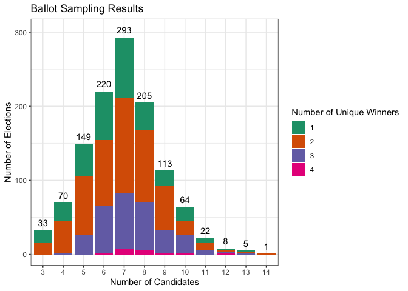
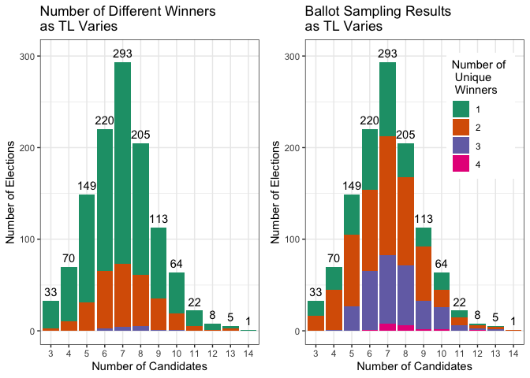
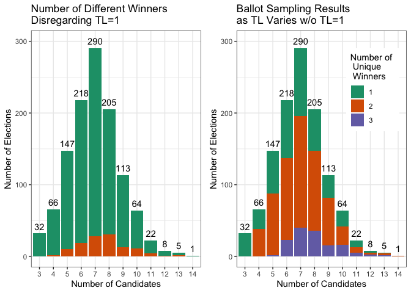
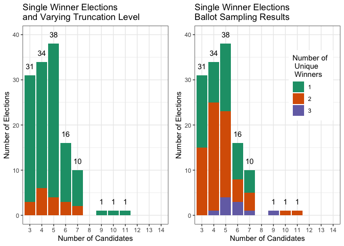

We ran simulations to investigate the possible effects of ballot truncation in data like ours.  For this method, we generated 1000 new elections (pseudoprofiles) for each of our elections by

1. randomly sampling $\min \{ 1001, \mbox{number of voters} \}$ ballots from each election with replacement, and
2. calculating the number of different RCV winners in the pseudoprofile as we vary TL from $1$ to $n-1$.

Then from the 1000 pseudoprofiles, we found the maximum number of different RCV winners as we vary the TL.

### Files

The following files are included in the ElectionFiles folder.


```r
files <- list.files("ElectionFiles/", pattern = ".(txt|csv|blt)", recursive = TRUE)
election <- "ElectionFiles/"
files <- str_c(election, files)

kable(files)
```


|x                                                                          |
|:--------------------------------------------------------------------------|
|ElectionFiles/2014 Berkeley City Council D8.csv                            |
|ElectionFiles/Argyll Bute by-election Isle of Bute 2021.csv                |
|ElectionFiles/Glasgow by-election 2021 Ward 23 Partick East-Kelvindale.csv |
|ElectionFiles/n-ayrshire12-03.blt                                          |
|ElectionFiles/Rep city council D50.csv                                     |

All of the American election files have the following format:

* The ballot column is the voter's ballot which gives their preferences. 
* The Count column is the number of voters who voted with the given preferences.
* The number of candidates in the election is given in the first row of the Num Cands column.
* The candidates are listed in the first row of the Cand List column.  All of these files have candidates listed simply as A, B, C, D, etc.


```r
files[[1]]
```

```
## [1] "ElectionFiles/2014 Berkeley City Council D8.csv"
```

```r
American1 <- read_csv(files[[1]])
head(American1)
```

```
## # A tibble: 6 × 5
##    ...1 ballot Count `Num Cands` `Cand List`
##   <dbl> <chr>  <dbl>       <dbl> <chr>      
## 1     0 ABC       70           4 ABCD       
## 2     1 ABD       69          NA <NA>       
## 3     2 AB        32          NA <NA>       
## 4     3 ACB      129          NA <NA>       
## 5     4 ACD      217          NA <NA>       
## 6     5 AC       105          NA <NA>
```

```r
tail(American1)
```

```
## # A tibble: 6 × 5
##    ...1 ballot Count `Num Cands` `Cand List`
##   <dbl> <chr>  <dbl>       <dbl> <chr>      
## 1    56 B          2          NA <NA>       
## 2    57 C          4          NA <NA>       
## 3    58 D          3          NA <NA>       
## 4    59 B          3          NA <NA>       
## 5    60 C          1          NA <NA>       
## 6    61 D          1          NA <NA>
```

All of the Scottish election files have the following format:

* The first line gives the number of candidates and the number of seats being filled in the election
* The next lines until the last few lines give the Count and the voter preferences in order where 1 is the first candidate, 2 is the second candidate, etc.  Thus the line 9 5 4 3 0 means 9 voters ranked candidate 5 first, candidate 4 second, and candidate 3 third.  Each of the lines end in a 0.
* The last few lines list the names of the candidates and the election.


```r
files[[2]]
```

```
## [1] "ElectionFiles/Argyll Bute by-election Isle of Bute 2021.csv"
```

```r
Scottish1 <- read_csv(files[[2]], col_names = FALSE)
head(Scottish1)
```

```
## # A tibble: 6 × 1
##   X1           
##   <chr>        
## 1 5 1          
## 2 315 1 0      
## 3 47 1 2 0     
## 4 15 1 2 3 0   
## 5 2 1 2 3 4 0  
## 6 7 1 2 3 4 5 0
```

```r
tail(Scottish1, n=12)
```

```
## # A tibble: 12 × 1
##    X1                   
##    <chr>                
##  1 8 5 4 2 3 1 0        
##  2 9 5 4 3 0            
##  3 2 5 4 3 1 2 0        
##  4 2 5 4 3 2 0          
##  5 6 5 4 3 2 1 0        
##  6 0                    
##  7 Kim FINDLAY          
##  8 Fraser GILLIES       
##  9 Dawn MACDONALD       
## 10 Liz MCCABE           
## 11 Peter WALLACE        
## 12 Ward 8 - Isle of Bute
```

### Functions

* Fix_Scottish_data_function: 
  + Input:  file name
  + Output:  Scottish data in the same format as the American data, Candidates

* Fix_American_data_function:
  + Input:  file name
  + Output:  American data, Candidates
  

```r
#########################
# Fix_Scottish_data_function
### input:  file name
### output: clean data frame to match American data, candidates
#########################

Fix_Scottish_data_function <- function(file) {
  my_data <- read_lines(file) %>%
    str_subset(".+") # get rid of any empty lines
  #Some of the data files have a line at the end with " ", so if it is there, we need to remove it.
  if (my_data[[length(my_data)]] == " ") { 
    my_data <- my_data[- length(my_data)]
  }
  
  first_line <- my_data[[1]] %>%
    str_subset(".+") %>%
    str_split("\\s")

  ## Read in the file and get the number of lines for the data and number of seats
  Remove_Lines <- strtoi(first_line[[1]][[1]]) + 2
  ###Num_seats <- strtoi(first_line[[1]][[2]])
  Num_Cands <- Remove_Lines - 2
  
  ## remove first and last few lines in the file.
  my_x <- my_data[-1]
  
  for (i in 1:Remove_Lines) {
    my_x <- my_x[-length(my_x)]
  }
  
  ## Remove "" 
  my_x_noBlank <- str_subset(my_x, ".+") %>%
    str_trim()
  
  
  ## Make it into a tibble and separate into vote (int) and ballot columns
  my_df <- as_tibble_col(my_x_noBlank) %>%
    mutate(votes = strtoi(str_trim(str_extract(value, "\\d+\\s"))), # get vote column (integer)
           ballot = str_remove(value, "\\d+\\s"), # get ballot column
           ballot = str_sub(ballot, end = -3), # remove 0 and space at the end of ballot
           newballot = str_replace_all(ballot, "26", LETTERS[26]),
           newballot = str_replace_all(newballot, "25", LETTERS[25]),
           newballot = str_replace_all(newballot, "24", LETTERS[24]),
           newballot = str_replace_all(newballot, "23", LETTERS[23]),
           newballot = str_replace_all(newballot, "22", LETTERS[22]),
           newballot = str_replace_all(newballot, "21", LETTERS[21]),
           newballot = str_replace_all(newballot, "20", LETTERS[20]),
           newballot = str_replace_all(newballot, "19", LETTERS[19]),
           newballot = str_replace_all(newballot, "18", LETTERS[18]),
           newballot = str_replace_all(newballot, "17", LETTERS[17]),
           newballot = str_replace_all(newballot, "16", LETTERS[16]),
           newballot = str_replace_all(newballot, "15", LETTERS[15]),
           newballot = str_replace_all(newballot, "14", LETTERS[14]),
           newballot = str_replace_all(newballot, "13", LETTERS[13]),
           newballot = str_replace_all(newballot, "12", LETTERS[12]),
           newballot = str_replace_all(newballot, "11", LETTERS[11]),
           newballot = str_replace_all(newballot, "10", LETTERS[10]),
           newballot = str_replace_all(newballot, "9", LETTERS[9]),
           newballot = str_replace_all(newballot, "8", LETTERS[8]),
           newballot = str_replace_all(newballot, "7", LETTERS[7]),
           newballot = str_replace_all(newballot, "6", LETTERS[6]),
           newballot = str_replace_all(newballot, "5", LETTERS[5]),
           newballot = str_replace_all(newballot, "4", LETTERS[4]),
           newballot = str_replace_all(newballot, "3", LETTERS[3]),
           newballot = str_replace_all(newballot, "2", LETTERS[2]),
           newballot = str_replace_all(newballot, "1", LETTERS[1]),
           newballot = str_remove_all(newballot, " ")) %>%
    select(votes, newballot) %>%
    transmute(ballot = newballot, Count = votes)
  return(list(my_df, Num_Cands))
}

#########################
# Fix_American_data_function
### input:  file name
### output: clean data frame to match American data, candidates
#########################

Fix_American_data_function <- function(file) {
  my_data <- read_csv(file, col_select = c(ballot, Count, 'Num Cands'))
  Num_Cands <- my_data[[3]][[1]]
  my_df <- my_data %>%
    select(ballot, Count)
  return(list(my_df, Num_Cands))
}
```

#### Example:

Here is the same Scottish election as before but in our fixed format.


```r
files[[2]]
```

```
## [1] "ElectionFiles/Argyll Bute by-election Isle of Bute 2021.csv"
```

```r
output <- Fix_Scottish_data_function(files[[2]])
head(output[[1]])
```

```
## # A tibble: 6 × 2
##   ballot Count
##   <chr>  <int>
## 1 A        315
## 2 AB        47
## 3 ABC       15
## 4 ABCD       2
## 5 ABCDE      7
## 6 ABCED      1
```

```r
tail(output[[1]])
```

```
## # A tibble: 6 × 2
##   ballot Count
##   <chr>  <int>
## 1 EDBC       1
## 2 EDBCA      8
## 3 EDC        9
## 4 EDCAB      2
## 5 EDCB       2
## 6 EDCBA      6
```

And the number of candidates for this election is:

```r
output[[2]]
```

```
## [1] 5
```


* Scottish_Candidate_function
  + Input:  fileNumber
  + Output:  Number of candidates
  
* American_Candidate_function
  + Input:  fileNumber
  + Output:  Number of candidates


```r
#########################
# Scottish_Candidate_function
### input:  fileNumber
### output: Number of Candidates
#########################

Scottish_Candidate_function <- function(fileNumber) {
  num_cands <- as.integer(Fix_Scottish_data_function(ScottishFiles[[fileNumber]])[[2]])
  return(num_cands)
}

#########################
# American_Candidate_function
### input:  fileNumber
### output: Number of Candidates
#########################

American_Candidate_function <- function(fileNum) {
  data <- AmericanFiles[[fileNum]]
  my_data <- read_csv(data, col_select = c(ballot, Count, 'Num Cands'))
  Num_Cands <- as.integer(my_data[[3]][[1]])
  return(Num_Cands)
}
```

This function allows us to get all of the candidates for all of the election files.

#### Example:

We will divide our election files into Scottish files and American files.


```r
AmericanFiles <- files[c(1,5)]
ScottishFiles <- files[2:4]
```

Then we can create a tibble of the file names and the number of candidates.


```r
NumCands <- map_int(1:3, Scottish_Candidate_function)
ScottishElections <- tibble(ScottishFiles, NumCands) %>%
  transmute(File = ScottishFiles, NumCands = NumCands)

NumCandsAmerican <- map_int(1:2, American_Candidate_function)
AmericanElections <- tibble(AmericanFiles, NumCandsAmerican) %>%
  transmute(File = AmericanFiles, NumCands = NumCandsAmerican)
Elections <- bind_rows(ScottishElections, AmericanElections)
Elections
```

```
## # A tibble: 5 × 2
##   File                                                                  NumCands
##   <chr>                                                                    <int>
## 1 ElectionFiles/Argyll Bute by-election Isle of Bute 2021.csv                  5
## 2 ElectionFiles/Glasgow by-election 2021 Ward 23 Partick East-Kelvinda…        6
## 3 ElectionFiles/n-ayrshire12-03.blt                                           11
## 4 ElectionFiles/2014 Berkeley City Council D8.csv                              4
## 5 ElectionFiles/Rep city council D50.csv                                       5
```


* IRV_function2
  + Input:  election data frame with two columns (ballot, Count), NumCands
  + Output:  election winner
  

```r
#########################
# IRV_function2
### input:  election data (ballot, Count), NumCands
### output: winner
#########################

IRV_function2 <- function(my_df, num_cands) {
  Num_Voters <- sum(my_df$Count)
  ###############
  # First Round and
  # Get rid of any candidates who didn't get any 1st place votes
  ###############
  R1 <- my_df %>%
    mutate(first = str_sub(ballot, start = 1, end = 1)) %>%
    group_by(first) %>%
    summarise(totalVotes = sum(Count)) %>%
    mutate(majority = totalVotes/sum(totalVotes)) %>%
    arrange(totalVotes)
  
  MajorityVariable <- max(R1$majority)
  
  if (MajorityVariable <= .5) {
    Candidates <- LETTERS[1:num_cands]
    ElimNoVotes <- setdiff(Candidates, R1$first)
    my_df_1 <- my_df
    for (r in ElimNoVotes) {
      my_df_1 <- my_df_1 %>%
        mutate(ballot = str_remove_all(ballot, r))
    }
    while (MajorityVariable <= .5) {
      Rounds <- my_df_1 %>%
        mutate(first = str_sub(ballot, start = 1, end = 1)) %>%
        filter(first != "") %>%
        group_by(first) %>%
        summarise(totalVotes = sum(Count)) %>%
        mutate(majority = totalVotes/sum(totalVotes)) %>%
        arrange(totalVotes)
      
      MajorityVariable <- max(Rounds$majority)
      if (MajorityVariable > .5) {
        WinTable <- Rounds %>% filter(majority > .5)
        Winner <- WinTable[[1]][[1]]
      }
      Elim <- Rounds[[1]][[1]]
      
      # Get rid of losing candidate
      my_df_1 <- my_df_1 %>%
        mutate(ballot = str_remove_all(ballot, Elim))
    }
  } else {
    WinTable <- R1 %>% filter(majority > .5)
    Winner <- WinTable[[1]][[1]]
  }
  return(Winner)
}
```

#### Example:

We can use our IRV function to get the winner of the Scottish file we fixed.


```r
files[[2]]
```

```
## [1] "ElectionFiles/Argyll Bute by-election Isle of Bute 2021.csv"
```

```r
IRV_function2(output[[1]], output[[2]])
```

```
## [1] "D"
```

* IRV_Trunc_function2
  + Input:  election data frame (ballot, Count), Truncation level TL, number of candidates
  + Output:  winner


```r
#########################
# IRV_Trunc_function2
### input:  election data (ballot, Count), TL, num_cands
### output: winner
#########################

IRV_Trunc_function2 <- function(TL, data, num_cands) {
  ## truncate ballots
  my_df <- data  %>%
    mutate(ballot = str_sub(ballot, start = 1, end = TL))
  Winner <- IRV_function2(my_df, num_cands)
  return(Winner)
}
```

#### Example:

We can find the winner of our Scottish election with different truncation levels.

Here is TL = 3

```r
files[[2]]
```

```
## [1] "ElectionFiles/Argyll Bute by-election Isle of Bute 2021.csv"
```

```r
IRV_Trunc_function2(3, output[[1]], output[[2]])
```

```
## [1] "A"
```

* sample_function
  + Input:  election data, sample size, number of candidates, truncation levels
  + Output:  data frame (unique_1, unique_2, unique_3, unique_4, unique_Max, uniqueNoT1_1, uniqueNoT1_2, uniqueNoT1_3, uniqueNoT1_4, uniqueNoT1_Max)
  
  This function gives the distribution of the number of unique winners for the 1000 ballot samples (pseudoprofiles).


```r
##################
# sample_function
# input: election data, sample_size, num_candsn, tcheck
# output:  tibble(unique_winners_1, unique_winners_2, unique_winners_3, unique_winners_4,
#   unique_winners_max, unique_winners_noT1_1, unique_winners_noT1_2,
#   unique_winners_noT1_3, unique_winners_noT1_4, unique_winners_noT1_max)
#################

sample_function <- function(my_df, sample_size, num_candsn, tcheck) {
  num_unique_winners <- vector("integer", 1000)
  num_unique_winners_noT1 <- vector("integer", 1000)
  for (j in 1:1000) 
  {
    sample_data <- sample(my_df[[1]], sample_size, replace = TRUE, prob = my_df[[2]])
    sample_data_table <- tibble(sample_data) %>%
      transmute(ballot = sample_data,
                Count = 1)
    All_winners <- sapply(tcheck, IRV_Trunc_function2, sample_data_table, num_candsn)
    All_winners_noT1 <- All_winners[-1]
    num_unique_winners[[j]] <- length(unique(All_winners))
    num_unique_winners_noT1[[j]] <- length(unique(All_winners_noT1))
  }
  unique_winners_1 <- length(which(1 == num_unique_winners))
  unique_winners_2 <- length(which(2 == num_unique_winners))
  unique_winners_3 <- length(which(3 == num_unique_winners))
  unique_winners_4 <- length(which(4 == num_unique_winners))
  unique_winners_max <- max(num_unique_winners)
  unique_winners_noT1_1 <- length(which(1 == num_unique_winners_noT1))
  unique_winners_noT1_2 <- length(which(2 == num_unique_winners_noT1))
  unique_winners_noT1_3 <- length(which(3 == num_unique_winners_noT1))
  unique_winners_noT1_4 <- length(which(4 == num_unique_winners_noT1))
  unique_winners_noT1_max <- max(num_unique_winners_noT1)
  outputAll <- tibble(unique_winners_1, unique_winners_2, unique_winners_3, unique_winners_4,
           unique_winners_max, unique_winners_noT1_1, unique_winners_noT1_2,
           unique_winners_noT1_3, unique_winners_noT1_4, unique_winners_noT1_max)
  return(outputAll)
}
```

* Scottish_full_sample_function
  + Input:  fileNumber
  + Output:  data frame (file name, unique_1, unique_2, unique_3, unique_4, unique_Max, uniqueNoT1_1, uniqueNoT1_2, uniqueNoT1_3, uniqueNoT1_4, uniqueNoT1_Max)

* American_full_sample_function
  + Input:  fileNumber
  + Output:  data frame (file name, unique_1, unique_2, unique_3, unique_4, unique_Max, uniqueNoT1_1, uniqueNoT1_2, uniqueNoT1_3, uniqueNoT1_4, uniqueNoT1_Max)
  

```r
##################
# Scottish_full_sample_function
# input: num_file
# output:  tibble(filename, unique_winners_1, unique_winners_2, unique_winners_3, unique_winners_4,
#   unique_winners_max, unique_winners_noT1_1, unique_winners_noT1_2,
#   unique_winners_noT1_3, unique_winners_noT1_4, unique_winners_noT1_max))
#################

Scottish_full_sample_function <- function(num_file)
{
  data <- ScottishFiles[[num_file]]
  print(num_file)
  fixed_data <- Fix_Scottish_data_function(data)
  my_df <- fixed_data[[1]]
  num_voters <- sum(my_df$Count)
  sample_size = min(1001, num_voters)
  num_cands <- fixed_data[[2]]
  truncs_to_check = 1:(num_cands - 1)
  samplesAllData <- sample_function(my_df, sample_size, num_cands, truncs_to_check) %>%
    mutate(file = data) %>%
    select(file, everything())
  return(samplesAllData)
}

##################
# American_full_sample_function
# input: num_file
# output:  tibble(filename, unique_winners_1, unique_winners_2, unique_winners_3, unique_winners_4,
#   unique_winners_max, unique_winners_noT1_1, unique_winners_noT1_2,
#   unique_winners_noT1_3, unique_winners_noT1_4, unique_winners_noT1_max))
#################

American_full_sample_function <- function(num_file)
{
  data <- AmericanFiles[[num_file]]
  print(num_file)
  fixed_data <- Fix_American_data_function(data)
  my_df <- fixed_data[[1]]
  num_voters <- sum(my_df$Count)
  sample_size = min(1001, num_voters)
  num_cands <- fixed_data[[2]]
  truncs_to_check = 1:(num_cands - 1)
  samplesAllData <- sample_function(my_df, sample_size, num_cands, truncs_to_check) %>%
    mutate(file = data) %>%
    select(file, everything())
  return(samplesAllData)
}
```

#### Example:

We will not run the code to create the ballot sampling since that takes a significant amount of time, but the code chunk has the code we would run.


```r
#######
# Make table of samples
######

ScottishSamples <- map_dfr(1:3, Scottish_full_sample_function)
AmericanSamples <- map_dfr(1:2, American_full_sample_function)
Samples <- bind_rows(ScottishSamples, AmericanSamples)
ElectionsWSamples <- left_join(Elections, Samples)
ElectionsWSamples
```

## Results

Here are the results from all of the elections.


```r
Samples <- read_csv("AllSampleDataNew.csv") %>%
  mutate(NumCands = factor(NumCands),
         unique_winners_max = factor(unique_winners_max)) %>%
  arrange(NumCands)
datatable(Samples)
```

```{=html}
<div id="htmlwidget-3a2926c2e4035347f5c5" style="width:100%;height:auto;" class="datatables html-widget"></div>
<script type="application/json" data-for="htmlwidget-3a2926c2e4035347f5c5">{"x":{"filter":"none","data":[["1","2","3","4","5","6","7","8","9","10","11","12","13","14","15","16","17","18","19","20","21","22","23","24","25","26","27","28","29","30","31","32","33","34","35","36","37","38","39","40","41","42","43","44","45","46","47","48","49","50","51","52","53","54","55","56","57","58","59","60","61","62","63","64","65","66","67","68","69","70","71","72","73","74","75","76","77","78","79","80","81","82","83","84","85","86","87","88","89","90","91","92","93","94","95","96","97","98","99","100","101","102","103","104","105","106","107","108","109","110","111","112","113","114","115","116","117","118","119","120","121","122","123","124","125","126","127","128","129","130","131","132","133","134","135","136","137","138","139","140","141","142","143","144","145","146","147","148","149","150","151","152","153","154","155","156","157","158","159","160","161","162","163","164","165","166","167","168","169","170","171","172","173","174","175","176","177","178","179","180","181","182","183","184","185","186","187","188","189","190","191","192","193","194","195","196","197","198","199","200","201","202","203","204","205","206","207","208","209","210","211","212","213","214","215","216","217","218","219","220","221","222","223","224","225","226","227","228","229","230","231","232","233","234","235","236","237","238","239","240","241","242","243","244","245","246","247","248","249","250","251","252","253","254","255","256","257","258","259","260","261","262","263","264","265","266","267","268","269","270","271","272","273","274","275","276","277","278","279","280","281","282","283","284","285","286","287","288","289","290","291","292","293","294","295","296","297","298","299","300","301","302","303","304","305","306","307","308","309","310","311","312","313","314","315","316","317","318","319","320","321","322","323","324","325","326","327","328","329","330","331","332","333","334","335","336","337","338","339","340","341","342","343","344","345","346","347","348","349","350","351","352","353","354","355","356","357","358","359","360","361","362","363","364","365","366","367","368","369","370","371","372","373","374","375","376","377","378","379","380","381","382","383","384","385","386","387","388","389","390","391","392","393","394","395","396","397","398","399","400","401","402","403","404","405","406","407","408","409","410","411","412","413","414","415","416","417","418","419","420","421","422","423","424","425","426","427","428","429","430","431","432","433","434","435","436","437","438","439","440","441","442","443","444","445","446","447","448","449","450","451","452","453","454","455","456","457","458","459","460","461","462","463","464","465","466","467","468","469","470","471","472","473","474","475","476","477","478","479","480","481","482","483","484","485","486","487","488","489","490","491","492","493","494","495","496","497","498","499","500","501","502","503","504","505","506","507","508","509","510","511","512","513","514","515","516","517","518","519","520","521","522","523","524","525","526","527","528","529","530","531","532","533","534","535","536","537","538","539","540","541","542","543","544","545","546","547","548","549","550","551","552","553","554","555","556","557","558","559","560","561","562","563","564","565","566","567","568","569","570","571","572","573","574","575","576","577","578","579","580","581","582","583","584","585","586","587","588","589","590","591","592","593","594","595","596","597","598","599","600","601","602","603","604","605","606","607","608","609","610","611","612","613","614","615","616","617","618","619","620","621","622","623","624","625","626","627","628","629","630","631","632","633","634","635","636","637","638","639","640","641","642","643","644","645","646","647","648","649","650","651","652","653","654","655","656","657","658","659","660","661","662","663","664","665","666","667","668","669","670","671","672","673","674","675","676","677","678","679","680","681","682","683","684","685","686","687","688","689","690","691","692","693","694","695","696","697","698","699","700","701","702","703","704","705","706","707","708","709","710","711","712","713","714","715","716","717","718","719","720","721","722","723","724","725","726","727","728","729","730","731","732","733","734","735","736","737","738","739","740","741","742","743","744","745","746","747","748","749","750","751","752","753","754","755","756","757","758","759","760","761","762","763","764","765","766","767","768","769","770","771","772","773","774","775","776","777","778","779","780","781","782","783","784","785","786","787","788","789","790","791","792","793","794","795","796","797","798","799","800","801","802","803","804","805","806","807","808","809","810","811","812","813","814","815","816","817","818","819","820","821","822","823","824","825","826","827","828","829","830","831","832","833","834","835","836","837","838","839","840","841","842","843","844","845","846","847","848","849","850","851","852","853","854","855","856","857","858","859","860","861","862","863","864","865","866","867","868","869","870","871","872","873","874","875","876","877","878","879","880","881","882","883","884","885","886","887","888","889","890","891","892","893","894","895","896","897","898","899","900","901","902","903","904","905","906","907","908","909","910","911","912","913","914","915","916","917","918","919","920","921","922","923","924","925","926","927","928","929","930","931","932","933","934","935","936","937","938","939","940","941","942","943","944","945","946","947","948","949","950","951","952","953","954","955","956","957","958","959","960","961","962","963","964","965","966","967","968","969","970","971","972","973","974","975","976","977","978","979","980","981","982","983","984","985","986","987","988","989","990","991","992","993","994","995","996","997","998","999","1000","1001","1002","1003","1004","1005","1006","1007","1008","1009","1010","1011","1012","1013","1014","1015","1016","1017","1018","1019","1020","1021","1022","1023","1024","1025","1026","1027","1028","1029","1030","1031","1032","1033","1034","1035","1036","1037","1038","1039","1040","1041","1042","1043","1044","1045","1046","1047","1048","1049","1050","1051","1052","1053","1054","1055","1056","1057","1058","1059","1060","1061","1062","1063","1064","1065","1066","1067","1068","1069","1070","1071","1072","1073","1074","1075","1076","1077","1078","1079","1080","1081","1082","1083","1084","1085","1086","1087","1088","1089","1090","1091","1092","1093","1094","1095","1096","1097","1098","1099","1100","1101","1102","1103","1104","1105","1106","1107","1108","1109","1110","1111","1112","1113","1114","1115","1116","1117","1118","1119","1120","1121","1122","1123","1124","1125","1126","1127","1128","1129","1130","1131","1132","1133","1134","1135","1136","1137","1138","1139","1140","1141","1142","1143","1144","1145","1146","1147","1148","1149","1150","1151","1152","1153","1154","1155","1156","1157","1158","1159","1160","1161","1162","1163","1164","1165","1166","1167","1168","1169","1170","1171","1172","1173","1174","1175","1176","1177","1178","1179","1180","1181","1182","1183"],["eilean-siar22/ward_03_preferenceprofile.txt","eilean-siar22/ward_04_preferenceprofile.txt","scottish by-elections/aberdeenshire by-election 2016 Banff and District.csv","American elections/2008_Pierce_City_Council_D2.csv","American elections/2009_Pierce_County_Auditor.csv","American elections/2012 Oakland School Director D3.csv","American elections/2012 San Leandro City Council D2.csv","American elections/2014 San Leandro Mayor.csv","American elections/2015 Telluride CO Mayor.csv","American elections/2016 Berkeley City Council D2.csv","American elections/2017-Minneapolis-Park-Board-District-1.csv","American elections/2017-Minneapolis-Park-District-3.csv","American elections/2017-Minneapolis-Ward-1.csv","American elections/2017-Minneapolis-Ward-11.csv","American elections/2018 Santa Fe Councilor D4.csv","American elections/2019 St Louis Park, City Council at-large A.csv","American elections/2020 SF BoS D11.csv","American elections/2020_Maine_D11_Dem_Primary.csv","American elections/2020_Maine_D41_Dem_Primary.csv","American elections/2020_Maine_D47_Dem_Primary.csv","American elections/2020_Maine_D49_Dem_Primary.csv","American elections/2020_Maine_D90_Dem_Primary.csv","American elections/2020_ME_CongressRep_D2_R.csv","American elections/2021 St. Louis Park Ward 3.csv","American elections/2021-Minneapolis-Park-2.csv","American elections/APA 2017 BOD race1.csv","American elections/APA 2017 BOD race2.csv","American elections/APA 2018 BOD race2.csv","American elections/APA 2019 BOD race2.csv","American elections/APA 2020 BOD race2.csv","American elections/APA 2021 BOD race1.csv","American elections/Dem Borough President Queens.csv","American elections/Dem city council D12.csv","aberdeen2017/aberdeen17-11.blt","aberdeenshire17-ballots/aberdeenshire17-01.blt","aberdeenshire17-ballots/aberdeenshire17-16.blt","aberdeenshire22/preferenceprofile_v0001_ward-6-peterhead-south-and-cruden_06052022_172115.csv","angus12-ballots/angus12-01.blt","argyll-bute12-ballots/argyll-bute12-11.blt","argyll22/ward1.csv","clackmannanshire12-ballots/clacks12-05.blt","dumgal12-ballots/dumgal12-01.blt","dumgal12-ballots/dumgal12-02.blt","e-ayrshire12-ballots/e-ayrshire12-02.blt","e-duns12-ballots/e-duns12-01.blt","e-duns12-ballots/e-duns12-07.blt","eilean-siar12-ballots/eilean-siar12-03.blt","eilean-siar17-ballots/eilean-siar17-04.blt","eilean-siar22/ward_05_preferenceprofile.txt","falkirk12-ballots/falkirk12-08.blt","falkirk17-ballots/falkirk17-07.blt","highland22/PreferenceProfile_V0001_Inverness_Millburn_06052022_161539.blt","midlothian22/ward_2_bonnyrigg_preference_profile_open_from_within_ms_word_or_similar.blt","moray12-ballots/moray12-07.blt","moray17-ballots/moray17-01.blt","moray17-ballots/moray17-03.blt","moray17-ballots/moray17-07.blt","n-lanarks12-ballots/n-lanarks12-09.blt","n-lanarks12-ballots/n-lanarks12-13.blt","orkney12-ballots/orkney12-06.blt","s-ayrshire12-ballots/s-ayrshire12-06.blt","s-ayrshire12-ballots/s-ayrshire12-08.blt","s-ayrshire17-ballots/s-ayrshire17-06.blt","s-lanarks12-ballots/s-lanarks12-16.blt","sc-borders17/sc-borders17-11.blt","scottish by-elections/aberdeenshire by-election 2016 inverurie and district.csv","scottish by-elections/Argyll Bute by-election 2021 Lomond North.csv","scottish by-elections/Falkirk 2021 by-election South.csv","shetland12-ballots/shetland12-05.blt","shetland17/shetland17-02.blt","shetland17/shetland17-06.blt","stirling12-ballots/stirling12-05.blt","American elections/2008_Pierce_County_Executive.csv","American elections/2009 Aspen Mayor.csv","American elections/2009-Minneapolis-Council-Ward-4.csv","American elections/2010 Berkeley City Council D7.csv","American elections/2010 SF BoS D8.csv","American elections/2011_SF_Sheriff.csv","American elections/2012 Oakland City Council D5.csv","American elections/2012 San Leandro City Council D4.csv","American elections/2013-Minneapolis-Council-Ward-5.csv","American elections/2014 Berkeley City Council D8.csv","American elections/2014 San Leandro City Council D1.csv","American elections/2016 Oakland School Director D5.csv","American elections/2017-Minneapolis-Council-Ward-5.csv","American elections/2017-Minneapolis-Park-District-6.csv","American elections/2017-Minneapolis-Ward-3.csv","American elections/2017-Minneapolis-Ward-4.csv","American elections/2017-Minneapolis-Ward-9.csv","American elections/2018 SF BoS D2.csv","American elections/2018_Maine_Dem_CD2_primary.csv","American elections/2018_Maine_House_rep_CD2.csv","American elections/2019 SF D5.csv","American elections/2019 SF DA.csv","American elections/2021-Minneapolis-Park-6.csv","American elections/2021-Minneapolis-Ward-1.csv","American elections/2021-Minneapolis-Ward-3.csv","American elections/2022 SF DAstreamlined.csv","American elections/Berkeley_11032020_MemberCityCouncilDist2BerkeleyRCVstreamlined.csv","American elections/Dem city council D42.csv","American elections/Dem city council D47.csv","American elections/Oakland_11032020_SchoolDirectorDist5OaklandRCVstreamlined.csv","American elections/Rep Borough President Richmond.csv","aberdeen2022/Ward11.txt","aberdeenshire12-ballots/aberdeenshire12-01.blt","aberdeenshire12-ballots/aberdeenshire12-10.blt","aberdeenshire12-ballots/aberdeenshire12-13.blt","aberdeenshire12-ballots/aberdeenshire12-15.blt","aberdeenshire12-ballots/aberdeenshire12-16.blt","aberdeenshire17-ballots/aberdeenshire17-04.blt","aberdeenshire17-ballots/aberdeenshire17-07.blt","aberdeenshire17-ballots/aberdeenshire17-09.blt","aberdeenshire17-ballots/aberdeenshire17-15.blt","aberdeenshire22/preferenceprofile_v0001_ward-2-troup_06052022_172123.csv","angus17-ballots/angus17-04.blt","angus17-ballots/angus17-06.blt","angus22/ward2.txt","argyll-bute17-ballots/argyll-bute17-10.blt","argyll22/ward11.csv","clackmannanshire12-ballots/clacks12-04.blt","dumgal12-ballots/dumgal12-07.blt","dumgal12-ballots/dumgal12-09.blt","dumgal17-ballots/dumgal17-07.blt","dumgal17-ballots/dumgal17-11.blt","dumgal22/ward2.blt","dumgal22/ward5.blt","dumgal22/ward6.blt","dumgal22/ward7.blt","dumgal22/ward8.blt","e-ayrshire12-ballots/e-ayrshire12-04.blt","e-ayrshire12-ballots/e-ayrshire12-05.blt","e-ayrshire12-ballots/e-ayrshire12-06.blt","e-ayrshire17-ballots/e-ayrshire17-02.blt","e-ayrshire17-ballots/e-ayrshire17-05.blt","e-ayrshire22 (pdfs)/Ward6.csv","e-duns12-ballots/e-duns12-04.blt","e-duns12-ballots/e-duns12-05.blt","e-duns22-ballots/ward7.csv","e-lothian12-ballots/e-lothian12-02.blt","e-renfs12-ballots/e-renfs12-03.blt","e-renfs12-ballots/e-renfs12-04.blt","edinburgh17-ballots/edinburgh17-03.blt","edinburgh17-ballots/edinburgh17-13.blt","edinburgh17-ballots/edinburgh17-15.blt","edinburgh22/ward15.blt","eilean-siar12-ballots/eilean-siar12-08.blt","eilean-siar17-ballots/eilean-siar17-07.blt","eilean-siar22/ward08_preferenceprofile.txt","falkirk12-ballots/falkirk12-01.blt","falkirk12-ballots/falkirk12-04.blt","falkirk12-ballots/falkirk12-06.blt","falkirk12-ballots/falkirk12-09.blt","fife12-ballots/fife12-02.blt","fife12-ballots/fife12-09.blt","fife12-ballots/fife12-18.blt","fife12-ballots/fife12-21.blt","highland12-ballots/highland12-03.blt","highland22/PreferenceProfile_V0001_East_Sutherland_and_Edderton_06052022_161530.blt","highland22/PreferenceProfile_V0001_Fort_William_and_Ardnamurchan_06052022_161540.blt","highland22/PreferenceProfile_V0001_Tain_and_Easter_Ross_06052022_161537.blt","highland22/PreferenceProfile_V0001_Wester_Ross_Strathpeffer_and_Lochalsh_06052022_161539.blt","inverclyde12-ballots/inverclyde12-01.blt","inverclyde17-ballots/inverclyde17-01.blt","inverclyde22/PreferenceProfile_Ward-7.blt","midlothian12-ballots/midlothian12-06_cleaned.csv","moray12-ballots/moray12-02.blt","moray12-ballots/moray12-03.blt","moray12-ballots/moray12-04.blt","moray12-ballots/moray12-06.blt","moray17-ballots/moray17-02.blt","moray22/file141884.txt","moray22/file141894.txt","moray22/file141896.txt","n-lanarks12-ballots/n-lanarks12-10.blt","n-lanarks12-ballots/n-lanarks12-16.blt","n-lanarks17-ballots/n-lanarks17-010.blt","n-lanarks17-ballots/n-lanarks17-014.blt","n-lanarks17-ballots/n-lanarks17-016.blt","n-lanarks22/Preference Profile Ward 12 Airdrie South.csv","n-lanarks22/Preference Profile WArd 14 Thorniewood.csv","n-lanarks22/Preference Profile Ward 21 Wishaw.csv","orkney17-ballots/orkney17-05.blt","orkney22/ward1.blt","orkney22/ward5.blt","orkney22/ward6.blt","perth-kinross12-ballots/perth-kinross12-01.blt","perth-kinross12-ballots/perth-kinross12-03.blt","perth-kinross12-ballots/perth-kinross12-05.blt","perth-kinross12-ballots/perth-kinross12-07.blt","perth-kinross22 (pdfs)/Ward5.csv","renfs17-ballots/renfs17-11.blt","renfs22/Preference_profile_for_Ward_10_Houston_Crosslee_and_Linwood_copy.csv","renfs22/Preference_profile_for_Ward_11_Bishopton_Bridge_of_Weir_and_Langbank_copy.csv","renfs22/Preference_profile_for_Ward_2_Renfrew_South_and_Gallowhill_copy.csv","s-ayrshire12-ballots/s-ayrshire12-03.blt","s-ayrshire12-ballots/s-ayrshire12-07.blt","s-ayrshire17-ballots/s-ayrshire17-04.blt","s-ayrshire17-ballots/s-ayrshire17-07.blt","s-lanarks22/ward_19_hamilton_south_preference_profile.txt","s-lanarks22/ward_2_clydesdale_north_preference_profile.txt","sc-borders12-ballots/sc-borders12-06.blt","sc-borders17/sc-borders17-02.blt","scottish by-elections/Aberdeenshire 2020 by-election Ellon and District.csv","scottish by-elections/Aberdeenshire 2021 by-election East Garioch.csv","scottish by-elections/aberdeenshire by-election 2017 inverurie.csv","scottish by-elections/Argyll Bute by-election Isle of Bute 2021.csv","scottish by-elections/East Lothian 2019 by-election Ward 5 haddington.csv","scottish by-elections/Falkirk 2018 by-election bonnybridge.csv","scottish by-elections/Highland 2021 by-election Wick.csv","scottish by-elections/Perth Kinross 2015 by-election Ward 12.csv","scottish by-elections/Perth Kinross 2016 by-election ward 9.csv","shetland12-ballots/shetland12-01.blt","shetland17/shetland17-01.blt","shetland17/shetland17-04.blt","shetland17/shetland17-07.blt","shetland22/ward-5-lerwick-north-and-bressay-preference-profile.blt","shetland22/ward-7-shetland-south-preference-profile.blt","w-duns17-ballots/w-duns17-04.blt","w-duns22/preferenceprofile_v0001_ward-1-lomond_06052022_120102.csv","w-duns22/preferenceprofile_v0001_ward-4-kilpatrick_06052022_120059.csv","w-duns22/preferenceprofile_v0001_ward-5-clydebank-central_06052022_120100.csv","w-lothian12-ballots/w-lothian12-09.blt","American elections/2006 Burlington mayor.csv","American elections/2009 Burlington mayor.csv","American elections/2018 Santa Fe Mayor.csv","American elections/2019 Payson Utah City Council seat 1.csv","American elections/APA 1998.csv","American elections/APA 1999.csv","American elections/APA 2000.csv","American elections/APA 2001.csv","American elections/APA 2002.csv","American elections/APA 2003.csv","American elections/APA 2004.csv","American elections/APA 2005.csv","American elections/APA 2006.csv","American elections/APA 2007.csv","American elections/APA 2008.csv","American elections/APA 2009.csv","American elections/APA 2017 President.csv","American elections/APA 2018 President.csv","American elections/APA 2019 President.csv","American elections/APA 2020 President.csv","American elections/APA 2021 President.csv","American elections/Dem Borough President Bronx.csv","American elections/Dem Borough President Richmond.csv","American elections/Dem city council D36.csv","American elections/Dem city council D48.csv","American elections/Oakland_11032020_MemberCityCouncilDist7OaklandRCVstreamlined.csv","American elections/Oakland_11032020_SchoolDirectorDist3OaklandRCVstreamlined.csv","American elections/Oakland_11032020_SchoolDirectorDist7OaklandRCVstreamlined.csv","American elections/Portland_06142022_Schoolboarddistrict5streamlined.csv","American elections/Rep city council D50.csv","aberdeen2012/aberdeen12-11.blt","aberdeen2017/aberdeen17-10.blt","aberdeen2022/Ward7.txt","aberdeenshire12-ballots/aberdeenshire12-06.blt","aberdeenshire12-ballots/aberdeenshire12-07.blt","aberdeenshire12-ballots/aberdeenshire12-09.blt","aberdeenshire12-ballots/aberdeenshire12-12.blt","aberdeenshire12-ballots/aberdeenshire12-14.blt","aberdeenshire17-ballots/aberdeenshire17-02.blt","aberdeenshire17-ballots/aberdeenshire17-05.blt","aberdeenshire17-ballots/aberdeenshire17-06.blt","aberdeenshire17-ballots/aberdeenshire17-10.blt","aberdeenshire17-ballots/aberdeenshire17-11.blt","aberdeenshire17-ballots/aberdeenshire17-12.blt","aberdeenshire17-ballots/aberdeenshire17-14.blt","aberdeenshire22/preferenceprofile_v0001_ward-11-inverurie-and-district_06052022_172124.csv","aberdeenshire22/preferenceprofile_v0001_ward-12-east-garioch_06052022_172124.csv","aberdeenshire22/preferenceprofile_v0001_ward-15-aboyne-upper-deeside-and-donside_06052022_172124.csv","aberdeenshire22/preferenceprofile_v0001_ward-16-banchory-and-mid-deeside_06052022_172124.csv","aberdeenshire22/preferenceprofile_v0001_ward-7-turriff-and-district_06052022_172118.csv","aberdeenshire22/preferenceprofile_v0001_ward-8-mid-formartine_06052022_172123.csv","angus12-ballots/angus12-02.blt","angus12-ballots/angus12-04.blt","angus12-ballots/angus12-07.blt","angus12-ballots/angus12-08.blt","angus17-ballots/angus17-01.blt","angus22/ward7.txt","argyll-bute12-ballots/argyll-bute12-03.blt","argyll-bute12-ballots/argyll-bute12-08.blt","argyll-bute12-ballots/argyll-bute12-10.blt","argyll-bute12-ballots/argyll-bute120510-07.blt","argyll-bute17-ballots/argyll-bute17-02.blt","argyll-bute17-ballots/argyll-bute17-06.blt","argyll22/ward2.csv","clackmannanshire12-ballots/clacks12-03.blt","clackmannanshire17-ballots/clacks17-003.blt","clackmannanshire17-ballots/clacks17-005.blt","dumgal12-ballots/dumgal12-03.blt","dumgal12-ballots/dumgal12-06.blt","dumgal12-ballots/dumgal12-08.blt","dumgal17-ballots/dumgal17-04.blt","dumgal17-ballots/dumgal17-12.blt","dumgal22/ward10.blt","dundee12-ballots/dundee12-08.blt","e-ayrshire12-ballots/e-ayrshire12-01.csv","e-ayrshire12-ballots/e-ayrshire12-03.blt","e-ayrshire12-ballots/e-ayrshire12-07.blt","e-ayrshire12-ballots/e-ayrshire12-09.blt","e-ayrshire17-ballots/e-ayrshire17-03.blt","e-ayrshire22 (pdfs)/Ward1.csv","e-ayrshire22 (pdfs)/Ward2.csv","e-ayrshire22 (pdfs)/Ward4.csv","e-ayrshire22 (pdfs)/Ward5.csv","e-ayrshire22 (pdfs)/Ward7.csv","e-ayrshire22 (pdfs)/Ward8.csv","e-ayrshire22 (pdfs)/Ward9.csv","e-duns12-ballots/e-duns12-03.blt","e-duns12-ballots/e-duns12-06.blt","e-duns17-ballots/e-duns17-01.blt","e-duns17-ballots/e-duns17-02.blt","e-duns17-ballots/e-duns17-03.blt","e-duns17-ballots/e-duns17-05.blt","e-duns22-ballots/ward1.csv","e-duns22-ballots/ward2.csv","e-duns22-ballots/ward5.csv","e-duns22-ballots/ward6.csv","e-lothian12-ballots/e-lothian12-05.blt","e-lothian12-ballots/e-lothian12-06.blt","e-lothian12-ballots/e-lothian12-07.blt","e-lothian17-ballots/e-lothian17-04.blt","e-lothian17-ballots/e-lothian17-06.blt","e-renfs12-ballots/e-renfs12-06.blt","edinburgh12-ballots/edinburgh12-06.blt","edinburgh12-ballots/edinburgh12-09.blt","edinburgh12-ballots/edinburgh12-11.blt","edinburgh17-ballots/edinburgh17-08.blt","edinburgh17-ballots/edinburgh17-09.blt","edinburgh17-ballots/edinburgh17-10.blt","edinburgh17-ballots/edinburgh17-11.blt","edinburgh22/ward14.blt","eilean-siar12-ballots/eilean-siar12-02.blt","eilean-siar12-ballots/eilean-siar12-09.blt","eilean-siar17-ballots/eilean-siar17-05.blt","eilean-siar17-ballots/eilean-siar17-08.blt","eilean-siar17-ballots/eilean-siar17-09.blt","eilean-siar22/ward07_preferenceprofile.txt","falkirk12-ballots/falkirk12-05.blt","falkirk17-ballots/falkirk17-01.blt","falkirk17-ballots/falkirk17-02.blt","falkirk17-ballots/falkirk17-05.blt","falkirk17-ballots/falkirk17-06.blt","falkirk22/ward1.csv","falkirk22/ward5.csv","falkirk22/ward7.csv","fife12-ballots/fife12-07.blt","fife12-ballots/fife12-08.blt","fife12-ballots/fife12-12.blt","fife12-ballots/fife12-20.blt","fife17-ballots/fife17-20.blt","fife22/PreferenceProfile_V0001_Ward-13-Glenrothes-West-and-Kinglassie_06052022_145551.blt","fife22/PreferenceProfile_V0001_Ward-18-St.-Andrews_06052022_151928.blt","glasgow22/Ward11.blt","glasgow22/Ward12.blt","highland12-ballots/highland12-17.blt","highland17-ballots/highland17-07.blt","highland17-ballots/highland17-15.blt","highland22/PreferenceProfile_V0001_Thurso_and_Northwest_Caithness_06052022_161528.blt","highland22/PreferenceProfile_V0001_Wick_and_East_Caithness_06052022_161532.blt","inverclyde12-ballots/inverclyde12-02.blt","inverclyde12-ballots/inverclyde12-04.blt","inverclyde17-ballots/inverclyde17-02.blt","inverclyde17-ballots/inverclyde17-03.blt","inverclyde22/PreferenceProfile_Ward-2.blt","inverclyde22/PreferenceProfile_Ward-3.blt","inverclyde22/PreferenceProfile_Ward-6.blt","midlothian12-ballots/midlothian12-01_cleaned.csv","midlothian17-ballots/midlothian17-01.blt","midlothian17-ballots/midlothian17-05.blt","midlothian22/ward_5_midlothian_east_preference_profile_open_from_within_ms_word_or_similar.blt","moray12-ballots/moray12-01.blt","moray17-ballots/moray17-06.blt","moray22/file141902.txt","moray22/file141913.txt","moray22/file141915.txt","moray22/file141922.txt","n-ayrshire12-ballots/n-ayrshire12-08.blt","n-ayrshire17-ballots/n-ayrshire17-02.blt","n-ayrshire17-ballots/n-ayrshire17-08.blt","n-ayrshire22 (pdfs)/Preference-Profile-Arran_copy.csv","n-ayrshire22 (pdfs)/Preference-Profile-Kilwinning_copy.csv","n-lanarks12-ballots/n-lanarks12-01.blt","n-lanarks12-ballots/n-lanarks12-04.blt","n-lanarks12-ballots/n-lanarks12-06.blt","n-lanarks12-ballots/n-lanarks12-08.blt","n-lanarks12-ballots/n-lanarks12-12.blt","n-lanarks12-ballots/n-lanarks12-14.blt","n-lanarks12-ballots/n-lanarks12-15.blt","n-lanarks12-ballots/n-lanarks12-19.blt","n-lanarks12-ballots/n-lanarks12-20.blt","n-lanarks17-ballots/n-lanarks17-005.blt","n-lanarks17-ballots/n-lanarks17-018.blt","n-lanarks22/Preference Profile Ward 10 Coatbridge West.csv","n-lanarks22/Preference Profile Ward 16 Mossend and Holytown.csv","n-lanarks22/Preference Profile Ward 17 Motherwell West.csv","n-lanarks22/Preference Profile Ward 18 Motherwell North.csv","n-lanarks22/Preference Profile Ward 6 Gartcosh, Glenboig and Moodiesburn.csv","n-lanarks22/Preference Profile WArd 9 Airdrie Central.csv","orkney22/ward3.blt","orkney22/ward4.blt","perth-kinross12-ballots/perth-kinross12-06.blt","perth-kinross12-ballots/perth-kinross12-09.blt","perth-kinross17-ballots/perth-kinross17-01.blt","perth-kinross17-ballots/perth-kinross17-03.blt","perth-kinross17-ballots/perth-kinross17-04.blt","perth-kinross17-ballots/perth-kinross17-09.blt","perth-kinross22 (pdfs)/Ward6.csv","perth-kinross22 (pdfs)/Ward7.csv","perth-kinross22 (pdfs)/Ward9.csv","renfs12-ballots/renfs12-10.blt","renfs22/Preference_profile_for_Ward_12_Erskine_and_Inchinnan_copy.csv","renfs22/Preference_profile_for_Ward_8_Johnstone_South_and_Elderslie_copy.csv","s-ayrshire12-ballots/s-ayrshire12-01.blt","s-ayrshire12-ballots/s-ayrshire12-02.blt","s-ayrshire17-ballots/s-ayrshire17-01.blt","s-ayrshire17-ballots/s-ayrshire17-02.blt","s-ayrshire17-ballots/s-ayrshire17-03.blt","s-ayrshire17-ballots/s-ayrshire17-08.blt","s-ayrshire22/PreferenceProfile_V0001_Ward-6---Kyle_06052022_142627.csv","s-ayrshire22/PreferenceProfile_V0001_Ward-7---Maybole-North-Carrick-and-Coylton_06052022_142628.csv","s-lanarks12-ballots/s-lanarks12-02.blt","s-lanarks12-ballots/s-lanarks12-03.blt","s-lanarks12-ballots/s-lanarks12-04.blt","s-lanarks12-ballots/s-lanarks12-07.blt","s-lanarks12-ballots/s-lanarks12-09.blt","s-lanarks12-ballots/s-lanarks12-10.blt","s-lanarks12-ballots/s-lanarks12-11.blt","s-lanarks12-ballots/s-lanarks12-13.blt","s-lanarks12-ballots/s-lanarks12-14.blt","s-lanarks12-ballots/s-lanarks12-20.blt","s-lanarks17-ballots/s-lanarks17-11.blt","s-lanarks17-ballots/s-lanarks17-16.blt","s-lanarks22/ward_13_cambuslang_west_preference_profile.txt","s-lanarks22/ward_16_bothwell_and_uddingston_preference_profile.txt","s-lanarks22/ward_17_hamilton_north_and_east_preference_profile.txt","sc-borders12-ballots/sc-borders12-01.blt","sc-borders12-ballots/sc-borders12-02.blt","sc-borders12-ballots/sc-borders12-04.blt","sc-borders12-ballots/sc-borders12-05.blt","sc-borders17/sc-borders17-06.blt","sc-borders17/sc-borders17-10.blt","sc-borders22/Ward_1___Tweeddale_West___Preferene.csv","sc-borders22/Ward_10___Preference.csv","sc-borders22/Ward_4___Preference.csv","scottish by-elections/clackmannanshire 2019 by-election ward 3 central.csv","scottish by-elections/East Lothian 2022 by-election ward 2.blt","scottish by-elections/Glasgow by-election 2021 Ward 23 Partick East-Kelvindale.csv","scottish by-elections/Highland 2021 by-election Aird Ward 3.csv","scottish by-elections/Perth Kinross 2017 by-election Ward 10.csv","scottish by-elections/Perth Kinross by-election 2020 South.csv","scottish by-elections/West Lothian 2021 by-election Ward_5.csv","shetland12-ballots/shetland12-04.blt","shetland17/shetland17-03.blt","shetland22/ward-4-shetland-central-preference-profile.blt","stirling12-ballots/stirling12-01.blt","stirling12-ballots/stirling12-03.blt","stirling12-ballots/stirling12-06.blt","stirling17-ballots/stirling17-05.blt","w-lothian12-ballots/w-lothian12-01.blt","w-lothian12-ballots/w-lothian12-02.blt","w-lothian12-ballots/w-lothian12-06.blt","w-lothian17-ballots/w-lothian17-09.blt","w-lothian22/PreferenceProfile_V0001_Ward-1---Linlithgow_06052022_160231.csv","American elections/Dem city council D14.csv","American elections/Dem city council D19.csv","American elections/Dem city council D22.csv","American elections/Dem city council D3.csv","American elections/Dem city council D32.csv","American elections/Dem city council D37.csv","American elections/Dem city council D38.csv","American elections/Oakland_11032020_MemberCityCouncilDist3OaklandRCVstreamlined.csv","aberdeen2012/aberdeen12-04.blt","aberdeen2012/aberdeen12-07.blt","aberdeen2012/aberdeen12-09.blt","aberdeen2012/aberdeen12-13.blt","aberdeen2017/aberdeen17-01.blt","aberdeen2017/aberdeen17-03.blt","aberdeen2022/Ward10.txt","aberdeen2022/Ward3.txt","aberdeen2022/Ward5.txt","aberdeen2022/Ward8.txt","aberdeen2022/Ward9.txt","aberdeenshire12-ballots/aberdeenshire12-08.blt","aberdeenshire12-ballots/aberdeenshire12-17.blt","aberdeenshire12-ballots/aberdeenshire12-19.blt","aberdeenshire17-ballots/aberdeenshire17-08.blt","aberdeenshire17-ballots/aberdeenshire17-13.blt","aberdeenshire17-ballots/aberdeenshire17-17.blt","aberdeenshire17-ballots/aberdeenshire17-18.blt","aberdeenshire22/preferenceprofile_v0001_ward-13-westhill-and-district_06052022_172124.csv","aberdeenshire22/preferenceprofile_v0001_ward-14-huntly-strathbogie-and-howe-of-alford_06052022_172124.csv","aberdeenshire22/preferenceprofile_v0001_ward-3-fraserburgh-and-district_06052022_172124.csv","aberdeenshire22/preferenceprofile_v0001_ward-9-ellon-and-district_06052022_172124.csv","angus12-ballots/angus12-03.blt","angus12-ballots/angus12-05.blt","angus17-ballots/angus17-02.blt","angus17-ballots/angus17-05.blt","angus17-ballots/angus17-08.blt","angus22/ward1.txt","angus22/ward5.txt","argyll-bute12-ballots/argyll-bute12-01.blt","argyll-bute12-ballots/argyll-bute12-02.blt","argyll-bute12-ballots/argyll-bute12-09.blt","argyll-bute17-ballots/argyll-bute17-03.blt","argyll-bute17-ballots/argyll-bute17-08.blt","argyll-bute17-ballots/argyll-bute17-09.blt","argyll22/ward10.csv","argyll22/ward6.csv","argyll22/ward7.csv","argyll22/ward9.csv","clackmannanshire12-ballots/clacks12-01.blt","clackmannanshire17-ballots/clacks17-004.blt","clackmannanshire22/ward1.txt","clackmannanshire22/ward3.txt","clackmannanshire22/ward4.txt","clackmannanshire22/ward5.txt","dumgal12-ballots/dumgal12-05.blt","dumgal12-ballots/dumgal12-11.blt","dumgal12-ballots/dumgal12-12.blt","dumgal17-ballots/dumgal17-05.blt","dumgal17-ballots/dumgal17-06.blt","dumgal17-ballots/dumgal17-10.blt","dumgal22/ward1.blt.docx","dumgal22/ward11.blt","dumgal22/ward12.blt","dumgal22/ward3.blt","dumgal22/ward9.blt","dundee12-ballots/dundee12-03.blt","dundee12-ballots/dundee12-05.blt","dundee12-ballots/dundee12-07.blt","dundee17-ballots/dundee17-01.blt","dundee17-ballots/dundee17-05.blt","dundee22/Ward6.blt","dundee22/Ward7.blt","e-ayrshire17-ballots/e-ayrshire17-04.blt","e-ayrshire17-ballots/e-ayrshire17-07.blt","e-ayrshire22 (pdfs)/Ward3.csv","e-duns12-ballots/e-duns12-08.blt","e-duns17-ballots/e-duns17-04.blt","e-duns17-ballots/e-duns17-07.blt","e-duns22-ballots/ward3.csv","e-lothian12-ballots/e-lothian12-01.blt","e-lothian12-ballots/e-lothian12-03.blt","e-lothian12-ballots/e-lothian12-04.blt","e-lothian17-ballots/e-lothian17-05.blt","e-lothian22/Ward6.blt","e-renfs12-ballots/e-renfs12-05.blt","e-renfs22 (pdfs)/ward3_copy.csv","edinburgh12-ballots/edinburgh12-01.blt","edinburgh12-ballots/edinburgh12-02.blt","edinburgh12-ballots/edinburgh12-05.blt","edinburgh12-ballots/edinburgh12-07.blt","edinburgh12-ballots/edinburgh12-08.blt","edinburgh12-ballots/edinburgh12-10.blt","edinburgh12-ballots/edinburgh12-13.blt","edinburgh17-ballots/edinburgh17-02.blt","edinburgh17-ballots/edinburgh17-06.blt","edinburgh17-ballots/edinburgh17-16.blt","edinburgh17-ballots/edinburgh17-17.blt","edinburgh22/ward10.blt","edinburgh22/ward6.blt","edinburgh22/ward8.blt","edinburgh22/ward9.blt","eilean-siar12-ballots/eilean-siar12-04.blt","eilean-siar12-ballots/eilean-siar12-05.blt","eilean-siar12-ballots/eilean-siar12-06.blt","eilean-siar22/ward10_preferenceprofile.txt","falkirk12-ballots/falkirk12-07.blt","falkirk17-ballots/falkirk17-04.blt","falkirk17-ballots/falkirk17-09.blt","falkirk22/ward3.csv","falkirk22/ward4.csv","falkirk22/ward6.csv","falkirk22/ward8.csv","fife12-ballots/fife12-03.blt","fife12-ballots/fife12-04.blt","fife12-ballots/fife12-06.blt","fife12-ballots/fife12-11.blt","fife12-ballots/fife12-13.blt","fife12-ballots/fife12-16.blt","fife12-ballots/fife12-17.blt","fife17-ballots/fife17-02.blt","fife17-ballots/fife17-04.blt","fife17-ballots/fife17-06.blt","fife17-ballots/fife17-07.blt","fife17-ballots/fife17-08.blt","fife17-ballots/fife17-10.blt","fife17-ballots/fife17-16.blt","fife17-ballots/fife17-17.blt","fife17-ballots/fife17-19.blt","fife22/PreferenceProfile_V0001_Ward-11-Kirkcaldy-Central_06052022_145551.blt","fife22/PreferenceProfile_V0001_Ward-16-Howe-Of-Fife-and-Tay-Coast_06052022_151928.blt","glasgow17-ballots/glasgow17-002.blt","glasgow17-ballots/glasgow17-012.blt","glasgow17-ballots/glasgow17-015.blt","glasgow17-ballots/glasgow17-022.blt","glasgow17-ballots/glasgow17-023.blt","glasgow22/Ward20.blt","glasgow22/Ward22.blt","highland12-ballots/highland12-02.blt","highland12-ballots/highland12-05.blt","highland12-ballots/highland12-06.blt","highland12-ballots/highland12-11.csv","highland12-ballots/highland12-15.blt","highland12-ballots/highland12-16.blt","highland12-ballots/highland12-21.blt","highland17-ballots/highland17-04.blt","highland17-ballots/highland17-08.blt","highland17-ballots/highland17-09.blt","highland17-ballots/highland17-11.blt","highland17-ballots/highland17-12.blt","highland17-ballots/highland17-13.blt","highland17-ballots/highland17-16.blt","highland17-ballots/highland17-21.blt","highland22/PreferenceProfile_V0001_Aird_and_Loch_Ness_06052022_161539.blt","highland22/PreferenceProfile_V0001_Culloden_and_Ardersier_06052022_161539.blt","highland22/PreferenceProfile_V0001_Dingwall_and_Seaforth_06052022_161539.blt","highland22/PreferenceProfile_V0001_Inverness_Ness_side_06052022_161539.blt","highland22/PreferenceProfile_V0001_Inverness_South_06052022_161540.blt","highland22/PreferenceProfile_V0001_North_West_and_Central_Sutherland_06052022_161534.blt","inverclyde12-ballots/inverclyde12-03.blt","inverclyde12-ballots/inverclyde12-05.blt","inverclyde12-ballots/inverclyde12-06.blt","inverclyde17-ballots/inverclyde17-04.blt","inverclyde17-ballots/inverclyde17-05.blt","inverclyde17-ballots/inverclyde17-06.blt","inverclyde22/PreferenceProfile_Ward-5.blt","midlothian12-ballots/midlothian12-02_cleaned.csv","midlothian12-ballots/midlothian12-03_cleaned.csv","midlothian12-ballots/midlothian12-05_cleaned.csv","midlothian17-ballots/midlothian17-02.blt","midlothian17-ballots/midlothian17-03.blt","midlothian17-ballots/midlothian17-06.blt","midlothian22/ward_1_penicuik_preference_profile_open_from_within_ms_word_or_similar.blt","midlothian22/ward_3_dalkeith_preference_profile_open_from_within_ms_word_or_similar.blt","midlothian22/ward_4_midlothian_west_preference_profile_open_from_within_ms_word_or_similar.blt","moray12-ballots/moray12-05.blt","moray17-ballots/moray17-05.blt","moray17-ballots/moray17-08.blt","n-ayrshire12-ballots/n-ayrshire12-06.blt","n-ayrshire17-ballots/n-ayrshire17-01.blt","n-ayrshire17-ballots/n-ayrshire17-03.blt","n-ayrshire17-ballots/n-ayrshire17-05.blt","n-ayrshire17-ballots/n-ayrshire17-07.blt","n-ayrshire17-ballots/n-ayrshire17-09.blt","n-ayrshire17-ballots/n-ayrshire17-10.blt","n-ayrshire22 (pdfs)/Preference-Profile-Ardrossan_copy.csv","n-ayrshire22 (pdfs)/Preference-Profile-Irvine-East_copy.csv","n-ayrshire22 (pdfs)/Preference-Profile-Irvine-South_copy.csv","n-lanarks12-ballots/n-lanarks12-05.blt","n-lanarks12-ballots/n-lanarks12-07.blt","n-lanarks12-ballots/n-lanarks12-17.blt","n-lanarks17-ballots/n-lanarks17-001.blt","n-lanarks17-ballots/n-lanarks17-006.blt","n-lanarks17-ballots/n-lanarks17-013.blt","n-lanarks17-ballots/n-lanarks17-015.blt","n-lanarks17-ballots/n-lanarks17-017.blt","n-lanarks17-ballots/n-lanarks17-021.blt","n-lanarks22/Preference Profile Ward 1 Kilsyth.csv","n-lanarks22/Preference Profile Ward 11 Coatbridge South.csv","n-lanarks22/Preference Profile Ward 13 Fortissat.csv","n-lanarks22/Preference Profile WArd 15 Bellshill.csv","n-lanarks22/Preference Profile Ward 20 Murdostoun.csv","n-lanarks22/Preference Profile Ward 5 Stepps, Chryston and Muirhead.csv","orkney12-ballots/orkney12-03.blt","orkney12-ballots/orkney12-05.blt","orkney17-ballots/orkney17-02.blt","orkney17-ballots/orkney17-04.blt","perth-kinross12-ballots/perth-kinross12-02.blt","perth-kinross12-ballots/perth-kinross12-04.blt","perth-kinross12-ballots/perth-kinross12-11.blt","perth-kinross17-ballots/perth-kinross17-02.blt","perth-kinross17-ballots/perth-kinross17-05.blt","perth-kinross22 (pdfs)/Ward10.csv","perth-kinross22 (pdfs)/Ward11.csv","perth-kinross22 (pdfs)/Ward2.csv","renfs12-ballots/renfs12-01.blt","renfs12-ballots/renfs12-02.blt","renfs12-ballots/renfs12-03.blt","renfs12-ballots/renfs12-06.blt","renfs12-ballots/renfs12-09.blt","renfs12-ballots/renfs12-11.blt","renfs17-ballots/renfs17-02.blt","renfs17-ballots/renfs17-05.blt","renfs17-ballots/renfs17-07.blt","renfs17-ballots/renfs17-08.blt","renfs17-ballots/renfs17-10.blt","renfs22/Preference_profile_for_Ward_5_Paisley_East_and_Central_copy.csv","renfs22/Preference_profile_for_Ward_7_Paisley_Southwest_copy.csv","s-ayrshire12-ballots/s-ayrshire12-04.blt","s-ayrshire12-ballots/s-ayrshire12-05.blt","s-ayrshire17-ballots/s-ayrshire17-05.blt","s-ayrshire22/PreferenceProfile_V0001_Ward-8---Girvan-and-South-Carrick_06052022_142628.csv","s-lanarks12-ballots/s-lanarks12-12.blt","s-lanarks12-ballots/s-lanarks12-17.blt","s-lanarks12-ballots/s-lanarks12-18.blt","s-lanarks12-ballots/s-lanarks12-19.blt","s-lanarks17-ballots/s-lanarks17-02.blt","s-lanarks17-ballots/s-lanarks17-07.blt","s-lanarks17-ballots/s-lanarks17-09.blt","s-lanarks17-ballots/s-lanarks17-12.blt","s-lanarks17-ballots/s-lanarks17-18.blt","s-lanarks17-ballots/s-lanarks17-19.blt","s-lanarks22/ward_1_clydesdale_west_preference_profile.txt","s-lanarks22/ward_10_east_kilbride_east_preference_profile.txt","s-lanarks22/ward_11_rutherglen_south_preference_profile.txt","s-lanarks22/ward_12_rutherglen_central_and_north_preference_profile.txt","s-lanarks22/ward_15_blantyre_preference_profile.txt","s-lanarks22/ward_18_hamilton_west_and_earnock_preference_profile.txt","s-lanarks22/ward_5_avondale_and_stonehouse_preference_profile.txt","s-lanarks22/ward_8_east_kilbride_central_north_preference_profile.txt","sc-borders12-ballots/sc-borders12-03.blt","sc-borders12-ballots/sc-borders12-07.blt","sc-borders12-ballots/sc-borders12-09.blt","sc-borders12-ballots/sc-borders12-10.blt","sc-borders12-ballots/sc-borders12-11.blt","sc-borders17/sc-borders17-05.blt","sc-borders17/sc-borders17-07.blt","sc-borders17/sc-borders17-09.blt","sc-borders22/Ward_11___Preference.csv","sc-borders22/Ward_2___Tweeddale_East___Preference.csv","sc-borders22/Ward_5___Preference.csv","sc-borders22/Ward_6__Preference.csv","sc-borders22/Ward_8___Preference.csv","sc-borders22/Ward_9___Preference.csv","scottish by-elections/Aberdeen City Torry-Ferryhill Ward by election 2019.csv","scottish by-elections/Highland 2021 by-election Fort William.blt","scottish by-elections/highland 2021 by-election Inverness West.csv","scottish by-elections/Perth Kinross 2018 by-election Ward 4.csv","scottish by-elections/Scottish Borders 2021 by-elction Ward 5.csv","scottish by-elections/South Lanarkshire 2019 by-election East Kilbride.csv","scottish by-elections/West Lothian 2021 by-election Ward_4.csv","shetland12-ballots/shetland12-02.blt","shetland12-ballots/shetland12-03.blt","shetland12-ballots/shetland12-06.blt","shetland12-ballots/shetland12-07.blt","shetland22/ward-6-lerwick-south-preference-profile.blt","stirling12-ballots/stirling12-07.blt","stirling17-ballots/stirling17-01.blt","stirling17-ballots/stirling17-02.blt","stirling17-ballots/stirling17-03.blt","stirling17-ballots/stirling17-06.blt","stirling17-ballots/stirling17-07.blt","stirling22/preferenceprofile_v0001_ward-4-stirling-north_06052022_124253.blt","stirling22/preferenceprofile_v0001_ward-5-stirling-west_06052022_124253.blt","w-duns12-ballots/w-duns12-01.blt","w-duns12-ballots/w-duns12-02.blt","w-duns12-ballots/w-duns12-04.blt","w-duns12-ballots/w-duns12-05.blt","w-duns17-ballots/w-duns17-01.blt","w-duns17-ballots/w-duns17-03.blt","w-duns17-ballots/w-duns17-05.blt","w-duns22/preferenceprofile_v0001_ward-6-clydebank-waterfront_06052022_120103.csv","w-lothian12-ballots/w-lothian12-04.blt","w-lothian12-ballots/w-lothian12-05.blt","w-lothian17-ballots/w-lothian17-01.blt","w-lothian17-ballots/w-lothian17-06.blt","w-lothian17-ballots/w-lothian17-07.blt","w-lothian22/PreferenceProfile_V0001_Ward-7---Whitburn-and-Blackburn_06052022_160234.csv","w-lothian22/PreferenceProfile_V0001_Ward-9---Armadale-and-Blackridge_06052022_160235.csv","American elections/2018_Maine_Dem_gov_primary.csv","American elections/2019 Vineyard Utah City Council seat 1.csv","American elections/2020 SF BoS D1.csv","American elections/2020 SF BoS D7.csv","aberdeen2012/aberdeen12-10.blt","aberdeen2017/aberdeen17-04.blt","aberdeen2017/aberdeen17-05.blt","aberdeen2017/aberdeen17-07.blt","aberdeen2017/aberdeen17-09.blt","aberdeen2017/aberdeen17-13.blt","aberdeen2022/Ward1.txt","aberdeen2022/Ward13.txt","aberdeen2022/Ward2.txt","aberdeenshire12-ballots/aberdeenshire12-02.blt","aberdeenshire12-ballots/aberdeenshire12-04.blt","aberdeenshire12-ballots/aberdeenshire12-11.blt","aberdeenshire17-ballots/aberdeenshire17-19.blt","aberdeenshire22/preferenceprofile_v0001_ward-10-west-garioch_06052022_172124.csv","aberdeenshire22/preferenceprofile_v0001_ward-18-stonehaven-and-lower-deeside_06052022_172124.csv","aberdeenshire22/preferenceprofile_v0001_ward-5-peterhead-north-and-rattray_06052022_172118.csv","aberdeenshire22/ward1.csv","angus12-ballots/angus12-06.blt","angus17-ballots/angus17-03.blt","angus17-ballots/angus17-07.blt","angus22/ward3.txt","angus22/ward4.txt","argyll-bute17-ballots/argyll-bute17-04.blt","argyll-bute17-ballots/argyll-bute17-11.blt","argyll22/ward5.csv","clackmannanshire12-ballots/clacks12-02.blt","clackmannanshire17-ballots/clacks17-001.blt","clackmannanshire17-ballots/clacks17-002.blt","clackmannanshire22/ward2.txt","dumgal12-ballots/dumgal12-04.blt","dumgal12-ballots/dumgal12-10.blt","dumgal17-ballots/dumgal17-01.blt","dumgal22/ward4.blt","dundee12-ballots/dundee12-06.blt","dundee17-ballots/dundee17-06.blt","dundee22/Ward5.blt","e-ayrshire12-ballots/e-ayrshire12-08.blt","e-ayrshire17-ballots/e-ayrshire17-01.blt","e-ayrshire17-ballots/e-ayrshire17-06.blt","e-ayrshire17-ballots/e-ayrshire17-08.blt","e-duns12-ballots/e-duns12-02.blt","e-duns17-ballots/e-duns17-06.blt","e-duns22-ballots/ward4.csv","e-lothian17-ballots/e-lothian17-02.blt","e-lothian17-ballots/e-lothian17-03.blt","e-lothian22/Ward2.blt","e-lothian22/Ward4.blt","e-renfs12-ballots/e-renfs12-02.blt","e-renfs17-ballots/e-renfs17-1.blt","e-renfs17-ballots/e-renfs17-5.blt","e-renfs22 (pdfs)/ward1_copy.csv","e-renfs22 (pdfs)/ward2_copy.csv","edinburgh12-ballots/edinburgh12-03.blt","edinburgh12-ballots/edinburgh12-14.blt","edinburgh12-ballots/edinburgh12-15.blt","edinburgh12-ballots/edinburgh12-16.blt","edinburgh12-ballots/edinburgh12-17.blt","edinburgh17-ballots/edinburgh17-04.blt","edinburgh17-ballots/edinburgh17-05.blt","edinburgh17-ballots/edinburgh17-14.blt","edinburgh22/ward13.blt","edinburgh22/ward3.blt","edinburgh22/ward4.blt","edinburgh22/ward7.blt","eilean-siar17-ballots/eilean-siar17-01.blt","eilean-siar17-ballots/eilean-siar17-02.blt","eilean-siar17-ballots/eilean-siar17-06.blt","eilean-siar22/ward02_preferenceprofile.txt","falkirk12-ballots/falkirk12-02.blt","falkirk12-ballots/falkirk12-03.blt","falkirk17-ballots/falkirk17-08.blt","falkirk22/ward2.csv","fife12-ballots/fife12-01.blt","fife12-ballots/fife12-05.blt","fife12-ballots/fife12-15.blt","fife12-ballots/fife12-22.blt","fife17-ballots/fife17-01.blt","fife17-ballots/fife17-13.blt","fife17-ballots/fife17-21.blt","fife22/PreferenceProfile_V0001_Ward-10-Kirkcaldy-North_06052022_151928.blt","fife22/PreferenceProfile_V0001_Ward-12-Kirkcaldy-East_06052022_151925.blt","fife22/PreferenceProfile_V0001_Ward-14-Glenrothes-North-Leslie-and-Markinch_06052022_151925.blt","fife22/PreferenceProfile_V0001_Ward-15-Glenrothes-Central-and-Thornton_06052022_145551.blt","fife22/PreferenceProfile_V0001_Ward-17-Tay-Bridgehead_06052022_145551.blt","fife22/PreferenceProfile_V0001_Ward-19-East-Neuk-and-Landward_06052022_145551.blt","fife22/PreferenceProfile_V0001_Ward-2-Dunfermline-North_06052022_151927.blt","fife22/PreferenceProfile_V0001_Ward-21-Leven-Kennoway-and-Largo_06052022_145552.blt","fife22/PreferenceProfile_V0001_Ward-22-Buckhaven-Methil-and-Wemyss-Villages_06052022_151928.blt","fife22/PreferenceProfile_V0001_Ward-6-Inverkeithing-and-Dalgety-Bay_06052022_151927.blt","fife22/PreferenceProfile_V0001_Ward-8-Lochgelly-Cardenden-and-Benarty_06052022_151928.blt","glasgow12/glasgow12-06.blt","glasgow12/glasgow12-07-recalc.blt","glasgow12/glasgow12-15.blt","glasgow17-ballots/glasgow17-006.blt","glasgow17-ballots/glasgow17-011.blt","glasgow17-ballots/glasgow17-021.blt","glasgow22/Ward13.blt","glasgow22/Ward15.blt","glasgow22/Ward17.blt","glasgow22/Ward19.blt","glasgow22/Ward21.blt","highland12-ballots/highland12-04.blt","highland12-ballots/highland12-07.blt","highland12-ballots/highland12-08.blt","highland12-ballots/highland12-12.blt","highland12-ballots/highland12-13.blt","highland12-ballots/highland12-14.blt","highland12-ballots/highland12-19.blt","highland12-ballots/highland12-20.blt","highland12-ballots/highland12-22.blt","highland17-ballots/highland17-01.blt","highland17-ballots/highland17-05.blt","highland17-ballots/highland17-14.blt","highland17-ballots/highland17-17.blt","highland17-ballots/highland17-19.blt","highland17-ballots/highland17-20.blt","highland22/PreferenceProfile_V0001_Badenoch_and_Strathspey_06052022_161540.blt","highland22/PreferenceProfile_V0001_Black_Isle_06052022_161539.blt","highland22/PreferenceProfile_V0001_Nairn_and_Cawdor_06052022_161539.blt","inverclyde17-ballots/inverclyde17-07.blt","midlothian17-ballots/midlothian17-04.blt","midlothian22/ward_6_midlothian_south_dalkeith_preference_profile_open_from_within_ms_word_or_similar.blt","moray17-ballots/moray17-04.blt","n-ayrshire12-ballots/n-ayrshire12-04.blt","n-ayrshire12-ballots/n-ayrshire12-07.blt","n-ayrshire17-ballots/n-ayrshire17-04.blt","n-ayrshire17-ballots/n-ayrshire17-06.blt","n-ayrshire22 (pdfs)/Preference-Profile-Saltcoats-and-Stevenston_copy.csv","n-lanarks12-ballots/n-lanarks12-02.csv","n-lanarks12-ballots/n-lanarks12-03.blt","n-lanarks12-ballots/n-lanarks12-11.blt","n-lanarks17-ballots/n-lanarks17-004.blt","n-lanarks17-ballots/n-lanarks17-007.blt","n-lanarks17-ballots/n-lanarks17-008.blt","n-lanarks17-ballots/n-lanarks17-009.blt","n-lanarks17-ballots/n-lanarks17-011.blt","n-lanarks17-ballots/n-lanarks17-012.blt","n-lanarks22/Preference Profile Ward 19 Motherwell South East and Ravenscraig.csv","n-lanarks22/Preference Profile Ward 2 Cumbernauld North.csv","n-lanarks22/Preference Profile WArd 4 Cumbernauld East.csv","n-lanarks22/Preference Profile Ward 8 Airdrie North.csv","orkney12-ballots/orkney12-01.blt","orkney17-ballots/orkney17-01.blt","orkney17-ballots/orkney17-06.blt","orkney22/ward2.blt","perth-kinross12-ballots/perth-kinross12-10.blt","perth-kinross12-ballots/perth-kinross12-12.blt","perth-kinross17-ballots/perth-kinross17-06.blt","perth-kinross17-ballots/perth-kinross17-07.blt","perth-kinross17-ballots/perth-kinross17-08.blt","perth-kinross17-ballots/perth-kinross17-10.blt","perth-kinross17-ballots/perth-kinross17-11.blt","perth-kinross17-ballots/perth-kinross17-12.blt","perth-kinross22 (pdfs)/Ward1.csv","perth-kinross22 (pdfs)/Ward4.csv","perth-kinross22 (pdfs)/Ward8.csv","renfs12-ballots/renfs12-04.blt","renfs12-ballots/renfs12-05.blt","renfs12-ballots/renfs12-07.blt","renfs12-ballots/renfs12-08.blt","renfs17-ballots/renfs17-01.blt","renfs22/Preference_profile_for_Ward_9_Johnstone_North_Kilbarchan_Howwood_and_Lochwinnoch_copy.csv","s-ayrshire22/PreferenceProfile_V0001_Ward-1---Troon_06052022_142627.csv","s-ayrshire22/PreferenceProfile_V0001_Ward-2---Prestwick_06052022_142624.csv","s-ayrshire22/PreferenceProfile_V0009_Ward-3---Ayr-North_10052022_111313.csv","s-lanarks12-ballots/s-lanarks12-06.blt","s-lanarks12-ballots/s-lanarks12-08.blt","s-lanarks17-ballots/s-lanarks17-01.blt","s-lanarks17-ballots/s-lanarks17-03.blt","s-lanarks17-ballots/s-lanarks17-05.blt","s-lanarks17-ballots/s-lanarks17-06.blt","s-lanarks17-ballots/s-lanarks17-08.blt","s-lanarks17-ballots/s-lanarks17-10.blt","s-lanarks17-ballots/s-lanarks17-13.blt","s-lanarks17-ballots/s-lanarks17-14.blt","s-lanarks17-ballots/s-lanarks17-15.blt","s-lanarks17-ballots/s-lanarks17-17.blt","s-lanarks22/ward_14_cambuslang_east_preference_profile.txt","s-lanarks22/ward_3_clydesdale_east_preference_profile.txt","s-lanarks22/ward_4_clydesdale_south_preference_profile.txt","s-lanarks22/ward_9_east_kilbride_west_preference_profile.txt","sc-borders12-ballots/sc-borders12-08.blt","sc-borders17/sc-borders17-01.blt","sc-borders17/sc-borders17-03.blt","sc-borders17/sc-borders17-08.blt","sc-borders22/Ward_7___Preference.csv","shetland22/ward-3-shetland-west-preference-profile.blt","stirling12-ballots/stirling12-02.blt","stirling12-ballots/stirling12-04.blt","stirling17-ballots/stirling17-04.blt","stirling22/preferenceprofile_v0001_ward-1-trossachs-and-teith_06052022_124254.blt","stirling22/preferenceprofile_v0001_ward-2-forth-and-endrick_06052022_124253.blt","stirling22/preferenceprofile_v0001_ward-6-stirling-east_06052022_124253.blt","stirling22/preferenceprofile_v0001_ward-7-bannockburn_06052022_124254.blt","w-duns12-ballots/w-duns12-06.blt","w-duns17-ballots/w-duns17-02.blt","w-duns22/preferenceprofile_v0001_ward-2-leven_06052022_120059.csv","w-lothian12-ballots/w-lothian12-03.blt","w-lothian12-ballots/w-lothian12-07.blt","w-lothian17-ballots/w-lothian17-03.blt","w-lothian17-ballots/w-lothian17-04.blt","w-lothian17-ballots/w-lothian17-05.blt","w-lothian22/PreferenceProfile_V0001_Ward-3---Livingston-North_06052022_160234.csv","w-lothian22/PreferenceProfile_V0001_Ward-6---Fauldhouse-and-the-Breich-Valley_06052022_160234.csv","w-lothian22/PreferenceProfile_V0001_Ward-8---Bathgate_06052022_160235.csv","aberdeen2012/aberdeen12-01.blt","aberdeen2012/aberdeen12-02.blt","aberdeen2012/aberdeen12-03.blt","aberdeen2012/aberdeen12-06.blt","aberdeen2017/aberdeen17-02.blt","aberdeen2017/aberdeen17-06.blt","aberdeen2017/aberdeen17-08.blt","aberdeen2022/Ward4.txt","aberdeenshire12-ballots/aberdeenshire12-05.blt","aberdeenshire22/preferenceprofile_v0001_ward-17-north-kincardine_06052022_172124.csv","angus22/ward8.txt","argyll-bute12-ballots/argyll-bute12-04.blt","argyll-bute12-ballots/argyll-bute12-06.blt","argyll22/ward3.csv","argyll22/ward8.csv","dumgal12-ballots/dumgal12-13.blt","dumgal17-ballots/dumgal17-02.blt","dumgal17-ballots/dumgal17-03.blt","dumgal17-ballots/dumgal17-08.blt","dundee12-ballots/dundee12-01.blt","dundee12-ballots/dundee12-02.blt","dundee12-ballots/dundee12-04.blt","dundee17-ballots/dundee17-03.blt","dundee17-ballots/dundee17-07.blt","dundee17-ballots/dundee17-08.blt","dundee22/Ward1.blt","dundee22/Ward2.blt","dundee22/Ward3.blt","dundee22/Ward4.blt","dundee22/Ward8.blt","e-ayrshire17-ballots/e-ayrshire17-09.blt","e-lothian17-ballots/e-lothian17-01.blt","e-lothian22/Ward1.blt","e-lothian22/Ward3.blt","e-lothian22/Ward5.blt","e-renfs12-ballots/e-renfs12-01.blt","e-renfs17-ballots/e-renfs17-2.blt","e-renfs17-ballots/e-renfs17-3.blt","e-renfs22 (pdfs)/ward5_copy.csv","edinburgh12-ballots/edinburgh12-04.blt","edinburgh17-ballots/edinburgh17-07.blt","edinburgh22/ward1.blt","edinburgh22/ward17.blt","edinburgh22/ward2.blt","eilean-siar17-ballots/eilean-siar17-03.blt","falkirk22/ward9.csv","fife12-ballots/fife12-10.blt","fife12-ballots/fife12-19.blt","fife12-ballots/fife12-23.blt","fife17-ballots/fife17-03.blt","fife17-ballots/fife17-05.blt","fife17-ballots/fife17-11.blt","fife17-ballots/fife17-12.blt","fife17-ballots/fife17-14.blt","fife22/PreferenceProfile_V0001_Ward-20-Cupar_06052022_151928.blt","fife22/PreferenceProfile_V0001_Ward-3-Dunfermline-Central_06052022_145551.blt","fife22/PreferenceProfile_V0001_Ward-5-Rosyth_06052022_145544.blt","fife22/PreferenceProfile_V0001_Ward-7-Cowdenbeath_06052022_145532.blt","fife22/PreferenceProfile_V0001_Ward-9-Burntisland-Kinghorn-and-Western-Kirkcaldy_06052022_145551.blt","glasgow12/glasgow12-01.blt","glasgow12/glasgow12-21.blt","glasgow17-ballots/glasgow17-007.blt","glasgow17-ballots/glasgow17-009.blt","glasgow17-ballots/glasgow17-010.blt","glasgow17-ballots/glasgow17-018.blt","glasgow17-ballots/glasgow17-020.blt","glasgow22/Ward1.blt","glasgow22/Ward23.blt","glasgow22/Ward4.blt","glasgow22/Ward7.blt","glasgow22/Ward9.blt","highland12-ballots/highland12-01.blt","highland12-ballots/highland12-18.blt","highland17-ballots/highland17-02.blt","highland17-ballots/highland17-03.blt","highland17-ballots/highland17-06.blt","highland22/PreferenceProfile_V0001_Cromarty_Firth_06052022_161538.blt","highland22/PreferenceProfile_V0001_Eilean_a__Che___06052022_161539.blt","highland22/PreferenceProfile_V0001_Inverness_West_06052022_161539.blt","inverclyde22/PreferenceProfile_Ward-4.blt","midlothian12-ballots/midlothian12-04_cleaned.csv","n-ayrshire12-ballots/n-ayrshire12-01.blt","n-lanarks12-ballots/n-lanarks12-18.csv","n-lanarks17-ballots/n-lanarks17-003.blt","n-lanarks17-ballots/n-lanarks17-020.blt","n-lanarks22/Preference Profile Ward 3 Cumbernauld South.csv","n-lanarks22/Preference Profile WArd 7 Coatbridge North.csv","orkney12-ballots/orkney12-04.blt","perth-kinross12-ballots/perth-kinross12-08.blt","perth-kinross22 (pdfs)/Ward12.csv","perth-kinross22 (pdfs)/Ward3.csv","renfs17-ballots/renfs17-03.blt","renfs17-ballots/renfs17-06.blt","renfs17-ballots/renfs17-12.blt","renfs22/Preference_profile_for_Ward_6_Paisley_Southeast_copy.csv","s-ayrshire22/PreferenceProfile_V0001_Ward-4---Ayr-East_06052022_142626.csv","s-ayrshire22/PreferenceProfile_V0001_Ward-5---Ayr-West_06052022_142628.csv","s-lanarks12-ballots/s-lanarks12-01.blt","s-lanarks17-ballots/s-lanarks17-04.blt","s-lanarks17-ballots/s-lanarks17-20.blt","s-lanarks22/ward_20_larkhall_preference_profile.txt","s-lanarks22/ward_6_east_kilbride_south_preference_profile.txt","s-lanarks22/ward_7_east_kilbride_central_south_preference_profile.txt","sc-borders17/sc-borders17-04.blt","sc-borders22/Ward_3___Preferences.csv","w-duns12-ballots/w-duns12-03.blt","w-duns17-ballots/w-duns17-06.blt","w-duns22/preferenceprofile_v0001_ward-3-dumbarton_06052022_120059.csv","w-lothian12-ballots/w-lothian12-08.blt","w-lothian17-ballots/w-lothian17-02.blt","w-lothian17-ballots/w-lothian17-08.blt","w-lothian22/PreferenceProfile_V0001_Ward-2---Broxburn-Uphall-and-Winchburgh_06052022_160218.csv","American elections/2009 Aspen CO city council.csv","aberdeen2017/aberdeen17-12.blt","aberdeen2022/Ward12.txt","aberdeen2022/Ward6.txt","aberdeenshire12-ballots/aberdeenshire12-03.blt","aberdeenshire12-ballots/aberdeenshire12-18.blt","aberdeenshire17-ballots/aberdeenshire17-03.blt","aberdeenshire22/preferenceprofile_v0001_ward-4-central-buchan_06052022_172124.csv","angus22/ward6.txt","argyll-bute12-ballots/argyll-bute12-05.blt","argyll-bute17-ballots/argyll-bute17-05.blt","argyll-bute17-ballots/argyll-bute17-07.blt","dumgal17-ballots/dumgal17-09.blt","dundee17-ballots/dundee17-02.blt","dundee17-ballots/dundee17-04.blt","e-renfs22 (pdfs)/ward4_copy.csv","edinburgh17-ballots/edinburgh17-01.blt","edinburgh17-ballots/edinburgh17-12.blt","edinburgh22/ward16.blt","edinburgh22/ward5.blt","eilean-siar12-ballots/eilean-siar12-07.blt","eilean-siar22/ward09_preferenceprofile.txt","falkirk17-ballots/falkirk17-03.blt","fife12-ballots/fife12-14.blt","fife17-ballots/fife17-09.blt","fife17-ballots/fife17-15.blt","fife17-ballots/fife17-18.blt","fife17-ballots/fife17-22.blt","fife22/PreferenceProfile_V0001_Ward-1-West-Fife-and-Coastal-Villages_06052022_145537.blt","fife22/PreferenceProfile_V0001_Ward-4-Dunfermline-South_06052022_151924.blt","glasgow12/glasgow12-04.blt","glasgow12/glasgow12-08.blt","glasgow12/glasgow12-17.blt","glasgow12/glasgow12-19.blt","glasgow12/glasgow12-20.blt","glasgow17-ballots/glasgow17-003.blt","glasgow17-ballots/glasgow17-004.blt","glasgow17-ballots/glasgow17-005.blt","glasgow17-ballots/glasgow17-008.blt","glasgow17-ballots/glasgow17-013.blt","glasgow17-ballots/glasgow17-014.blt","glasgow17-ballots/glasgow17-017.blt","glasgow22/Ward10.blt","glasgow22/Ward14.blt","glasgow22/Ward16.blt","glasgow22/Ward2.blt","glasgow22/Ward6.blt","glasgow22/Ward8.blt","highland12-ballots/highland12-09.blt","highland12-ballots/highland12-10.blt","highland17-ballots/highland17-18.blt","highland22/PreferenceProfile_V0001_Inverness_Central_06052022_161539.blt","moray12-ballots/moray12-08.blt","n-ayrshire12-ballots/n-ayrshire12-02.blt","n-ayrshire12-ballots/n-ayrshire12-05.blt","n-ayrshire22 (pdfs)/Preference-Profile-Irvine-West_copy.csv","n-lanarks17-ballots/n-lanarks17-002.blt","renfs17-ballots/renfs17-04.blt","renfs17-ballots/renfs17-09.blt","s-lanarks12-ballots/s-lanarks12-15.blt","scottish by-elections/edinburgh by-election 2015 Leith Walk.csv","stirling22/preferenceprofile_v0001_ward-3-dunblane-and-bridge-of-allan_06052022_124253.blt","w-lothian22/PreferenceProfile_V0001_Ward-4---Livingston-South_06052022_160228.csv","w-lothian22/PreferenceProfile_V0001_Ward-5---East-Livingston-and-East-Calder_06052022_160233.csv","American elections/LasCruces_11052019_MAYORCITYOFLASCRUCESstreamlined.csv","aberdeen2012/aberdeen12-05.blt","aberdeen2012/aberdeen12-08.blt","aberdeenshire22/preferenceprofile_v0001_ward-19-mearns_06052022_172124.csv","argyll22/ward4.csv","e-renfs17-ballots/e-renfs17-4.blt","edinburgh12-ballots/edinburgh12-12.blt","eilean-siar12-ballots/eilean-siar12-01.blt","glasgow12/glasgow12-02.blt","glasgow12/glasgow12-03.blt","glasgow12/glasgow12-10.blt","glasgow12/glasgow12-14.blt","glasgow12/glasgow12-18.blt","glasgow17-ballots/glasgow17-016.blt","glasgow22/Ward18.blt","glasgow22/Ward3.blt","glasgow22/Ward5.blt","n-ayrshire12-ballots/n-ayrshire12-03.blt","n-ayrshire22 (pdfs)/Preference-Profile-Garnock-Valley_copy.csv","orkney12-ballots/orkney12-02.blt","renfs22/Preference_profile_for_Ward_4_Paisley_Northwest_copy.csv","s-lanarks12-ballots/s-lanarks12-05.blt","scottish by-elections/edinburgh 2019 by-election Leith Walk.csv","aberdeen2012/aberdeen12-12.blt","edinburgh22/ward12.blt","glasgow12/glasgow12-16.blt","glasgow17-ballots/glasgow17-001.blt","glasgow17-ballots/glasgow17-019.blt","highland17-ballots/highland17-10.blt","n-ayrshire22 (pdfs)/Preference-Profile-North-Coast_copy.csv","n-lanarks17-ballots/n-lanarks17-019.blt","edinburgh22/ward11.blt","glasgow12/glasgow12-09.blt","glasgow12/glasgow12-11.blt","glasgow12/glasgow12-12.blt","glasgow12/glasgow12-13.blt","glasgow12/glasgow12-05.blt"],["3","3","3","3","3","3","3","3","3","3","3","3","3","3","3","3","3","3","3","3","3","3","3","3","3","3","3","3","3","3","3","3","3","4","4","4","4","4","4","4","4","4","4","4","4","4","4","4","4","4","4","4","4","4","4","4","4","4","4","4","4","4","4","4","4","4","4","4","4","4","4","4","4","4","4","4","4","4","4","4","4","4","4","4","4","4","4","4","4","4","4","4","4","4","4","4","4","4","4","4","4","4","4","5","5","5","5","5","5","5","5","5","5","5","5","5","5","5","5","5","5","5","5","5","5","5","5","5","5","5","5","5","5","5","5","5","5","5","5","5","5","5","5","5","5","5","5","5","5","5","5","5","5","5","5","5","5","5","5","5","5","5","5","5","5","5","5","5","5","5","5","5","5","5","5","5","5","5","5","5","5","5","5","5","5","5","5","5","5","5","5","5","5","5","5","5","5","5","5","5","5","5","5","5","5","5","5","5","5","5","5","5","5","5","5","5","5","5","5","5","5","5","5","5","5","5","5","5","5","5","5","5","5","5","5","5","5","5","5","5","5","5","5","5","5","5","5","5","5","5","5","5","6","6","6","6","6","6","6","6","6","6","6","6","6","6","6","6","6","6","6","6","6","6","6","6","6","6","6","6","6","6","6","6","6","6","6","6","6","6","6","6","6","6","6","6","6","6","6","6","6","6","6","6","6","6","6","6","6","6","6","6","6","6","6","6","6","6","6","6","6","6","6","6","6","6","6","6","6","6","6","6","6","6","6","6","6","6","6","6","6","6","6","6","6","6","6","6","6","6","6","6","6","6","6","6","6","6","6","6","6","6","6","6","6","6","6","6","6","6","6","6","6","6","6","6","6","6","6","6","6","6","6","6","6","6","6","6","6","6","6","6","6","6","6","6","6","6","6","6","6","6","6","6","6","6","6","6","6","6","6","6","6","6","6","6","6","6","6","6","6","6","6","6","6","6","6","6","6","6","6","6","6","6","6","6","6","6","6","6","6","6","6","6","6","6","6","6","6","6","6","6","6","6","6","6","6","6","6","6","6","6","6","6","6","6","6","6","6","6","6","6","7","7","7","7","7","7","7","7","7","7","7","7","7","7","7","7","7","7","7","7","7","7","7","7","7","7","7","7","7","7","7","7","7","7","7","7","7","7","7","7","7","7","7","7","7","7","7","7","7","7","7","7","7","7","7","7","7","7","7","7","7","7","7","7","7","7","7","7","7","7","7","7","7","7","7","7","7","7","7","7","7","7","7","7","7","7","7","7","7","7","7","7","7","7","7","7","7","7","7","7","7","7","7","7","7","7","7","7","7","7","7","7","7","7","7","7","7","7","7","7","7","7","7","7","7","7","7","7","7","7","7","7","7","7","7","7","7","7","7","7","7","7","7","7","7","7","7","7","7","7","7","7","7","7","7","7","7","7","7","7","7","7","7","7","7","7","7","7","7","7","7","7","7","7","7","7","7","7","7","7","7","7","7","7","7","7","7","7","7","7","7","7","7","7","7","7","7","7","7","7","7","7","7","7","7","7","7","7","7","7","7","7","7","7","7","7","7","7","7","7","7","7","7","7","7","7","7","7","7","7","7","7","7","7","7","7","7","7","7","7","7","7","7","7","7","7","7","7","7","7","7","7","7","7","7","7","7","7","7","7","7","7","7","7","7","7","7","7","7","7","7","7","7","7","7","7","7","7","7","7","7","7","7","7","7","7","7","7","7","7","7","7","7","8","8","8","8","8","8","8","8","8","8","8","8","8","8","8","8","8","8","8","8","8","8","8","8","8","8","8","8","8","8","8","8","8","8","8","8","8","8","8","8","8","8","8","8","8","8","8","8","8","8","8","8","8","8","8","8","8","8","8","8","8","8","8","8","8","8","8","8","8","8","8","8","8","8","8","8","8","8","8","8","8","8","8","8","8","8","8","8","8","8","8","8","8","8","8","8","8","8","8","8","8","8","8","8","8","8","8","8","8","8","8","8","8","8","8","8","8","8","8","8","8","8","8","8","8","8","8","8","8","8","8","8","8","8","8","8","8","8","8","8","8","8","8","8","8","8","8","8","8","8","8","8","8","8","8","8","8","8","8","8","8","8","8","8","8","8","8","8","8","8","8","8","8","8","8","8","8","8","8","8","8","8","8","8","8","8","8","8","8","8","8","8","8","8","8","8","8","8","8","8","8","8","8","8","8","9","9","9","9","9","9","9","9","9","9","9","9","9","9","9","9","9","9","9","9","9","9","9","9","9","9","9","9","9","9","9","9","9","9","9","9","9","9","9","9","9","9","9","9","9","9","9","9","9","9","9","9","9","9","9","9","9","9","9","9","9","9","9","9","9","9","9","9","9","9","9","9","9","9","9","9","9","9","9","9","9","9","9","9","9","9","9","9","9","9","9","9","9","9","9","9","9","9","9","9","9","9","9","9","9","9","9","9","9","9","9","9","9","10","10","10","10","10","10","10","10","10","10","10","10","10","10","10","10","10","10","10","10","10","10","10","10","10","10","10","10","10","10","10","10","10","10","10","10","10","10","10","10","10","10","10","10","10","10","10","10","10","10","10","10","10","10","10","10","10","10","10","10","10","10","10","10","11","11","11","11","11","11","11","11","11","11","11","11","11","11","11","11","11","11","11","11","11","11","12","12","12","12","12","12","12","12","13","13","13","13","13","14"],["BB","BB","CC","CC","BB","CC","CC","BB","CB","CA","BB","AA","AA","CC","CC","BB","CC","CC","BB","AA","CC","BB","CC","AA","AA","BB","BB","BB","BB","AB","CC","BB","AA","DDD","CCC","DDD","DDD","DBB","BBB","CCC","ABB","DDD","AAA","AAA","CCC","BBB","AAA","DDD","CCC","CCC","AAA","AAB","CCC","BBB","DDD","BBC","DDD","BBB","AAA","BBB","BBB","AAA","DDD","CCC","AAA","CCC","AAA","DDD","AAA","DDD","AAA","CCC","ACC","BBB","DDD","CCC","CCC","DDD","AAA","CCC","CCC","DDD","AAA","CAA","AAA","DDD","ADD","DAA","CCC","CCC","CCC","BCC","BBB","DDD","DAA","DDD","BBB","BBB","BBB","AAA","AAA","DDD","CCC","EEEE","AAAA","BBBB","CCBB","EEEE","CCCC","AAAA","EEEE","DDDD","CCCC","CCCC","AAAA","CCCC","CCCC","DDDD","EEEE","DDDD","DDCC","BDDD","BAAA","BBBB","CCCC","BBBB","BBBB","ABBB","DDDD","BBBB","BBBB","CBBB","AAAA","EEEE","AAAA","CCCC","EEEE","CCAA","ADDD","AAAA","DEEE","AAAA","CCCC","EAAA","DADD","AAEE","EECC","AAAA","DDDD","DDDD","AAAA","BBBB","DCCC","BBBB","BAAA","EEEE","CCCC","CCCC","CCCC","ADDD","BBBB","BBBB","EEEE","AAAA","CCCC","AAAA","CCCC","EEEE","CEEE","CBCC","CCCC","CCCC","CCCC","AAAA","EBBB","AAAA","BBBB","DDDD","AAAA","EDDD","BBBB","BBBB","DBBB","CCCC","EEEE","DEEE","AAAA","ECCC","CCCC","DDDD","DDDD","AAAA","AAAA","CCCC","BBBB","AAAA","CCCC","AAAA","DBBB","DDDD","DDDD","BBBB","EEEE","BBBB","AAAA","AAAD","DDDD","AAAA","EEEE","CCCC","AAAA","CCCC","DEEE","DDDD","BEEE","BBBB","CCCC","CCCC","BBDD","BBBB","AAAA","AAAA","AAAA","ADDD","BBBB","CCCC","BBBB","AAAA","CCCC","CCCC","CCCC","AAAA","AAAA","DEEE","BBBB","EEEE","EEEE","CCCC","EEEE","DDDD","EEEE","EEEE","BBBB","AAAA","AAAA","DDDD","EEEE","DDDD","BBBB","DDDD","EEEE","AACC","FFFFF","FFFFF","BBBBB","EEEEE","AAAAA","CCCCC","DDDDD","AEEEE","BBBBB","BBBBB","CCCCC","BBBBB","BBBBB","CCCCC","BBBBB","CCCCC","FFFFF","BBBBB","FFBBB","EEEEE","DDDDD","BBBBB","ACCCC","DFFFF","EBEEE","EEEEE","DDDDD","DDDDD","DDDDD","BBBBB","FFFFF","BBAAA","AEEEE","DDDDC","DDDDD","CCCCC","DDDDD","AABBB","CCCCC","AAAAA","BBBAA","AAAAA","BBBEE","EDDDD","FDDDD","CCCCC","EEBBB","CCCCC","BEEEE","EBBBB","AAAAA","CCCCC","EEEEE","BBBAA","AAAAA","BBBBB","DDDDD","CCCCC","EBBBB","BBBBB","ECCCC","BDFFF","BDDDD","AAAAA","DDEEE","CCAAA","BBBBB","DDDDD","BDDDD","AAAAA","CCCCC","DDDDD","ABBBB","BBBBB","EFFFF","EEEEE","BAAAA","ADDDD","CBBBB","DAAAA","DDDDD","EEEEE","BCCCC","AAAAA","CCCCC","CCCCC","BBBBB","FFFFF","AAAAA","BBBBB","AAAAA","FFFFF","AAAAA","AAAAA","FFFFF","DDDDD","AAAAA","DDDDD","BBBBB","CCCCC","EEEEE","FFFFF","CCCCC","BBBBB","BDDDD","AAAAA","CCCCC","FFFFF","CCCCC","EEEEE","EEEEE","DCCCC","EEEEE","AEEEE","BBBBB","DDDDD","CDEEE","FFDDD","EEEEE","EFFFF","BBBBB","CAAAA","CFFFF","ECCCC","BBBBB","CCCCC","AAAAA","CCCCC","AAAAA","AAAAA","BBBBB","ACCCC","CCCCC","BBBBB","CEEEE","AAAAA","BBBBB","DDDDD","DDDDD","AFFFF","CCBBB","CCCCC","EEEEE","AAAAA","BBBBB","CCCCC","CCAAA","EEEEE","DDDDD","FBBBB","EAAAA","CCCCC","FFFFF","AAAAA","BBBBB","EAAAA","AAAAA","BCCCC","DAAAA","EEEEE","ABBBB","BBBBB","DBBBB","AAAAA","BBBBB","DAAAA","AAAAA","CCCCC","CCCCC","BBBBB","BBBBB","BBBBB","ABBBB","EFFFF","BBBBB","EEEEE","BBBBB","AAAAA","AAAAA","EAAAA","CCCCC","FFFFF","CCCCC","DDDDD","BBBBB","AAAAA","ACCCC","CCCCC","AAAAA","CCCCC","FFBBB","DDDDD","AAAAA","DDDDD","FFFFF","CCDDD","BBBBB","ECCCC","FAAAA","FFFFF","DDDDD","EEEEE","BBBBB","BCCCC","CCCCC","FECCC","AAAAA","DBBBB","BBBBB","AAAAA","AAAAA","DEEEE","DDDDD","AAAAA","CCCCC","FFFFF","EEEEE","CCCCC","CCCCC","FFFFF","BBBBBB","CAAAAA","BBBBBB","FBBBBB","EDDDDD","CCCCCC","CCCCCC","CCCCCC","AAAAAA","DDDDDD","BBBBBB","DDDDDD","AAAAAA","BCCBBB","BBBBBB","DDDDDD","FFEEEE","AAAAAA","CCFFFF","ECCCCC","AEEEEE","BEEEEE","CCCCCC","CCCCCC","DDCCCC","DBBBBB","GAGGGG","AAAAAA","FFBBBB","EEEEEE","CCCCCC","BBBBBB","FFFFFF","EEEEEE","FFFFFF","FFFDDD","AAAAAA","BBBBBB","AAAAAA","CCCCCC","EEEEEE","AAAAAA","AAAAAA","ABBBBB","DBBBBB","AAAAAA","ACCCCC","BBEEEE","AAAAAA","AAAAAA","BBBBBB","CCCCCC","FFDDDD","AAAAAA","DCCCCC","AAAAAA","DDDDDD","CCCCCC","CCCCCC","AAAAAA","EEEEEE","DDDDDD","BBBBBB","AAAAAA","AAAAAA","CCCCCC","DDDDDD","DDDDBB","AAAAAA","CFFFFF","EEEEEE","CCCCCC","DDDDDD","ECCCCC","FDDDDD","GGGGGG","BBBBBB","GGGGGG","CDDDDD","DDDDDD","FFFFFF","FFFFFF","GFFFFF","EEEEEE","AAAAAA","ABBBBB","AAAAAA","DDDDDD","GEEEEE","AAAAAA","AAAAAA","AGGGGG","CFFFFF","GGCCCC","GGGGGG","GGGGGG","BBBBBB","DBBBBB","DDDDDD","BBBBBB","BBBBBB","FFFFFF","CCCCCC","CCCCCC","FFFFFF","DDDDDD","AAAAAA","AAAAAA","FFFBFF","BBBBBB","BCGGGG","FGGGGG","CCCCCC","CCCCCC","AAAAAA","AAAAAA","EEEEEE","AAAAAA","FGGGGG","ABBDDD","GFFFFF","CCCCCC","BBBBBB","DDDDDD","AAAAAA","DDDDDD","EEEEEE","GBBBBB","CCCCCC","CCCCCC","AAAAAA","CCCCCC","AAAAAA","FAABBB","AAAAAA","DDDDDD","DDFFFF","CCAAAA","BBBBBB","DDDDDD","DDDDDD","CCCCCC","BBBBBB","FDDDDD","BBBBBB","DDDDDD","AAAAAA","DDDDDD","CCCCCC","AAAAAA","AAAAAA","CCCCCC","AAAAAA","AAAAAA","DDDDDD","DDDDDD","EEEEEE","AAAAAA","AAAAAA","FFFFFF","BCCCCC","CCCCCC","DDDDDD","DDDDDD","CCCCCC","DDCCCC","AAAAAA","CCCCCC","AAAAAA","AAAAAA","AAAAAA","BCCCCC","BBEEEE","EEEEEE","EEEEEE","BBBBBB","AAAAAA","EEEEEE","AAAAAA","EEDDDD","EEEEEE","BBBBBB","BBBBBB","CCCCCC","DDDDDD","BGGCCC","CCCCCC","CAAAAA","BBBBBB","EEEEEE","ECCCCC","CCCCCC","AAADDD","FFFFFF","EEEEEE","EEEEEE","CAAAAA","DCCCCC","DDDDDD","CCCCCC","CCCCCC","CCCCCC","AAAAAA","DDDDDD","FFFFFF","FFFFFF","FCCCCC","FFFFFF","AEEEEE","BBBBBB","BBBBBB","EEEEEE","EEEEEE","GBBBBB","CCCCCC","EAAAAA","EEEEEE","EAAAAA","CCCCCC","CCCCCC","DDDDDD","AAAAAA","DDDDDD","FFFFFF","AAAAAA","DDDDDD","CFFFFF","AAAAAA","AAAAAA","BBBBBB","AAABBB","FFCCCC","DDDDDD","AAAAAA","DAAAAA","EEEEEE","AEEEEE","AAAAAA","CCCCCC","DDDDDD","AAAAAA","BBBBBB","BBBBBB","FFFFFF","DDDDDD","FFFFFF","DDDDDD","EBBBBB","EEEEEE","CCGGGG","DDDDDD","BBBBBB","EGGEEE","CCCCCC","FFFFFF","BBBBBB","FAAAAA","BBBBBB","CCCCCC","AAAAAA","DDDDDD","EEEEEE","FFFFFF","BBBBBB","GGGGGG","DDDDDD","CAAAAA","BBBBBB","AAAAAA","EEEEEE","EEEEEE","EEEEEE","CCCCCC","AAABBB","EEEEEE","CCCCCC","FFFFFF","DDDDDD","AAFFFF","CCCCCC","CCCCCC","CCCCCC","BBBBBB","EEEEEE","DDDDDD","DDDDDD","FFFFFF","AEEEEE","AAAAAA","CCCCCC","EEEEEE","GGGGGG","ECCCCC","GGGGGGG","AAAAAAA","AAAAAAA","FAAAAAA","AAAAAAA","EEEEEEE","AAAAAAA","FFFFFFF","BBBBBBB","FFFFFFF","CCCCCCC","FFFFFFF","BBBBBBB","BBBGGGG","DADDDDD","GGBBBBB","FFFFFFF","CCCCCCC","CBBBBBB","FAEEEEE","BBBBGGG","BDDDDDD","FFFFFFF","DDDDDDD","GGGGGGG","BBBBBBB","CDDDDDD","BDDDDDD","BBBBBBB","HHHHHHH","CCCCCCC","FFFFFFF","BBBBBBB","FFFFFFF","EEEEEEE","EGGGGGG","HHHHHHH","EEEEEEE","GGGGGGG","CCCCCCC","AAAAAAA","HCCCCCC","AAAAAAA","DDDDDDD","GAAAAAA","HHHHHHH","GEGGGGG","BBBBBBB","EEEEEEE","HHHHHHH","EEEEEEE","AAAAAAA","FFFFFFF","GGGGGGG","BBBBBBB","AAAAAAA","BBBBBBB","BAAAAAA","EEEFFFF","FAAAAAA","FFFFFFF","AAAAAAA","DDDDDDD","GBBBBBB","FFFFFFF","GGGGGGG","HHHHHHH","FFFFFFF","BBBBBBB","FFFFFFF","FFFFFFF","AAAAAAA","BBBBBBB","BAAAAAA","CCBBBBB","BDBBBBB","BBBBBBB","EEEEEEE","BBBBBBB","FFFFFFF","AAAAAAA","AAAAAAA","GGGGGGG","CGGGGGG","AAAAAAA","GGGGGGG","AAAAAAA","DDDDDDD","AAAAAAA","BBBBBBB","HCCCCCC","DDDDDDD","FFFFFFF","CCCCCCC","GAAAGGG","BEEEBEE","AAAAAAA","FGGGGGG","DDDDDDD","BDDDDDD","AAAAAAA","EEEEEEE","HHHHHHH","CCCCCCC","BBBBBBB","CCCCCCC","DDHHHHH","FFFFFFF","FFDDDDD","ADDAAAA","HDDDDDD","GCBBBBB","EEEEEEE","ABAAAAA","EEEEEEE","AFFFFFF","FFFFFFF","CCCCDDD","FBBBBBB","BBBBBBB","HFFFFFF","BBBBBBB","EEEEEEE","EEEEEEE","BBBBBBB","CCHHHHH","BCAAAAA","CGGGGGG","FCCBBBB","AAAAAAA","CCCCCCC","EEEEEEE","CCEEEEE","BFFFFFF","CCCCCCC","CCCCCCC","BBBBBBB","BBBBBBB","FFFFFFF","AAAAAAA","BBBBBBB","AAAAAAA","DDDDDDD","EEEEEEE","EEEEEEE","HHHHHHH","BBBBBBB","FFFAAAA","EEEEEEE","EEEEEFF","HHHHHHH","CCCCCCC","AAAAAAA","AAAAAAA","AHHHHHH","HFFFFFF","CCCCCCC","AAAAAAA","GGGGGGG","BBBBBBB","FFFAAAA","AGAAAAA","EEEEEEE","BBBBCCC","AAAAAAA","AAAAAAA","DDDDDDD","AAAAAAA","AAAAAAA","AAAAAAA","AAAAAAA","CCCCCCC","DDDDDDD","HAHHHHH","AAAAAAA","FFFFFFF","FCGGGGG","BBBBBBB","EAAAAAA","CCCCCCC","DDDDDDD","HHHHHHH","AHHHHHH","DDDDDDD","HHHHHHH","CCCCCCC","AAAAAAA","AGGGGGG","GGGCCCC","EDDDDDD","AAAAAAA","BBEBEEE","EEEEEEE","DDDDDDD","AAAAAAA","BBBBBBB","CCGGGGG","BBBBBBB","GGGGGGG","ACCCCCC","AAAAAAA","EEEEEEE","CCCCCCC","BGGGGGG","BBBBBBB","AEEEEEEE","FFFFFFFF","BBBBBBBB","CCCCCCCC","CAAAAAAA","DFFFFFFF","AAAAAAAA","BBBBBBBB","AAAAAAAA","AAAAAAAA","ECCCCCCC","BBIIIIII","AAAFFFFF","HHHHHHHH","BDDDDDDD","CCFFFFFF","DDDDDDDD","BBBBBBBB","AAAAAAAA","AAAAAAAA","DDDDDDDD","BBBBBBBB","DDDDDDDD","AAAAAAAA","GGGGGGGG","AAAAAAAA","GGGGGGGG","HHHHHHHH","CCCCCCCC","CCCCCCCC","BBBBBBBB","BBBBBBBB","DDDDDDDD","AAAAAAAA","FAAAAAAA","BBCCCCCC","CCCCCCCC","FIIIIIII","BCCCCCCC","BBBBBBBB","CBBBBBBB","FFFFFFFF","AAAAAAAA","AAADDDDD","AAAAAAAA","GGGGGGGG","BBBBBBBB","EDDDDDDD","AAAAAAAA","ACHHHHHH","EGGGGGGG","DAAAAAAA","ACCCCCCC","CCCCCCCC","GGGGGGGG","ACAAAAAA","IAAAAAAA","CCCCCCCC","AGGGGGGG","BBBBBBBB","BBBBBBBB","AAAAAAAA","BBBBBBBB","AAAAAAAA","DDAAAAAA","AAAAAAAA","BBBBBBBB","CCCCCCCC","FDDDDDDD","BBBBBBBB","BDBBBBBB","AAFFFFFF","AAAAAAAA","GGGGGGGG","EEEEEEEE","IIIIIIII","BFFFFFFF","BBBBBBBB","EEEEEEEE","AAAAAAAA","BBBBBBBB","BBCCCCCC","AAAAAAAA","CCCCCCCC","CCCCCCCC","HHAAAAAA","BBBBBBBB","DDDDDDDD","EIIIIIII","CCCCCCCC","IIIIIIII","FAAAAAAA","DDDDDDDD","IIIIIIII","DDDDDDDD","CCCCCCCC","BBBBBBBB","DDDDDDDD","FCCCCCCC","HCCCCCCC","BBBBBBBB","AAAAAAAA","AAAAAAAA","BBBBBBBB","GGGGGGGG","DDDDDDDD","CCCCCCCC","ACCCCCCC","HHIIIIII","AAAAAAAA","CCCCCCCC","AAAAAAAA","HHHHHHHH","CBBBBBBBB","BBBBBBBBB","FFFFFFFFF","IIIIIIIII","AAAAAAAAA","DDDDDDDDD","HHHHHHHHH","FBBBBBBBB","IIIIIIIII","HHHHHHHHH","CCCCCCCCC","EEEGGGGGG","IIIIIIIII","BBBBBBBBB","CCCCCCCCC","DDDDDDDDD","GHHHHHHHH","AAAAAAAAA","IIIIIIIII","FFFFFFFFF","JDDDDDDDD","DDDDDDDDD","CCCCCCCCC","DAAAAAAAA","IIIIIIIII","CCCCCCCCC","FFFFFFFFF","BBBBBBBBB","CBBBEEEEE","BBBBBBBBB","IIIIIIIII","CCCCCCCCC","BBBBBBBBB","BBBBBBBBB","EEEEEEEEE","DBDDDDDDD","FDDDDDDDD","IIFFFFFFF","BBDDDDDDD","BBAAAAAAA","FFFFFFFFF","GBBBBBBBB","AAAAAAAAA","ABAAAAAAA","CCAAAAAAA","FBBFFFFFF","AAAAAAAAA","JJJJJJJJJ","BBBBBBBBB","EEEEEEEEE","FBBBBBBBB","AAAAAAAAA","JJJJJJJJJ","DDBBBBBBB","FFFFFFFFF","EEEEEEEEE","EEEEEEEEE","BBBBBBBBB","BBBBBBBBB","HHHHHHHHH","CCCDDDDDD","GGGGGGGGG","FFFFFFFFF","HHHHHHHHH","AAAAAAAAAA","FFFFFFFFFF","IICIIIIIII","HHHHHHHHHH","GGGGGGGGGG","CAAAAAAAAA","IIIIIIIIII","CCCCCCCCCC","BBBBBBBBBB","CCCCCCCCCC","BBBBBBBBBB","CCCCCCCCCC","BBBBBBBBBB","EEEEEEEEEE","AAAAAAAAAA","AABBBBBBBB","BBBBBBBBAB","GCGGGGGGGG","GGGGGGGGGG","DDDDDDDDDD","CCCCCCCCCC","HHHHHHHHHH","AAAAAAAAAAA","IIIIIIIIIII","EEEEEEEEEEE","GEGGGGGGGGG","IIIIIIIIIII","BBBBBBBBBBB","AAAAAAAAAAA","GGGGGGGGGGG","HGGGGGGGGGGG","IIIIIIIIIIII","AAAAAAAAAAAA","DEDDDDDDDDDD","AIAAAAAAAAAA","AAAAAAAAAAAAA"],[1,1,1,1,1,1,1,1,2,2,1,1,1,1,1,1,1,1,1,1,1,1,1,1,1,1,1,1,1,2,1,1,1,1,1,1,1,2,1,1,2,1,1,1,1,1,1,1,1,1,1,2,1,1,1,2,1,1,1,1,1,1,1,1,1,1,1,1,1,1,1,1,2,1,1,1,1,1,1,1,1,1,1,2,1,1,2,2,1,1,1,2,1,1,2,1,1,1,1,1,1,1,1,1,1,1,2,1,1,1,1,1,1,1,1,1,1,1,1,1,2,2,2,1,1,1,1,2,1,1,1,2,1,1,1,1,1,2,2,1,2,1,1,2,2,2,2,1,1,1,1,1,2,1,2,1,1,1,1,2,1,1,1,1,1,1,1,1,2,2,1,1,1,1,2,1,1,1,1,2,1,1,2,1,1,2,1,2,1,1,1,1,1,1,1,1,1,1,2,1,1,1,1,1,1,2,1,1,1,1,1,1,2,1,2,1,1,1,2,1,1,1,1,2,1,1,1,1,1,1,1,1,1,2,1,1,1,1,1,1,1,1,1,1,1,1,1,1,1,1,1,2,1,1,1,1,1,1,1,2,1,1,1,1,1,1,1,1,1,1,2,1,1,1,2,2,2,1,1,1,1,1,1,2,2,2,1,1,1,2,1,1,2,1,2,2,2,1,2,1,2,2,1,1,1,2,1,1,1,1,2,1,2,3,2,1,2,2,1,1,2,1,1,1,2,1,2,1,2,2,2,2,1,1,2,1,1,1,1,1,1,1,1,1,1,1,1,1,1,1,1,1,1,1,1,1,2,1,1,1,1,1,1,2,1,2,1,1,3,2,1,2,1,2,2,2,1,1,1,1,1,1,1,2,1,1,2,1,1,1,1,2,2,1,1,1,1,1,2,1,1,2,2,1,1,1,1,2,1,2,2,1,2,1,2,1,1,2,1,1,1,1,1,1,2,2,1,1,1,1,1,2,1,1,1,1,1,1,2,1,1,1,2,1,1,1,1,2,1,2,2,1,1,1,1,2,1,3,1,2,1,1,1,2,1,1,1,1,1,1,1,1,1,2,1,2,2,1,1,1,1,1,1,1,1,2,1,1,2,1,2,2,2,2,1,1,2,2,2,1,2,1,1,1,1,1,1,2,1,1,1,1,1,1,1,2,2,1,2,2,1,1,1,1,2,1,2,1,1,1,1,1,1,1,1,1,1,1,1,2,1,2,1,1,1,2,2,1,1,1,2,1,1,1,2,1,1,2,1,1,2,1,1,2,2,2,1,1,1,2,1,1,1,1,1,1,1,1,1,1,2,1,3,2,1,1,1,1,1,1,2,3,2,1,1,1,1,1,1,2,1,1,1,1,1,3,1,1,2,2,1,1,1,1,1,2,1,1,1,1,1,1,1,1,1,1,1,1,1,1,1,1,2,1,1,1,1,2,1,1,1,1,1,2,2,1,1,1,1,1,1,2,1,1,1,1,1,3,1,2,1,1,2,1,2,1,1,1,2,2,1,1,1,1,1,1,1,1,2,1,2,1,1,1,1,2,1,2,1,2,1,1,1,1,1,1,1,1,2,1,1,1,2,2,1,1,2,1,2,1,1,1,1,1,1,1,1,1,1,2,1,2,1,1,2,1,1,1,2,1,1,1,1,1,1,1,1,1,2,1,1,1,1,1,1,2,1,1,1,1,2,1,1,1,1,1,1,1,1,2,1,1,1,1,2,1,1,1,2,1,1,1,1,1,1,1,1,1,2,2,2,1,1,2,3,2,2,1,1,1,1,2,2,1,1,1,1,1,1,1,2,1,1,1,1,1,2,1,1,2,1,2,1,1,1,1,1,1,1,1,1,1,2,2,2,1,1,1,2,1,1,1,1,1,1,1,1,1,2,2,2,1,1,1,1,1,1,1,2,1,1,1,1,1,1,2,1,1,1,2,2,1,2,1,2,1,1,1,1,1,1,2,1,2,2,2,3,1,2,1,2,1,2,2,1,2,1,1,1,1,2,3,2,3,1,1,1,2,2,1,1,1,1,1,1,1,1,1,1,1,1,1,2,1,2,1,1,1,1,2,2,1,1,1,1,2,2,1,2,1,1,1,1,1,1,1,1,1,2,1,1,3,1,2,1,1,1,2,1,1,1,1,2,2,2,1,2,1,1,1,1,2,1,1,2,1,1,1,2,1,2,1,1,1,2,2,1,1,1,1,2,2,2,1,2,2,1,1,1,1,1,1,1,1,1,1,1,1,1,1,1,1,1,1,2,2,1,2,2,1,2,1,1,2,1,1,1,2,1,3,2,2,2,1,1,2,2,1,2,1,1,1,1,1,2,1,1,1,2,1,2,2,1,1,1,1,2,1,1,1,1,2,1,1,1,2,1,1,2,1,1,2,1,1,1,1,1,1,2,2,1,1,1,1,1,1,1,2,2,1,1,1,1,2,1,1,1,1,1,1,2,1,1,1,2,1,1,1,1,2,1,1,1,2,1,1,2,1,1,1,1,3,1,1,1,1,1,1,2,2,2,2,2,1,2,1,2,2,2,1,1,1,1,2,1,1,2,1,1,1,1,1,1,2,1,1,1,1,1,2,1,1,2,1,1,1,1,1,1,1,1,1,2,2,2,1,1,1,1,1,1,1,2,1,1,1,1,2,1,1,2,2,1],["2","1","2","2","2","1","2","1","2","2","2","1","2","2","1","1","2","1","1","2","1","1","1","2","1","1","1","2","1","2","1","2","1","1","2","1","2","2","1","2","2","1","1","2","1","2","1","1","1","2","2","2","2","1","2","2","2","2","2","1","2","1","2","2","1","2","2","2","1","1","1","2","2","2","1","1","2","2","2","1","1","3","1","2","2","2","2","2","1","2","2","2","2","2","2","2","2","2","1","2","1","1","2","1","2","1","3","3","2","2","2","1","1","2","1","2","2","1","2","2","3","2","2","3","2","3","2","3","2","3","2","2","1","2","2","1","2","2","3","1","2","2","2","3","3","3","2","1","1","3","1","2","3","2","3","1","1","2","2","3","2","2","1","2","1","1","2","2","3","2","2","2","2","1","2","2","2","2","2","2","2","1","3","1","1","3","2","3","2","2","1","2","2","2","2","3","2","2","3","2","2","1","2","2","1","3","2","2","3","1","1","2","3","2","2","2","1","1","3","1","1","1","2","3","1","1","1","3","1","1","2","1","2","2","1","2","2","2","1","2","2","1","2","2","1","2","2","1","1","2","1","2","1","2","3","1","1","1","1","3","1","1","2","1","1","2","1","3","1","3","3","3","3","1","2","3","3","2","2","1","2","3","2","3","3","3","2","2","1","2","3","2","2","1","3","3","3","3","3","1","3","4","1","1","2","2","1","2","2","2","2","1","2","3","3","1","2","3","2","2","2","2","3","2","3","3","3","1","2","3","3","3","1","2","2","1","2","3","2","3","2","2","1","1","3","3","1","2","1","2","1","2","3","2","2","1","3","1","2","2","1","1","2","2","3","3","2","2","3","3","1","3","2","2","2","2","2","1","2","2","2","1","1","3","1","2","3","1","1","2","1","3","3","2","2","2","2","2","3","2","2","2","2","1","1","1","1","3","2","2","3","2","3","3","3","1","1","3","2","2","2","1","2","2","2","3","3","2","2","1","1","2","2","2","2","2","2","2","3","1","1","1","3","1","2","2","1","2","3","3","3","1","1","1","2","3","3","3","2","2","3","1","1","3","1","2","1","1","2","1","1","1","2","2","1","2","2","1","2","1","1","2","3","2","2","3","2","1","2","2","3","2","2","4","3","1","3","3","2","2","3","1","4","1","2","3","2","2","2","1","3","1","2","3","2","3","2","3","4","4","2","3","3","2","3","2","3","2","1","1","1","1","1","2","1","1","4","3","1","2","4","2","1","1","2","3","2","1","3","2","2","3","2","2","3","2","2","2","3","3","3","1","1","3","3","3","1","2","2","3","3","1","2","1","3","1","3","3","1","1","3","2","4","4","1","1","3","1","1","1","3","3","3","3","3","3","2","3","2","3","2","1","2","2","2","3","3","3","3","2","2","1","2","2","1","2","2","2","1","2","2","1","1","3","2","1","2","3","2","2","1","1","3","2","2","2","3","3","1","2","2","2","1","3","3","2","3","2","2","3","2","3","2","1","2","1","2","3","2","3","2","2","2","2","2","1","1","1","2","3","1","2","1","2","2","1","2","2","2","2","3","2","2","2","2","3","2","3","2","3","3","1","1","2","1","2","2","1","3","2","2","2","3","2","2","2","3","2","2","2","3","2","2","1","3","1","1","2","1","2","1","2","1","2","3","2","1","1","2","2","1","1","1","2","2","1","1","2","2","1","1","2","3","2","2","3","1","1","1","1","3","2","1","2","1","2","1","1","2","3","1","2","2","2","3","2","1","2","3","1","2","2","1","2","2","2","3","1","2","3","3","2","3","3","3","3","3","3","1","2","3","4","4","2","2","2","2","2","2","2","3","3","2","2","2","1","2","2","2","3","2","3","2","2","2","2","2","3","2","2","3","1","3","3","3","2","1","3","3","1","1","1","2","2","2","2","1","1","3","3","3","2","2","3","2","2","2","2","3","2","2","1","2","1","2","3","2","2","2","3","3","2","3","2","2","2","1","2","2","2","1","2","1","3","3","4","4","2","3","3","3","2","3","2","2","3","3","1","1","2","3","3","2","4","2","2","2","2","3","2","2","3","2","1","1","2","1","2","2","3","2","2","2","2","2","1","1","2","3","4","3","2","1","2","1","3","3","3","2","1","1","2","3","1","2","1","3","2","3","2","2","3","3","2","2","2","2","3","2","2","1","1","3","3","2","1","3","1","3","1","3","3","3","2","3","2","3","1","3","2","2","2","3","2","2","2","2","1","3","2","3","2","2","2","2","3","2","2","1","3","2","2","1","1","1","1","2","1","1","1","2","3","2","3","3","3","3","3","2","2","2","1","1","2","1","2","2","3","2","3","3","3","2","2","2","3","3","2","2","3","2","1","2","2","2","2","2","2","2","2","3","3","1","1","2","2","3","1","2","2","3","2","2","2","2","3","1","2","3","2","2","4","2","3","3","1","2","2","4","3","3","1","2","2","1","1","2","2","3","2","3","2","3","4","1","1","1","1","3","3","3","2","2","3","3","1","1","3","1","3","2","2","2","3","1","3","2","1","2","3","2","4","3","2","1","1","1","2","3","3","3","3","2","3","3","2","2","2","3","3","2","1","1","3","1","3","3","2","1","1","3","2","1","3","2","1","2","1","3","2","2","3","3","1","2","1","1","1","2","2","3","2","3","2","3","1","1","2","2","2","2","1","4","3","1","3","2","3","1","2","3","2","2"],[1,1,1,1,1,1,1,1,1,1,1,1,1,1,1,1,1,1,1,1,1,1,1,1,1,1,1,1,1,1,1,1,1,1,2,1,2,2,1,1,2,1,1,1,1,2,1,1,1,2,2,2,1,1,2,2,2,2,2,1,2,1,2,2,1,1,2,2,1,1,1,2,2,2,1,1,1,2,2,1,1,2,1,2,1,2,2,2,1,2,2,2,2,2,2,2,1,2,1,2,1,1,2,1,2,1,2,2,2,2,2,1,1,2,1,2,2,1,1,1,2,2,1,2,1,2,2,2,2,2,2,2,1,1,2,1,2,2,2,1,2,1,2,2,2,3,2,1,1,2,1,2,2,2,2,1,1,1,1,2,2,1,1,2,1,1,2,2,3,2,2,2,2,1,1,2,1,2,2,2,2,1,2,1,1,2,1,2,2,1,1,1,2,1,2,2,2,2,2,2,2,1,2,2,1,2,2,1,2,1,1,2,2,2,2,2,1,1,2,1,1,1,2,2,1,1,1,2,1,1,2,1,2,2,1,2,2,2,1,2,1,1,2,2,1,2,2,1,1,2,1,2,1,2,2,1,1,1,1,2,1,1,2,1,1,2,1,2,1,2,2,2,2,1,2,3,3,1,2,1,2,2,1,3,3,3,2,2,1,2,2,1,2,1,2,3,2,2,3,1,2,3,1,1,1,2,1,2,1,1,2,1,2,2,2,1,2,3,2,2,2,2,3,2,3,2,3,1,1,2,3,2,1,2,2,1,1,3,2,2,2,2,1,1,2,2,1,2,1,1,1,2,2,1,2,1,2,1,2,1,1,1,2,2,2,2,2,1,2,3,1,2,2,1,2,2,2,1,2,2,2,1,1,2,1,2,2,1,1,2,1,2,3,2,2,2,2,2,3,2,2,2,2,1,1,1,1,2,2,2,3,2,3,2,2,1,1,2,1,2,2,1,2,2,2,2,2,1,1,1,1,2,2,2,2,2,2,2,3,1,1,1,2,1,1,2,1,2,3,2,2,1,1,1,2,2,2,3,2,2,3,1,1,2,1,2,1,1,2,1,1,1,2,2,1,2,2,1,2,1,1,2,3,2,2,3,2,1,2,1,2,2,2,3,3,1,3,3,2,2,3,1,3,1,1,2,2,2,2,1,3,1,2,2,2,2,2,2,3,3,2,2,3,2,3,2,3,2,1,1,1,1,1,2,1,1,3,2,1,2,3,2,1,1,1,3,2,1,3,2,2,3,2,2,3,2,1,2,2,2,2,1,1,2,3,3,1,2,2,2,2,1,2,1,2,1,2,3,1,1,2,2,3,3,1,1,3,1,1,1,3,3,2,2,2,2,2,2,2,3,1,1,2,1,2,3,3,2,3,2,1,1,2,2,1,2,2,2,1,2,2,1,1,2,2,1,2,2,2,1,1,1,2,2,1,2,3,3,1,2,1,1,1,3,2,2,2,2,2,2,2,2,2,1,2,1,2,2,2,2,2,2,2,2,2,1,1,1,2,2,1,2,1,2,2,1,2,2,2,2,2,2,2,2,2,2,2,3,2,2,2,1,1,1,1,2,2,1,3,2,2,2,2,2,1,2,2,2,2,2,2,2,2,1,3,1,1,2,1,2,1,2,1,1,3,1,1,1,2,2,1,1,1,2,2,1,1,2,2,1,1,2,2,2,1,2,1,1,1,1,2,2,1,2,1,2,1,1,2,2,1,2,2,2,3,2,1,2,2,1,1,1,1,1,1,2,2,1,2,3,3,2,2,3,2,2,2,3,1,2,2,3,3,1,2,2,1,1,1,1,2,2,2,2,1,1,2,2,1,2,1,3,2,2,2,2,2,2,2,2,2,1,2,3,2,2,1,3,3,1,1,1,1,2,1,2,1,1,2,2,3,2,2,2,2,2,2,1,2,1,2,1,2,1,2,2,2,2,1,2,3,2,2,2,2,2,1,2,1,1,1,2,1,2,3,3,3,2,3,3,2,2,3,1,2,2,2,1,1,2,3,3,2,3,2,2,2,2,3,2,2,2,2,1,1,2,1,2,2,3,2,2,2,2,2,1,1,2,3,3,3,2,1,2,1,2,3,3,2,1,1,2,3,1,2,1,2,2,3,2,2,2,2,2,2,2,2,2,2,2,1,1,2,3,1,1,3,1,3,1,2,3,2,2,2,2,3,1,3,2,2,2,2,1,2,2,2,1,3,2,2,2,2,1,2,3,2,2,1,2,2,2,1,1,1,1,2,1,1,1,1,2,2,2,2,3,2,2,2,1,1,1,1,2,1,2,2,2,2,3,2,3,2,1,1,3,2,2,2,2,2,1,2,1,2,2,2,2,2,2,3,3,1,1,2,2,2,1,2,2,3,2,2,2,2,3,1,1,3,2,2,3,2,2,2,1,2,2,3,2,2,1,2,1,1,1,2,2,3,2,2,2,3,3,1,1,1,1,3,3,2,2,2,2,3,1,1,2,1,3,2,1,2,3,1,3,2,1,1,3,2,3,2,2,1,1,1,2,2,3,2,3,2,3,3,2,2,2,2,2,2,1,1,2,1,3,3,2,1,1,2,1,1,3,2,1,2,1,3,2,2,3,3,1,1,1,1,1,1,2,3,2,2,2,3,1,1,2,2,2,2,1,3,3,1,3,1,3,1,2,3,2,2],[839,1000,998,999,998,1000,672,1000,430,241,999,1000,944,591,1000,1000,989,1000,1000,920,1000,1000,1000,977,1000,1000,1000,822,1000,487,1000,891,1000,1000,640,1000,997,349,1000,903,254,1000,1000,997,1000,962,1000,1000,1000,634,709,450,968,1000,984,415,958,986,965,1000,905,1000,999,523,1000,938,970,727,1000,1000,1000,927,319,986,1000,1000,995,977,994,1000,1000,614,1000,540,998,806,29,380,1000,886,993,759,890,703,339,972,981,987,1000,992,1000,1000,864,1000,986,1000,469,975,985,993,997,1000,1000,961,1000,997,769,1000,941,998,463,411,55,840,567,487,997,244,520,785,991,63,1000,909,855,1000,920,75,34,1000,401,998,989,4,462,150,472,1000,1000,739,1000,834,15,890,354,1000,1000,999,943,8,907,843,1000,872,1000,1000,981,978,88,508,859,783,587,1000,152,800,833,791,853,12,512,1000,95,1000,1000,1,561,142,687,987,1000,967,880,922,892,866,997,972,85,548,993,1000,810,998,1000,479,963,989,698,1000,1000,986,95,991,267,635,1000,1000,76,1000,1000,1000,997,221,1000,1000,1000,659,1000,1000,910,1000,999,443,1000,787,888,733,1000,998,999,1000,969,985,1000,993,977,1000,1000,962,1000,619,1000,810,670,1000,1000,1000,1000,195,1000,1000,990,1000,1000,751,1000,560,1000,550,350,556,546,1000,215,220,315,940,589,1000,742,586,976,393,182,447,993,966,1000,360,578,663,236,1000,153,75,202,926,111,1000,40,44,1000,1000,688,381,1000,974,732,878,501,1000,3,96,68,1000,173,316,837,996,463,938,507,782,288,461,169,1000,40,87,11,387,1000,891,459,1000,980,693,918,782,940,985,1000,1000,834,742,1000,975,1000,878,1000,984,745,997,633,1000,51,1000,908,981,1000,1000,596,495,693,126,631,712,233,285,1000,422,997,136,69,176,656,1000,933,984,891,1000,1000,354,1000,992,556,1000,1000,985,1000,3,143,853,808,816,947,994,178,928,964,163,58,1000,1000,1000,1000,352,998,11,459,904,13,660,157,1000,1000,506,996,678,571,1000,859,829,388,305,704,663,999,1000,1000,467,715,831,886,802,645,796,87,1000,1000,1000,73,1000,999,983,1000,321,527,324,327,1000,1000,1000,997,2,952,17,996,76,564,1000,1000,6,1000,995,1000,1000,693,1000,1000,1000,976,624,1000,407,161,1000,983,1000,1000,808,703,920,942,484,928,1000,140,998,174,223,460,311,604,1000,103,0,299,977,39,1000,661,1000,684,616,622,369,992,1000,776,1000,918,647,987,240,524,540,196,40,967,616,665,580,0,905,278,994,1000,1000,1000,1000,1000,934,1000,1000,447,841,1000,434,507,280,1000,1000,971,5,244,1000,486,990,612,903,933,990,5,997,999,141,747,866,434,1000,1000,33,35,428,1000,992,861,401,721,1000,899,1000,762,1000,672,792,1000,1000,522,974,62,56,1000,1000,931,1000,1000,1000,0,359,2,829,861,866,538,494,965,28,961,1000,997,922,676,81,919,788,7,49,949,1000,998,998,1000,59,999,975,1000,570,506,1000,1000,506,991,1000,765,913,994,998,1000,1000,50,911,999,946,622,172,1000,990,998,992,1000,92,340,959,493,803,995,700,819,379,890,1000,504,1000,924,305,947,433,973,781,247,983,480,1000,1000,1000,461,108,1000,996,1000,987,994,1000,970,882,405,904,220,979,971,992,958,381,659,25,970,203,554,1000,1000,999,1000,847,608,1000,359,969,980,637,408,333,426,821,156,642,265,811,830,710,633,1000,727,1000,1000,952,1000,426,1000,368,1000,900,235,999,1000,1000,279,998,1000,1000,1000,986,999,1000,1000,908,498,1000,1000,844,872,670,891,565,1000,1000,1000,1000,377,820,1000,761,1000,994,1000,1000,960,49,1000,977,994,652,191,839,1000,994,120,1000,994,874,1000,635,983,996,743,1000,592,311,14,879,770,14,57,429,242,703,1000,885,745,183,0,979,995,998,941,986,986,993,436,554,998,959,998,1000,342,738,583,15,967,65,938,987,998,766,912,925,664,514,741,1000,58,235,360,665,1000,527,23,1000,1000,1000,989,849,998,880,1000,1000,357,239,267,996,962,873,855,882,999,992,287,997,617,1000,975,1000,682,105,533,601,716,191,339,550,95,912,365,948,1000,640,999,999,1000,596,1000,117,210,56,35,998,356,555,267,998,190,44,630,253,544,1000,1000,995,224,107,317,4,575,875,611,495,67,995,995,699,998,1000,1000,683,1000,843,597,629,984,648,221,977,391,1000,1000,937,731,94,31,994,1000,698,1000,398,325,621,421,1000,1000,821,241,1000,948,1000,842,684,243,575,953,158,720,201,769,988,774,113,882,916,1000,1000,38,549,48,1000,459,1000,893,1000,627,412,935,974,0,989,724,1000,88,992,165,628,857,976,132,323,794,1000,609,997,358,430,337,977,231,322,981,997,1000,880,992,999,1000,1000,1000,1000,971,1000,1000,1000,909,839,690,790,285,260,700,246,59,979,383,1000,1000,533,1000,930,858,34,846,112,449,60,317,915,999,243,207,774,612,951,923,1000,997,979,165,999,867,948,354,602,274,231,1000,1000,793,973,387,1000,897,899,779,433,725,807,995,7,1000,999,157,989,717,20,621,669,779,1000,740,998,46,4,630,1000,935,980,1000,1000,941,268,354,484,732,981,487,2,1000,1000,1000,1000,623,870,217,912,986,751,147,1000,1000,879,1000,195,967,962,645,102,1000,849,260,1000,765,804,595,145,899,997,1000,1000,1000,690,181,2,187,56,151,741,123,929,233,404,308,570,988,1000,1000,355,1000,914,480,941,1000,1000,651,992,1000,341,692,1000,999,1000,862,461,838,627,317,1000,987,1000,1000,1000,985,962,831,666,208,493,196,1000,1000,986,891,998,862,1000,200,964,1000,409,994,178,1000,953,553,581,919],[161,0,2,1,2,0,328,0,570,759,1,0,56,409,0,0,11,0,0,80,0,0,0,23,0,0,0,178,0,513,0,109,0,0,360,0,3,651,0,97,746,0,0,3,0,38,0,0,0,366,291,550,32,0,16,585,42,14,35,0,95,0,1,477,0,62,30,273,0,0,0,73,681,14,0,0,5,23,6,0,0,383,0,460,2,194,971,620,0,114,7,241,110,297,661,28,19,13,0,8,0,0,136,0,14,0,516,24,15,7,3,0,0,39,0,3,231,0,59,2,468,589,945,157,433,508,3,755,480,213,9,937,0,91,145,0,80,925,937,0,599,2,11,927,537,772,528,0,0,260,0,166,953,110,622,0,0,1,57,990,93,157,0,128,0,0,19,22,901,492,141,217,413,0,848,200,167,209,147,988,488,0,861,0,0,931,439,854,313,13,0,33,120,78,108,132,3,28,912,452,7,0,190,2,0,520,37,11,294,0,0,14,789,9,733,365,0,0,923,0,0,0,3,778,0,0,0,336,0,0,90,0,1,557,0,213,112,267,0,2,1,0,31,15,0,7,23,0,0,38,0,381,0,190,284,0,0,0,0,798,0,0,10,0,0,249,0,415,0,415,463,440,399,0,785,762,679,60,411,0,258,387,24,606,798,551,7,34,0,640,413,337,764,0,512,911,754,73,883,0,943,893,0,0,312,619,0,26,268,122,499,0,997,514,924,0,827,682,163,4,537,62,490,218,686,531,733,0,960,910,842,593,0,109,541,0,20,303,82,217,60,15,0,0,165,257,0,25,0,122,0,16,254,3,367,0,877,0,92,19,0,0,404,505,303,871,369,288,617,710,0,575,3,864,931,824,344,0,67,16,109,0,0,645,0,8,431,0,0,15,0,992,787,147,192,184,53,6,806,72,36,837,942,0,0,0,0,619,2,989,528,96,931,339,788,0,0,493,4,322,429,0,141,171,612,646,292,337,1,0,0,533,285,169,114,198,355,204,866,0,0,0,926,0,1,17,0,679,472,641,666,0,0,0,3,979,47,856,4,924,403,0,0,976,0,5,0,0,307,0,0,0,24,376,0,593,839,0,17,0,0,192,291,80,58,483,72,0,860,2,821,777,540,567,372,0,891,857,701,23,957,0,331,0,316,337,378,631,8,0,220,0,82,334,13,759,476,454,773,875,33,380,334,420,995,95,684,6,0,0,0,0,0,66,0,0,380,158,0,566,403,720,0,0,29,987,756,0,488,10,388,94,67,10,993,3,1,859,236,120,551,0,0,813,721,505,0,8,139,598,276,0,101,0,226,0,322,206,0,0,477,26,405,702,0,0,68,0,0,0,972,547,990,168,137,132,462,483,35,966,39,0,3,78,324,694,80,210,905,951,51,0,2,2,0,941,1,25,0,430,494,0,0,453,9,0,235,86,6,2,0,0,910,89,1,54,373,775,0,10,2,8,0,857,645,41,373,197,5,299,181,616,110,0,496,0,76,478,53,522,27,219,753,17,520,0,0,0,539,815,0,4,0,13,6,0,30,118,595,96,767,21,29,8,42,617,341,775,30,771,377,0,0,1,0,153,392,0,620,31,20,363,533,667,574,179,843,358,735,189,164,290,367,0,262,0,0,48,0,574,0,632,0,100,760,1,0,0,721,2,0,0,0,14,1,0,0,92,502,0,0,156,119,330,109,430,0,0,0,0,611,180,0,239,0,6,0,0,40,946,0,23,6,348,788,161,0,6,879,0,6,126,0,365,17,4,242,0,408,645,980,121,220,981,454,428,727,262,0,115,246,520,728,21,5,2,59,14,14,7,561,414,2,41,2,0,658,262,417,984,33,801,62,13,2,234,88,74,336,486,246,0,941,617,588,335,0,428,967,0,0,0,11,151,2,120,0,0,639,757,731,4,38,119,145,118,1,8,705,3,383,0,25,0,318,877,467,399,284,807,659,450,891,88,635,52,0,360,1,1,0,404,0,876,668,684,347,2,503,443,729,2,775,956,370,733,452,0,0,5,769,737,683,378,425,125,389,505,930,5,5,290,2,0,0,317,0,157,403,350,16,352,779,23,609,0,0,63,232,820,947,6,0,302,0,596,533,349,579,0,0,179,722,0,52,0,151,316,713,425,47,593,277,799,231,12,226,784,118,84,0,0,823,431,952,0,519,0,100,0,318,583,64,26,962,11,257,0,877,8,835,372,135,24,868,677,206,0,364,3,637,570,663,23,769,665,19,3,0,119,8,1,0,0,0,0,29,0,0,0,91,133,310,208,713,725,291,744,941,21,617,0,0,467,0,70,142,960,154,593,548,860,683,85,1,749,792,226,388,48,77,0,3,21,835,1,133,52,646,398,719,756,0,0,207,27,611,0,103,101,208,567,275,193,5,978,0,1,771,11,283,803,379,245,210,0,260,2,922,951,369,0,65,20,0,0,59,732,626,516,267,19,454,810,0,0,0,0,355,122,782,88,14,245,850,0,0,120,0,772,33,38,355,882,0,150,740,0,235,195,405,731,100,3,0,0,0,310,816,995,730,907,849,255,870,71,767,596,685,376,12,0,0,619,0,84,518,59,0,0,317,8,0,647,308,0,1,0,137,539,162,347,669,0,13,0,0,0,15,38,167,334,791,507,777,0,0,14,109,2,138,0,755,35,0,515,6,790,0,47,444,419,81],[0,0,0,0,0,0,0,0,0,0,0,0,0,0,0,0,0,0,0,0,0,0,0,0,0,0,0,0,0,0,0,0,0,0,0,0,0,0,0,0,0,0,0,0,0,0,0,0,0,0,0,0,0,0,0,0,0,0,0,0,0,0,0,0,0,0,0,0,0,0,0,0,0,0,0,0,0,0,0,0,0,3,0,0,0,0,0,0,0,0,0,0,0,0,0,0,0,0,0,0,0,0,0,0,0,0,15,1,0,0,0,0,0,0,0,0,0,0,0,0,69,0,0,3,0,5,0,1,0,2,0,0,0,0,0,0,0,0,29,0,0,0,0,69,1,78,0,0,0,1,0,0,32,0,24,0,0,0,0,2,0,0,0,0,0,0,0,0,11,0,0,0,0,0,0,0,0,0,0,0,0,0,44,0,0,68,0,4,0,0,0,0,0,0,0,2,0,0,3,0,0,0,0,0,0,1,0,0,8,0,0,0,116,0,0,0,0,0,1,0,0,0,0,1,0,0,0,5,0,0,0,0,0,0,0,0,0,0,0,0,0,0,0,0,0,0,0,0,0,0,0,0,0,0,46,0,0,0,0,7,0,0,0,0,0,0,0,25,0,35,187,4,55,0,0,18,6,0,0,0,0,27,0,1,20,2,0,0,0,0,9,0,0,0,335,14,44,1,6,0,17,61,0,0,0,0,0,0,0,0,0,0,0,390,8,0,0,2,0,0,0,0,3,0,26,8,98,0,0,3,147,20,0,0,0,0,0,4,0,1,0,0,0,0,1,1,0,0,0,0,0,0,1,0,0,0,72,0,0,0,0,0,0,0,4,3,0,0,150,5,0,3,0,0,0,0,0,0,0,0,0,0,0,1,0,0,13,0,0,0,0,5,70,0,0,0,0,0,16,0,0,0,0,0,0,0,0,29,0,0,13,0,56,1,55,0,0,1,0,0,0,0,0,0,0,49,4,0,0,0,0,0,0,0,0,0,0,0,47,0,0,0,1,0,0,0,0,0,1,35,7,0,0,0,0,19,1,127,0,0,33,0,0,18,0,0,0,0,0,0,0,0,0,0,0,0,0,0,0,0,0,0,6,0,0,33,0,0,0,0,5,0,0,121,24,0,6,143,0,0,4,0,6,0,0,47,0,0,0,0,4,0,0,19,0,1,0,6,30,84,0,4,1,0,5,0,38,0,0,0,0,0,0,0,0,0,172,1,0,0,89,0,0,0,0,8,0,0,26,0,0,3,0,0,2,0,0,0,17,14,15,0,0,154,244,67,0,0,0,1,3,0,0,0,12,0,6,2,0,0,1,0,531,238,0,0,1,0,0,0,28,94,8,3,2,2,0,23,0,6,0,0,0,0,0,225,1,2,88,0,0,0,0,0,0,0,0,0,0,0,0,0,0,41,0,0,0,1,0,0,0,0,40,0,0,0,5,53,0,0,0,0,0,51,15,0,134,0,0,1,0,5,0,0,0,0,0,217,0,45,0,0,0,0,0,0,0,0,0,77,0,0,0,0,0,0,0,0,0,0,13,0,0,0,0,2,0,200,0,26,69,0,0,0,0,0,0,0,21,0,0,0,59,0,0,0,1,0,0,0,6,0,0,0,11,0,0,0,0,0,0,0,0,0,5,0,0,0,0,0,0,0,0,0,0,0,0,0,0,0,0,0,9,0,0,5,0,0,0,0,12,0,0,0,0,0,0,0,0,5,0,0,0,0,21,0,0,0,1,0,0,0,0,0,0,0,15,0,0,44,6,0,10,5,489,143,31,35,0,0,9,295,269,0,0,0,0,0,0,0,3,32,0,0,0,0,0,0,0,1,0,134,0,0,0,0,0,1,0,0,13,0,1,148,52,0,0,45,10,0,0,0,0,0,0,0,0,0,4,4,2,0,0,8,0,0,0,0,8,0,0,0,0,0,0,18,0,0,0,2,2,0,14,0,0,0,0,0,0,0,0,0,0,7,122,259,598,0,141,2,4,0,35,0,0,14,4,0,0,0,7,156,0,613,0,0,0,0,3,0,0,11,0,0,0,0,0,0,0,21,0,0,0,0,0,0,0,0,37,85,22,0,0,0,0,6,142,30,0,0,0,0,37,0,0,0,7,0,44,0,0,249,3,0,0,0,0,103,0,0,0,0,139,20,0,0,22,0,7,0,55,5,1,0,38,0,19,0,35,0,0,0,8,0,0,0,0,0,27,0,5,0,0,0,0,13,0,0,0,1,0,0,0,0,0,0,0,0,0,0,0,28,0,2,2,15,9,10,0,0,0,0,0,0,0,0,0,6,0,295,3,80,0,0,0,8,1,0,0,1,0,0,0,0,0,0,0,0,0,0,7,13,0,0,0,0,2,0,0,0,13,0,0,0,0,15,0,0,72,0,0,174,0,86,11,0,0,0,31,45,1,0,0,0,0,0,0,0,20,0,1,0,59,179,0,0,0,0,22,8,1,0,0,4,3,0,0,1,0,33,0,0,0,16,0,1,0,0,0,1,0,123,1,0,0,0,0,0,3,3,83,37,0,4,7,0,0,0,7,54,0,0,0,26,0,2,2,0,0,0,32,0,0,12,0,0,0,0,1,0,0,26,14,0,0,0,0,0,0,0,2,0,1,0,27,0,0,0,0,0,0,0,44,1,0,76,0,32,0,0,3,0,0],[0,0,0,0,0,0,0,0,0,0,0,0,0,0,0,0,0,0,0,0,0,0,0,0,0,0,0,0,0,0,0,0,0,0,0,0,0,0,0,0,0,0,0,0,0,0,0,0,0,0,0,0,0,0,0,0,0,0,0,0,0,0,0,0,0,0,0,0,0,0,0,0,0,0,0,0,0,0,0,0,0,0,0,0,0,0,0,0,0,0,0,0,0,0,0,0,0,0,0,0,0,0,0,0,0,0,0,0,0,0,0,0,0,0,0,0,0,0,0,0,0,0,0,0,0,0,0,0,0,0,0,0,0,0,0,0,0,0,0,0,0,0,0,0,0,0,0,0,0,0,0,0,0,0,0,0,0,0,0,0,0,0,0,0,0,0,0,0,0,0,0,0,0,0,0,0,0,0,0,0,0,0,0,0,0,0,0,0,0,0,0,0,0,0,0,0,0,0,0,0,0,0,0,0,0,0,0,0,0,0,0,0,0,0,0,0,0,0,0,0,0,0,0,0,0,0,0,0,0,0,0,0,0,0,0,0,0,0,0,0,0,0,0,0,0,0,0,0,0,0,0,0,0,0,0,0,0,0,0,0,0,0,0,0,0,0,0,0,0,0,0,0,0,0,0,0,0,0,0,0,0,0,0,0,0,0,0,0,0,0,0,0,0,0,0,0,0,0,0,0,0,2,0,0,0,0,0,0,0,0,0,0,0,0,0,0,0,0,0,0,0,0,0,0,0,0,0,0,0,0,0,0,0,0,0,0,0,0,0,0,0,0,0,0,0,0,0,0,0,0,0,0,0,0,0,0,0,0,0,0,0,0,0,0,0,0,0,0,0,0,0,0,0,0,0,0,0,0,0,0,0,0,0,0,0,0,0,0,0,0,0,0,0,0,0,0,0,0,0,0,0,0,0,0,0,0,0,0,0,0,0,0,0,0,0,0,0,0,0,0,0,0,0,0,0,0,0,0,0,0,0,0,0,0,0,0,0,0,0,0,0,0,0,0,0,0,0,0,0,0,0,0,0,0,0,0,0,0,0,0,0,0,0,0,0,0,0,0,0,0,0,0,0,0,0,0,0,0,0,0,0,0,0,0,0,0,0,0,0,0,0,0,0,1,0,0,0,0,0,0,0,0,2,0,0,0,0,0,0,0,0,0,0,0,0,0,0,0,1,1,0,0,0,0,0,0,0,0,0,0,0,0,0,0,0,0,1,0,0,0,1,0,0,0,0,0,0,0,0,0,0,0,0,0,0,0,0,0,0,0,0,0,0,0,0,0,0,0,0,0,0,0,0,0,0,0,0,0,0,0,0,0,2,4,0,0,0,0,0,0,0,0,0,0,0,0,0,0,0,0,0,0,0,0,0,0,0,0,0,0,0,0,0,0,0,0,0,0,0,0,0,0,0,0,0,0,0,0,0,0,0,0,0,0,0,0,0,0,0,0,0,0,0,0,0,0,0,0,0,0,0,0,0,0,0,0,0,0,0,0,0,0,0,0,0,0,0,0,0,0,0,0,0,0,0,0,0,0,0,0,0,0,0,0,0,0,0,0,0,0,0,0,0,0,0,0,0,0,0,0,0,0,0,0,0,0,0,0,0,0,0,0,0,0,0,0,0,0,0,0,0,0,0,0,0,0,0,0,0,0,0,0,0,0,0,0,0,0,0,0,0,0,0,0,0,0,0,0,0,0,0,0,0,0,0,0,0,0,0,0,0,0,0,0,0,0,0,0,0,0,0,0,0,0,0,0,0,0,0,0,0,0,0,0,0,0,0,0,0,0,0,2,3,0,0,0,0,0,0,0,0,0,0,0,0,0,0,0,0,0,0,0,0,0,0,0,0,0,0,0,0,0,0,0,0,0,0,0,0,0,0,0,0,0,0,0,0,0,0,0,0,0,0,0,0,0,0,0,0,0,0,0,0,0,0,0,0,0,0,0,0,0,0,0,0,0,0,0,0,0,0,0,0,0,0,1,20,0,0,0,0,0,0,0,0,0,0,0,0,0,0,0,0,5,0,0,0,0,0,0,0,0,0,0,0,0,0,0,0,0,0,0,0,0,0,0,0,0,0,1,0,0,0,0,0,0,0,0,0,0,0,0,0,0,0,0,0,0,0,0,0,0,0,0,0,0,0,0,0,0,0,0,0,0,0,0,0,0,0,0,0,0,0,0,0,0,0,0,0,0,0,0,0,0,0,0,0,0,0,0,0,0,0,0,0,0,0,0,0,0,0,0,0,0,0,0,0,0,0,0,0,0,0,0,0,0,0,0,0,0,0,0,0,0,0,0,0,0,0,0,0,0,0,0,0,0,0,0,0,0,0,0,0,0,0,0,0,0,0,0,0,0,0,0,0,0,0,0,0,0,0,0,0,0,0,0,0,0,0,0,0,3,0,0,0,0,0,0,1,0,0,0,0,0,0,0,0,0,0,0,0,0,0,9,0,0,0,0,0,0,0,0,0,0,0,0,0,0,0,0,0,0,0,0,0,0,0,0,0,0,0,1,0,0,0,0,0,0,0,0,0,0,0,0,0,0,0,0,0,0,0,0,0,0,0,0,0,0,0,0,0,0,0,0,0,0,0,0,0,0,0,0,0,0,0,0,0,0,0,0,0,0,0,0,0,0,0,0,0,0,0,0,1,0,0,0,0,0,0,0,0,0,0],[1000,1000,1000,1000,1000,1000,1000,1000,1000,1000,1000,1000,1000,1000,1000,1000,1000,1000,1000,1000,1000,1000,1000,1000,1000,1000,1000,1000,1000,1000,1000,1000,1000,1000,825,1000,997,931,1000,1000,987,1000,1000,1000,1000,999,1000,1000,1000,875,904,513,1000,1000,988,800,980,995,988,1000,945,1000,999,879,1000,1000,970,918,1000,1000,1000,934,832,996,1000,1000,1000,994,998,1000,1000,927,1000,947,1000,959,991,936,1000,976,998,894,946,886,986,993,1000,993,1000,995,1000,1000,975,1000,989,1000,807,980,986,997,997,1000,1000,997,1000,997,841,1000,1000,1000,813,998,1000,924,1000,860,997,878,871,955,997,999,1000,1000,857,1000,978,376,882,1000,972,1000,989,900,526,538,723,1000,1000,985,1000,927,968,909,954,1000,1000,1000,1000,753,908,1000,1000,973,1000,1000,985,988,876,568,928,892,880,1000,1000,864,1000,997,853,695,709,1000,837,1000,1000,931,1000,996,810,1000,1000,1000,925,1000,995,995,997,973,973,998,994,1000,916,998,1000,508,978,1000,936,1000,1000,986,782,994,624,955,1000,1000,596,1000,1000,1000,997,705,1000,1000,1000,883,1000,1000,940,1000,999,884,1000,897,962,746,1000,998,1000,1000,979,992,1000,993,999,1000,1000,979,1000,814,1000,913,780,1000,1000,1000,1000,821,1000,1000,992,1000,1000,753,1000,738,1000,878,460,974,833,1000,999,751,495,1000,604,1000,905,884,1000,608,799,465,996,970,1000,370,962,1000,251,1000,280,933,942,995,144,1000,913,822,1000,1000,1000,466,1000,985,1000,1000,967,1000,595,583,462,1000,303,346,887,998,927,997,714,891,778,987,554,1000,1000,986,625,941,1000,999,830,1000,1000,752,960,999,976,985,1000,1000,843,995,1000,982,1000,1000,1000,995,996,1000,751,1000,926,1000,920,1000,1000,1000,796,962,852,736,915,1000,651,664,1000,977,998,1000,882,704,893,1000,938,988,910,1000,1000,999,1000,995,921,1000,1000,985,1000,755,375,996,906,829,969,996,607,960,999,907,943,1000,1000,1000,1000,815,998,999,839,912,924,999,906,1000,1000,998,1000,795,782,1000,957,949,962,943,908,1000,1000,1000,1000,999,715,853,998,881,999,889,641,1000,1000,1000,312,1000,1000,985,1000,544,998,901,971,1000,1000,1000,999,978,987,817,996,968,787,1000,1000,850,1000,996,1000,1000,911,1000,1000,1000,992,829,1000,856,790,1000,999,1000,1000,990,722,920,995,661,928,1000,415,1000,397,828,993,618,664,1000,177,847,609,987,426,1000,949,1000,1000,817,627,369,993,1000,900,1000,996,966,987,933,902,683,918,182,967,648,666,596,58,906,759,994,1000,1000,1000,1000,1000,990,1000,1000,659,921,1000,834,751,995,1000,1000,1000,676,798,1000,771,995,750,906,965,996,710,997,1000,934,964,911,875,1000,1000,826,531,656,1000,998,971,998,838,1000,999,1000,835,1000,960,828,1000,1000,911,997,257,662,1000,1000,968,1000,1000,1000,929,784,992,931,997,940,973,943,970,938,1000,1000,998,1000,892,522,923,970,445,342,1000,1000,998,998,1000,589,999,975,1000,598,672,1000,1000,877,996,1000,777,993,999,1000,1000,1000,955,964,1000,999,763,183,1000,990,1000,1000,1000,861,380,964,734,810,996,709,848,565,899,1000,999,1000,945,676,947,924,987,999,796,983,602,1000,1000,1000,748,914,1000,996,1000,996,994,1000,975,946,960,960,985,994,985,992,969,822,831,716,985,954,841,1000,1000,1000,1000,951,981,1000,863,991,986,644,496,469,1000,946,985,717,852,815,987,755,700,1000,784,1000,1000,958,1000,806,1000,385,1000,1000,454,1000,1000,1000,912,999,1000,1000,1000,991,999,1000,1000,985,911,1000,1000,905,946,972,1000,758,1000,1000,1000,1000,676,827,1000,761,1000,994,1000,1000,998,559,1000,990,999,870,865,936,1000,997,960,1000,1000,1000,1000,1000,1000,996,907,1000,721,413,236,905,976,977,345,472,941,769,1000,885,964,612,645,1000,995,998,1000,1000,1000,1000,933,851,998,977,1000,1000,829,739,1000,849,1000,119,940,987,998,972,943,946,800,999,925,1000,760,409,939,719,1000,726,969,1000,1000,1000,1000,929,1000,924,1000,1000,996,332,319,996,998,981,990,935,999,1000,992,1000,721,1000,981,1000,824,979,859,975,1000,547,817,648,882,941,991,976,1000,804,1000,1000,1000,670,1000,521,477,707,230,998,420,559,950,999,218,1000,921,802,757,1000,1000,999,298,584,883,373,589,877,997,752,959,996,995,988,998,1000,1000,717,1000,862,738,710,998,974,221,987,391,1000,1000,958,844,710,733,999,1000,821,1000,483,391,629,422,1000,1000,925,660,1000,950,1000,936,980,421,670,971,645,919,944,774,992,948,891,909,969,1000,1000,848,792,1000,1000,816,1000,922,1000,853,651,972,998,943,990,913,1000,763,994,840,719,945,1000,918,844,940,1000,830,999,995,629,350,1000,987,383,981,997,1000,992,998,999,1000,1000,1000,1000,977,1000,1000,1000,1000,906,764,984,997,634,811,961,993,1000,1000,1000,1000,587,1000,932,916,911,971,489,993,618,849,1000,1000,463,762,963,817,976,953,1000,997,1000,165,999,932,948,792,654,303,509,1000,1000,940,973,791,1000,999,944,886,845,945,994,995,215,1000,1000,769,989,908,821,997,822,970,1000,741,999,968,897,999,1000,987,1000,1000,1000,974,989,385,999,999,982,878,791,1000,1000,1000,1000,626,933,876,993,996,994,311,1000,1000,895,1000,686,994,1000,707,883,1000,851,787,1000,1000,817,605,395,941,997,1000,1000,1000,779,232,537,328,325,154,749,848,940,306,636,688,889,996,1000,1000,948,1000,941,818,941,1000,1000,752,1000,1000,506,747,1000,999,1000,888,861,886,720,841,1000,1000,1000,1000,1000,1000,989,852,988,459,511,284,1000,1000,988,896,998,889,1000,249,965,1000,648,1000,880,1000,964,793,668,931],[0,0,0,0,0,0,0,0,0,0,0,0,0,0,0,0,0,0,0,0,0,0,0,0,0,0,0,0,0,0,0,0,0,0,175,0,3,69,0,0,13,0,0,0,0,1,0,0,0,125,96,487,0,0,12,200,20,5,12,0,55,0,1,121,0,0,30,82,0,0,0,66,168,4,0,0,0,6,2,0,0,73,0,53,0,41,9,64,0,24,2,106,54,114,14,7,0,7,0,5,0,0,25,0,11,0,193,20,14,3,3,0,0,3,0,3,159,0,0,0,187,2,0,76,0,140,3,122,129,45,3,1,0,0,143,0,22,624,118,0,28,0,11,100,474,461,277,0,0,15,0,73,32,91,46,0,0,0,0,247,92,0,0,27,0,0,15,12,123,432,72,108,120,0,0,136,0,3,147,305,291,0,163,0,0,69,0,4,190,0,0,0,75,0,5,5,3,27,27,2,6,0,84,2,0,492,22,0,64,0,0,14,218,6,376,45,0,0,404,0,0,0,3,295,0,0,0,117,0,0,60,0,1,116,0,103,38,254,0,2,0,0,21,8,0,7,1,0,0,21,0,186,0,87,220,0,0,0,0,179,0,0,8,0,0,247,0,262,0,122,540,26,167,0,1,248,500,0,396,0,95,116,0,391,198,534,4,30,0,630,38,0,749,0,720,66,58,5,852,0,87,175,0,0,0,534,0,15,0,0,33,0,405,417,538,0,697,652,113,2,73,3,284,109,221,13,437,0,0,14,374,59,0,1,170,0,0,247,40,1,24,15,0,0,157,5,0,18,0,0,0,5,4,0,249,0,74,0,80,0,0,0,204,38,148,264,85,0,349,334,0,23,2,0,118,296,107,0,62,12,90,0,0,1,0,5,79,0,0,15,0,245,616,4,94,171,31,4,390,40,1,93,57,0,0,0,0,185,2,1,160,88,75,1,94,0,0,2,0,205,218,0,43,51,38,57,92,0,0,0,0,1,285,147,2,119,1,111,357,0,0,0,688,0,0,15,0,456,1,99,29,0,0,0,1,22,13,180,4,32,211,0,0,150,0,4,0,0,89,0,0,0,8,171,0,144,210,0,1,0,0,10,277,80,5,336,72,0,585,0,603,172,7,378,329,0,820,152,391,13,572,0,49,0,0,183,373,631,7,0,98,0,4,34,13,67,98,317,80,796,33,352,333,404,938,94,239,6,0,0,0,0,0,10,0,0,339,79,0,166,246,5,0,0,0,319,202,0,227,5,250,93,35,4,289,3,0,66,36,89,125,0,0,174,465,336,0,2,29,2,162,0,1,0,165,0,40,171,0,0,89,3,740,333,0,0,31,0,0,0,69,214,8,69,3,60,27,57,30,60,0,0,2,0,108,469,76,30,541,658,0,0,2,2,0,411,1,25,0,402,328,0,0,123,4,0,223,7,1,0,0,0,45,36,0,1,236,816,0,10,0,0,0,136,620,36,266,190,4,291,152,435,101,0,1,0,55,324,53,76,13,1,204,17,398,0,0,0,252,86,0,4,0,4,6,0,25,54,40,40,15,6,15,8,31,178,169,282,15,46,159,0,0,0,0,49,19,0,135,9,14,356,504,531,0,54,15,283,148,185,13,245,300,0,214,0,0,42,0,194,0,615,0,0,544,0,0,0,88,1,0,0,0,9,1,0,0,15,89,0,0,95,54,28,0,242,0,0,0,0,324,173,0,239,0,6,0,0,2,441,0,10,1,130,130,64,0,3,40,0,0,0,0,0,0,4,93,0,279,580,760,95,24,22,655,528,59,222,0,115,36,385,341,0,5,2,0,0,0,0,67,149,2,23,0,0,171,261,0,151,0,879,60,13,2,28,57,54,200,1,75,0,240,588,61,281,0,271,30,0,0,0,0,71,0,76,0,0,4,668,680,4,2,19,10,65,1,0,8,0,279,0,19,0,176,21,141,25,0,453,182,352,118,59,9,24,0,196,0,0,0,330,0,479,516,291,729,2,571,440,50,1,749,0,79,198,243,0,0,1,700,399,117,622,411,123,3,248,40,4,5,12,2,0,0,283,0,138,262,279,2,26,779,13,609,0,0,42,153,281,266,1,0,179,0,517,580,368,578,0,0,75,337,0,50,0,64,20,578,330,29,355,81,56,226,8,52,109,91,31,0,0,152,201,0,0,180,0,76,0,147,347,28,2,57,10,86,0,236,6,160,281,55,0,82,156,60,0,165,1,5,371,650,0,13,604,19,3,0,8,2,1,0,0,0,0,23,0,0,0,0,94,236,16,3,361,189,39,7,0,0,0,0,413,0,68,84,89,29,487,7,375,151,0,0,536,238,37,183,24,47,0,3,0,835,1,68,52,208,346,693,485,0,0,60,27,209,0,1,56,111,155,55,6,5,776,0,0,224,11,92,176,3,178,30,0,259,1,31,103,1,0,13,0,0,0,26,11,611,1,1,18,121,197,0,0,0,0,353,66,124,7,4,6,688,0,0,105,0,307,6,0,293,113,0,148,213,0,0,182,395,579,59,3,0,0,0,221,768,461,672,650,846,248,149,60,694,364,312,111,4,0,0,52,0,58,181,59,0,0,248,0,0,483,253,0,1,0,111,139,114,268,158,0,0,0,0,0,0,11,146,12,541,489,715,0,0,12,104,2,111,0,748,34,0,347,0,119,0,36,206,332,69],[0,0,0,0,0,0,0,0,0,0,0,0,0,0,0,0,0,0,0,0,0,0,0,0,0,0,0,0,0,0,0,0,0,0,0,0,0,0,0,0,0,0,0,0,0,0,0,0,0,0,0,0,0,0,0,0,0,0,0,0,0,0,0,0,0,0,0,0,0,0,0,0,0,0,0,0,0,0,0,0,0,0,0,0,0,0,0,0,0,0,0,0,0,0,0,0,0,0,0,0,0,0,0,0,0,0,0,0,0,0,0,0,0,0,0,0,0,0,0,0,0,0,0,0,0,0,0,0,0,0,0,0,0,0,0,0,0,0,0,0,0,0,0,0,0,1,0,0,0,0,0,0,0,0,0,0,0,0,0,0,0,0,0,0,0,0,0,0,1,0,0,0,0,0,0,0,0,0,0,0,0,0,0,0,0,0,0,0,0,0,0,0,0,0,0,0,0,0,0,0,0,0,0,0,0,0,0,0,0,0,0,0,0,0,0,0,0,0,0,0,0,0,0,0,0,0,0,0,0,0,0,0,0,0,0,0,0,0,0,0,0,0,0,0,0,0,0,0,0,0,0,0,0,0,0,0,0,0,0,0,0,0,0,0,0,0,0,0,0,0,0,0,0,0,0,1,5,0,0,0,0,0,0,1,3,1,0,0,0,0,0,0,0,0,0,1,0,0,4,0,0,3,0,0,0,0,0,0,0,0,0,0,0,0,0,0,0,2,0,0,0,0,2,0,1,0,9,0,0,0,1,0,0,0,0,0,0,1,0,0,0,0,0,0,0,0,0,0,0,0,0,0,0,0,0,0,0,0,0,0,0,0,0,0,0,0,0,0,0,2,0,0,0,0,0,0,0,0,0,0,0,0,0,0,0,0,0,0,0,0,0,0,9,0,0,0,0,0,3,0,0,0,0,0,0,0,0,0,0,0,1,0,1,0,0,0,0,0,0,0,0,0,0,0,0,0,0,0,0,0,0,0,0,0,0,0,0,0,2,0,0,0,0,0,0,0,0,0,1,0,0,0,0,0,0,0,0,3,0,0,2,0,0,0,0,0,0,0,0,0,0,0,0,0,0,0,0,0,0,0,0,0,1,0,0,3,0,0,0,0,0,0,0,4,7,0,3,1,0,0,2,0,2,0,0,0,0,0,0,0,2,0,0,0,0,0,0,0,2,22,0,0,1,0,4,0,2,0,0,0,0,0,0,0,0,0,2,0,0,0,3,0,0,0,0,5,0,0,2,0,0,1,0,0,1,0,0,0,0,0,0,0,0,0,4,8,0,0,0,0,0,0,0,0,0,0,0,1,0,0,0,0,3,5,0,0,1,0,0,0,2,2,0,0,0,0,0,0,0,2,0,0,0,0,0,9,1,0,14,0,0,0,0,0,0,0,0,0,0,0,0,0,0,0,0,0,0,0,0,0,0,0,0,0,0,0,1,1,0,0,0,0,0,3,0,0,0,0,0,0,0,0,0,0,0,0,0,0,0,0,0,0,0,0,0,0,0,0,0,0,0,0,0,0,0,0,0,0,0,0,0,0,0,0,0,0,0,2,0,0,0,0,0,0,0,0,0,0,2,0,0,0,0,0,0,0,0,0,0,0,0,0,0,0,2,0,0,0,0,0,0,0,0,0,2,0,0,0,0,0,0,0,0,0,0,0,0,0,0,0,0,0,0,0,0,0,0,0,0,0,0,0,0,0,0,0,0,0,0,0,0,0,0,0,5,0,0,0,0,0,0,0,0,0,0,0,0,0,0,7,4,0,0,1,0,0,0,9,0,0,0,3,14,0,0,0,0,0,0,0,0,0,0,0,0,0,0,0,0,0,0,2,0,0,0,0,0,0,0,0,0,0,0,3,0,0,0,3,1,0,0,0,0,0,0,0,0,0,0,0,1,0,0,0,0,0,0,0,0,0,0,0,0,0,0,0,0,0,0,0,1,0,0,0,0,0,0,0,0,0,0,0,0,0,7,2,41,0,9,1,0,0,33,0,0,0,0,0,0,0,2,17,0,5,0,0,0,0,1,0,0,0,0,0,0,0,0,0,0,11,0,0,0,0,0,0,0,0,3,9,1,0,0,0,0,0,29,3,0,0,0,0,3,0,0,0,0,0,1,0,0,0,0,0,0,0,0,0,0,0,0,0,0,7,0,0,4,0,2,0,0,2,0,0,0,0,1,0,1,0,0,0,0,0,0,0,0,0,5,0,0,0,0,0,0,13,0,0,0,0,0,0,0,0,0,0,0,0,0,0,0,0,0,0,0,5,0,0,0,0,0,0,0,0,0,0,0,0,0,24,0,7,0,0,0,1,0,0,0,0,0,0,0,0,0,0,0,0,0,0,4,6,0,0,0,0,0,0,0,0,3,0,0,0,0,9,0,0,7,0,0,3,0,0,0,0,0,0,1,0,0,0,0,0,0,0,0,0,4,0,0,0,1,12,0,0,0,0,21,1,0,0,0,0,1,0,0,0,0,7,0,0,0,4,0,1,0,0,0,1,0,26,0,0,0,0,0,0,0,2,0,25,0,3,3,0,0,0,0,0,0,0,0,0,0,1,1,0,0,0,0,0,0,11,0,0,0,0,1,0,0,12,1,0,0,0,0,0,0,0,2,0,0,0,1,0,0,0,0,0,0,0,3,1,0,5,0,1,0,0,1,0,0],[0,0,0,0,0,0,0,0,0,0,0,0,0,0,0,0,0,0,0,0,0,0,0,0,0,0,0,0,0,0,0,0,0,0,0,0,0,0,0,0,0,0,0,0,0,0,0,0,0,0,0,0,0,0,0,0,0,0,0,0,0,0,0,0,0,0,0,0,0,0,0,0,0,0,0,0,0,0,0,0,0,0,0,0,0,0,0,0,0,0,0,0,0,0,0,0,0,0,0,0,0,0,0,0,0,0,0,0,0,0,0,0,0,0,0,0,0,0,0,0,0,0,0,0,0,0,0,0,0,0,0,0,0,0,0,0,0,0,0,0,0,0,0,0,0,0,0,0,0,0,0,0,0,0,0,0,0,0,0,0,0,0,0,0,0,0,0,0,0,0,0,0,0,0,0,0,0,0,0,0,0,0,0,0,0,0,0,0,0,0,0,0,0,0,0,0,0,0,0,0,0,0,0,0,0,0,0,0,0,0,0,0,0,0,0,0,0,0,0,0,0,0,0,0,0,0,0,0,0,0,0,0,0,0,0,0,0,0,0,0,0,0,0,0,0,0,0,0,0,0,0,0,0,0,0,0,0,0,0,0,0,0,0,0,0,0,0,0,0,0,0,0,0,0,0,0,0,0,0,0,0,0,0,0,0,0,0,0,0,0,0,0,0,0,0,0,0,0,0,0,0,0,0,0,0,0,0,0,0,0,0,0,0,0,0,0,0,0,0,0,0,0,0,0,0,0,0,0,0,0,0,0,0,0,0,0,0,0,0,0,0,0,0,0,0,0,0,0,0,0,0,0,0,0,0,0,0,0,0,0,0,0,0,0,0,0,0,0,0,0,0,0,0,0,0,0,0,0,0,0,0,0,0,0,0,0,0,0,0,0,0,0,0,0,0,0,0,0,0,0,0,0,0,0,0,0,0,0,0,0,0,0,0,0,0,0,0,0,0,0,0,0,0,0,0,0,0,0,0,0,0,0,0,0,0,0,0,0,0,0,0,0,0,0,0,0,0,0,0,0,0,0,0,0,0,0,0,0,0,0,0,0,0,0,0,0,0,0,0,0,0,0,0,0,0,0,0,0,0,0,0,0,0,0,0,0,0,0,0,0,0,0,0,0,0,0,0,0,0,0,0,0,0,0,0,0,0,0,0,0,0,0,0,0,0,0,0,0,0,0,0,0,0,0,0,0,0,0,0,0,0,0,0,0,0,0,0,0,0,0,0,0,0,0,0,0,0,0,0,0,0,0,0,0,0,0,0,0,0,0,0,0,0,0,0,0,0,0,0,0,0,0,0,0,0,0,0,0,0,0,0,0,0,0,0,0,0,0,0,0,0,0,0,0,0,0,0,0,0,0,0,0,0,0,0,0,0,0,0,0,0,0,0,0,0,0,0,0,0,0,0,0,0,0,0,0,0,0,0,0,0,0,0,0,0,0,0,0,0,0,0,0,0,0,0,0,0,0,0,0,0,0,0,0,0,0,0,0,0,0,0,0,0,0,0,0,0,0,0,0,0,0,0,0,0,0,0,0,0,0,0,0,0,0,0,0,0,0,0,0,0,0,0,0,0,0,0,0,0,0,0,0,0,0,0,0,0,0,0,0,0,0,0,0,0,0,0,0,0,0,0,0,0,0,0,0,0,0,0,0,0,0,0,0,0,0,0,0,0,0,0,0,0,0,0,0,0,0,0,0,0,0,0,0,0,0,0,0,0,0,0,0,0,0,0,0,0,0,0,0,0,0,0,0,0,0,0,0,0,0,0,0,0,0,0,0,0,0,0,0,0,0,0,0,0,0,0,0,0,0,0,0,0,0,0,0,0,0,0,0,0,0,0,0,0,0,0,0,0,0,0,0,0,0,0,0,0,0,0,0,0,0,0,0,0,0,0,0,0,0,0,0,0,0,0,0,0,0,0,0,0,0,0,0,0,0,0,0,0,0,0,0,0,0,0,0,0,0,0,0,0,0,0,0,0,0,0,0,0,0,0,0,0,0,0,0,0,0,0,0,0,0,0,0,0,0,0,0,0,0,0,0,0,0,0,0,0,0,0,0,0,0,0,0,0,0,0,0,0,0,0,0,0,0,0,0,0,0,0,0,0,0,0,0,0,0,0,0,0,0,0,0,0,0,0,0,0,0,0,0,0,0,0,0,0,0,0,0,0,0,0,0,0,0,0,0,0,0,0,0,0,0,0,0,0,0,0,0,0,0,0,0,0,0,0,0,0,0,0,0,0,0,0,0,0,0,0,0,0,0,0,0,0,0,0,0,0,0,0,0,0,0,0,0,0,0,0,0,0,0,0,0,0,0,0,0,0,0,0,0,0,0,0,0,0,0,0,0,0,0,0,0,0,0,0,0,0,0,0,0,0,0,0,0,0,0,0,0,0,0,0,0,0,0,0,0,0,0,0,0,0,0,0,0,0,0,0,0,0,0,0,0,0,0,0,0,0,0,0,0,0,0,0,0,0,0,0,0,0,0,0,0,0,0,0,0,0,0,0,0,0,0,0,0,0,0,0,0,0,0,0,0,0,0,0,0,0,0,0,0,0,0,0,0,0,0,0,0,0,0,0,0,0,0,0,0,0,0,0,0,0,0,0,0,0,0,0,0,0,0,0,0,0,0,0,0,0,0,0,0,0,0,0,0,0,0,0,0,0,0,0,0,0]],"container":"<table class=\"display\">\n  <thead>\n    <tr>\n      <th> <\/th>\n      <th>allFiles<\/th>\n      <th>NumCands<\/th>\n      <th>AllWins<\/th>\n      <th>NumUniqueWin<\/th>\n      <th>unique_winners_max<\/th>\n      <th>unique_winners_noT1_max<\/th>\n      <th>unique_winners_1<\/th>\n      <th>unique_winners_2<\/th>\n      <th>unique_winners_3<\/th>\n      <th>unique_winners_4<\/th>\n      <th>unique_winners_noT1_1<\/th>\n      <th>unique_winners_noT1_2<\/th>\n      <th>unique_winners_noT1_3<\/th>\n      <th>unique_winners_noT1_4<\/th>\n    <\/tr>\n  <\/thead>\n<\/table>","options":{"columnDefs":[{"className":"dt-right","targets":[4,6,7,8,9,10,11,12,13,14]},{"orderable":false,"targets":0}],"order":[],"autoWidth":false,"orderClasses":false}},"evals":[],"jsHooks":[]}</script>
```

```r
candidatetable <- Samples %>% count(NumCands)
```


```r
MoreDetailSampleUniqueWinTable <- Samples %>%
  group_by(NumCands) %>%
  count(unique_winners_max) %>%
  pivot_wider(names_from = unique_winners_max, values_from = n)

colnames(MoreDetailSampleUniqueWinTable) <- (c("Number_of_Candidate","1 winner", "2 winners","3 winners", "4 winners"))

kable(MoreDetailSampleUniqueWinTable)
```


|Number_of_Candidate | 1 winner| 2 winners| 3 winners| 4 winners|
|:-------------------|--------:|---------:|---------:|---------:|
|3                   |       17|        16|        NA|        NA|
|4                   |       25|        44|         1|        NA|
|5                   |       44|        78|        27|        NA|
|6                   |       66|        89|        64|         1|
|7                   |       81|       129|        75|         8|
|8                   |       37|        97|        65|         6|
|9                   |       21|        59|        31|         2|
|10                  |       19|        19|        24|         2|
|11                  |        7|         9|         6|        NA|
|12                  |        2|         3|         2|         1|
|13                  |        1|         2|         2|        NA|
|14                  |       NA|         1|        NA|        NA|

Below is the graph of our data and the sample data.


```r
ggplot(Samples, aes(x = NumCands)) +
  geom_bar(aes(fill = factor(unique_winners_max))) +
  geom_text(data = candidatetable, aes(x = NumCands, y = n, label = n), nudge_y = 10) +
  scale_fill_brewer(palette = "Dark2") +
  scale_x_discrete(limits = candidatetable$NumCands) +
  labs(x = "Number of Candidates", y = "Number of Elections", 
       title = "Ballot Sampling Results", fill = "Number of Unique Winners") +
  theme_bw()
```

<!-- -->

Side-by-side plot:


```r
plot1 <- ggplot(Samples, aes(x = factor(NumCands))) +
  geom_bar(aes(fill = factor(NumUniqueWin))) +
  geom_text(data = candidatetable, aes(x = factor(NumCands), y = n, label = n), nudge_y = 10) +
  scale_x_discrete(limits = candidatetable$NumCands) +
  scale_fill_brewer(palette = "Dark2") +
  labs(x = "Number of Candidates", y = "Number of Elections", 
       title = "Number of Different Winners\nas TL Varies") +
  theme_bw() +
  theme(legend.position = "none")

plot2 <- ggplot(Samples, aes(x = factor(NumCands))) +
  geom_bar(aes(fill = factor(unique_winners_max))) +
  geom_text(data = candidatetable, aes(x = factor(NumCands), y = n, label = n), nudge_y = 10) +
  scale_x_discrete(limits = candidatetable$NumCands) +
  scale_fill_brewer(palette = "Dark2") +
  labs(x = "Number of Candidates", y = "Number of Elections", 
       title = "Ballot Sampling Results\nas TL Varies", fill = "Number of \n Unique \n Winners") +
  theme_bw() +
  theme(legend.position = c(.8, .75))

plot_grid(plot1, plot2, ncol = 2)
```

<!-- -->

Without T1


```r
ElectionsWoT1 <- read_csv("AllElectionsCleanWoT1Data.csv") %>%
  mutate(NumUniqueWin = factor(NumUniqueWin),
         NumCands = factor(NumCands)) %>%
  filter(allFiles != "glasgow12/glasgow12-07.blt") %>%
  filter(allFiles != "scottish by-elections/Edinburgh 2021 by-election Ward 23 Partick East-Kelvindale_preference_profile_report_.csv")

plot1NoT1 <- ggplot(ElectionsWoT1, aes(x = NumCands)) +
  geom_bar(aes(fill = factor(NumUniqueWin))) +
  geom_text(data = candidatetable, aes(x = NumCands, y = n, label = n), nudge_y = 10) +
  scale_fill_brewer(palette = "Dark2") +
  labs(x = "Number of Candidates", y = "Number of Elections", 
       title = "Number of Different Winners\nDisregarding TL=1", fill = "Number of Winners") +
  theme_bw() +
  theme(legend.position = "none")

plot2NoT1 <- ggplot(Samples, aes(x = factor(NumCands))) +
  geom_bar(aes(fill = factor(unique_winners_noT1_max))) +
  geom_text(data = candidatetable, aes(x = factor(NumCands), y = n, label = n), nudge_y = 10) +
  scale_x_discrete(limits = candidatetable$NumCands) +
  scale_fill_brewer(palette = "Dark2") +
  labs(x = "Number of Candidates", y = "Number of Elections", 
       title = "Ballot Sampling Results\nas TL Varies w/o TL=1", fill = "Number of \n Unique \n Winners") +
  theme_bw() +
  theme(legend.position = c(.8, .75))

plot_grid(plot1NoT1, plot2NoT1, ncol = 2)
```

<!-- -->

## Single Seat Elections

We had 132 elections in our data that were single winner elections.  When we restrict our data to just those elections, we get the following plots.


```r
SingleSeats <- read_csv("SingleSeatsAll.csv") %>% mutate(allFiles = files)
SingleSeatWinners <- semi_join(Samples, SingleSeats)

SingleSeatWinners %>%
  mutate(SampleNumUniqueWin = unique_winners_max) %>%
  select(allFiles, NumCands, AllWins, NumUniqueWin, SampleNumUniqueWin) %>%  
  datatable()
```

```{=html}
<div id="htmlwidget-2b70c545103e66ce36b1" style="width:100%;height:auto;" class="datatables html-widget"></div>
<script type="application/json" data-for="htmlwidget-2b70c545103e66ce36b1">{"x":{"filter":"none","data":[["1","2","3","4","5","6","7","8","9","10","11","12","13","14","15","16","17","18","19","20","21","22","23","24","25","26","27","28","29","30","31","32","33","34","35","36","37","38","39","40","41","42","43","44","45","46","47","48","49","50","51","52","53","54","55","56","57","58","59","60","61","62","63","64","65","66","67","68","69","70","71","72","73","74","75","76","77","78","79","80","81","82","83","84","85","86","87","88","89","90","91","92","93","94","95","96","97","98","99","100","101","102","103","104","105","106","107","108","109","110","111","112","113","114","115","116","117","118","119","120","121","122","123","124","125","126","127","128","129","130","131","132"],["scottish by-elections/aberdeenshire by-election 2016 Banff and District.csv","American elections/2008_Pierce_City_Council_D2.csv","American elections/2009_Pierce_County_Auditor.csv","American elections/2012 Oakland School Director D3.csv","American elections/2012 San Leandro City Council D2.csv","American elections/2014 San Leandro Mayor.csv","American elections/2015 Telluride CO Mayor.csv","American elections/2016 Berkeley City Council D2.csv","American elections/2017-Minneapolis-Park-Board-District-1.csv","American elections/2017-Minneapolis-Park-District-3.csv","American elections/2017-Minneapolis-Ward-1.csv","American elections/2017-Minneapolis-Ward-11.csv","American elections/2018 Santa Fe Councilor D4.csv","American elections/2019 St Louis Park, City Council at-large A.csv","American elections/2020 SF BoS D11.csv","American elections/2020_Maine_D11_Dem_Primary.csv","American elections/2020_Maine_D41_Dem_Primary.csv","American elections/2020_Maine_D47_Dem_Primary.csv","American elections/2020_Maine_D49_Dem_Primary.csv","American elections/2020_Maine_D90_Dem_Primary.csv","American elections/2020_ME_CongressRep_D2_R.csv","American elections/2021 St. Louis Park Ward 3.csv","American elections/2021-Minneapolis-Park-2.csv","American elections/APA 2017 BOD race1.csv","American elections/APA 2017 BOD race2.csv","American elections/APA 2018 BOD race2.csv","American elections/APA 2019 BOD race2.csv","American elections/APA 2020 BOD race2.csv","American elections/APA 2021 BOD race1.csv","American elections/Dem Borough President Queens.csv","American elections/Dem city council D12.csv","scottish by-elections/aberdeenshire by-election 2016 inverurie and district.csv","scottish by-elections/Argyll Bute by-election 2021 Lomond North.csv","scottish by-elections/Falkirk 2021 by-election South.csv","American elections/2008_Pierce_County_Executive.csv","American elections/2009 Aspen Mayor.csv","American elections/2009-Minneapolis-Council-Ward-4.csv","American elections/2010 Berkeley City Council D7.csv","American elections/2010 SF BoS D8.csv","American elections/2011_SF_Sheriff.csv","American elections/2012 Oakland City Council D5.csv","American elections/2012 San Leandro City Council D4.csv","American elections/2013-Minneapolis-Council-Ward-5.csv","American elections/2014 Berkeley City Council D8.csv","American elections/2014 San Leandro City Council D1.csv","American elections/2016 Oakland School Director D5.csv","American elections/2017-Minneapolis-Council-Ward-5.csv","American elections/2017-Minneapolis-Park-District-6.csv","American elections/2017-Minneapolis-Ward-3.csv","American elections/2017-Minneapolis-Ward-4.csv","American elections/2017-Minneapolis-Ward-9.csv","American elections/2018 SF BoS D2.csv","American elections/2018_Maine_Dem_CD2_primary.csv","American elections/2018_Maine_House_rep_CD2.csv","American elections/2019 SF D5.csv","American elections/2019 SF DA.csv","American elections/2021-Minneapolis-Park-6.csv","American elections/2021-Minneapolis-Ward-1.csv","American elections/2021-Minneapolis-Ward-3.csv","American elections/2022 SF DAstreamlined.csv","American elections/Berkeley_11032020_MemberCityCouncilDist2BerkeleyRCVstreamlined.csv","American elections/Dem city council D42.csv","American elections/Dem city council D47.csv","American elections/Oakland_11032020_SchoolDirectorDist5OaklandRCVstreamlined.csv","American elections/Rep Borough President Richmond.csv","scottish by-elections/Aberdeenshire 2020 by-election Ellon and District.csv","scottish by-elections/Aberdeenshire 2021 by-election East Garioch.csv","scottish by-elections/aberdeenshire by-election 2017 inverurie.csv","scottish by-elections/Argyll Bute by-election Isle of Bute 2021.csv","scottish by-elections/East Lothian 2019 by-election Ward 5 haddington.csv","scottish by-elections/Falkirk 2018 by-election bonnybridge.csv","scottish by-elections/Highland 2021 by-election Wick.csv","scottish by-elections/Perth Kinross 2015 by-election Ward 12.csv","scottish by-elections/Perth Kinross 2016 by-election ward 9.csv","American elections/2006 Burlington mayor.csv","American elections/2009 Burlington mayor.csv","American elections/2018 Santa Fe Mayor.csv","American elections/APA 1998.csv","American elections/APA 1999.csv","American elections/APA 2000.csv","American elections/APA 2001.csv","American elections/APA 2002.csv","American elections/APA 2003.csv","American elections/APA 2004.csv","American elections/APA 2005.csv","American elections/APA 2006.csv","American elections/APA 2007.csv","American elections/APA 2008.csv","American elections/APA 2009.csv","American elections/APA 2017 President.csv","American elections/APA 2018 President.csv","American elections/APA 2019 President.csv","American elections/APA 2020 President.csv","American elections/APA 2021 President.csv","American elections/Dem Borough President Bronx.csv","American elections/Dem Borough President Richmond.csv","American elections/Dem city council D36.csv","American elections/Dem city council D48.csv","American elections/Oakland_11032020_MemberCityCouncilDist7OaklandRCVstreamlined.csv","American elections/Oakland_11032020_SchoolDirectorDist3OaklandRCVstreamlined.csv","American elections/Oakland_11032020_SchoolDirectorDist7OaklandRCVstreamlined.csv","American elections/Portland_06142022_Schoolboarddistrict5streamlined.csv","American elections/Rep city council D50.csv","n-ayrshire22 (pdfs)/Preference-Profile-Arran_copy.csv","scottish by-elections/clackmannanshire 2019 by-election ward 3 central.csv","scottish by-elections/East Lothian 2022 by-election ward 2.blt","scottish by-elections/Glasgow by-election 2021 Ward 23 Partick East-Kelvindale.csv","scottish by-elections/Highland 2021 by-election Aird Ward 3.csv","scottish by-elections/Perth Kinross 2017 by-election Ward 10.csv","scottish by-elections/Perth Kinross by-election 2020 South.csv","scottish by-elections/West Lothian 2021 by-election Ward_5.csv","American elections/Dem city council D14.csv","American elections/Dem city council D19.csv","American elections/Dem city council D22.csv","American elections/Dem city council D3.csv","American elections/Dem city council D32.csv","American elections/Dem city council D37.csv","American elections/Dem city council D38.csv","American elections/Oakland_11032020_MemberCityCouncilDist3OaklandRCVstreamlined.csv","scottish by-elections/Aberdeen City Torry-Ferryhill Ward by election 2019.csv","scottish by-elections/Highland 2021 by-election Fort William.blt","scottish by-elections/highland 2021 by-election Inverness West.csv","scottish by-elections/Perth Kinross 2018 by-election Ward 4.csv","scottish by-elections/Scottish Borders 2021 by-elction Ward 5.csv","scottish by-elections/South Lanarkshire 2019 by-election East Kilbride.csv","scottish by-elections/West Lothian 2021 by-election Ward_4.csv","American elections/2018_Maine_Dem_gov_primary.csv","American elections/2020 SF BoS D1.csv","American elections/2020 SF BoS D7.csv","American elections/2009 Aspen CO city council.csv","American elections/LasCruces_11052019_MAYORCITYOFLASCRUCESstreamlined.csv","scottish by-elections/edinburgh 2019 by-election Leith Walk.csv"],["3","3","3","3","3","3","3","3","3","3","3","3","3","3","3","3","3","3","3","3","3","3","3","3","3","3","3","3","3","3","3","4","4","4","4","4","4","4","4","4","4","4","4","4","4","4","4","4","4","4","4","4","4","4","4","4","4","4","4","4","4","4","4","4","4","5","5","5","5","5","5","5","5","5","5","5","5","5","5","5","5","5","5","5","5","5","5","5","5","5","5","5","5","5","5","5","5","5","5","5","5","5","5","6","6","6","6","6","6","6","6","6","6","6","6","6","6","6","6","7","7","7","7","7","7","7","7","7","7","9","10","11"],["CC","CC","BB","CC","CC","BB","CB","CA","BB","AA","AA","CC","CC","BB","CC","CC","BB","AA","CC","BB","CC","AA","AA","BB","BB","BB","BB","AB","CC","BB","AA","CCC","AAA","DDD","ACC","BBB","DDD","CCC","CCC","DDD","AAA","CCC","CCC","DDD","AAA","CAA","AAA","DDD","ADD","DAA","CCC","CCC","CCC","BCC","BBB","DDD","DAA","DDD","BBB","BBB","BBB","AAA","AAA","DDD","CCC","EEEE","BBBB","AAAA","AAAD","DDDD","AAAA","EEEE","CCCC","AAAA","AAAA","ADDD","BBBB","BBBB","AAAA","CCCC","CCCC","CCCC","AAAA","AAAA","DEEE","BBBB","EEEE","EEEE","CCCC","EEEE","DDDD","EEEE","EEEE","BBBB","AAAA","AAAA","DDDD","EEEE","DDDD","BBBB","DDDD","EEEE","AACC","AAAAA","DDDDD","FFFFF","CCDDD","BBBBB","ECCCC","FAAAA","FFFFF","DDDDD","AAAAA","CCCCC","FFFFF","EEEEE","CCCCC","CCCCC","FFFFF","FFFFFF","BBBBBB","FAAAAA","BBBBBB","CCCCCC","AAAAAA","DDDDDD","CCCCCC","GGGGGG","ECCCCC","HHHHHHHH","HHHHHHHHH","HHHHHHHHHH"],[1,1,1,1,1,1,2,2,1,1,1,1,1,1,1,1,1,1,1,1,1,1,1,1,1,1,1,2,1,1,1,1,1,1,2,1,1,1,1,1,1,1,1,1,1,2,1,1,2,2,1,1,1,2,1,1,2,1,1,1,1,1,1,1,1,1,1,1,2,1,1,1,1,1,1,2,1,1,1,1,1,1,1,1,2,1,1,1,1,1,1,1,1,1,1,1,1,1,1,1,1,1,2,1,1,1,2,1,2,2,1,1,1,1,1,1,1,1,1,1,1,2,1,1,1,1,1,1,2,1,1,1],["2","2","2","1","2","1","2","2","2","1","2","2","1","1","2","1","1","2","1","1","1","2","1","1","1","2","1","2","1","2","1","2","2","2","2","2","1","1","2","2","2","1","1","3","1","2","2","2","2","2","1","2","2","2","2","2","2","2","2","2","1","2","1","1","2","2","2","1","3","2","2","3","1","1","2","3","1","1","3","1","1","2","1","2","2","1","2","2","2","1","2","2","1","2","2","1","2","2","1","1","2","1","2","2","2","1","2","3","3","3","1","1","2","1","1","2","1","1","1","1","1","2","2","1","1","1","2","2","3","3","2","2"]],"container":"<table class=\"display\">\n  <thead>\n    <tr>\n      <th> <\/th>\n      <th>allFiles<\/th>\n      <th>NumCands<\/th>\n      <th>AllWins<\/th>\n      <th>NumUniqueWin<\/th>\n      <th>SampleNumUniqueWin<\/th>\n    <\/tr>\n  <\/thead>\n<\/table>","options":{"columnDefs":[{"className":"dt-right","targets":4},{"orderable":false,"targets":0}],"order":[],"autoWidth":false,"orderClasses":false}},"evals":[],"jsHooks":[]}</script>
```

```r
candidatetable1 <- SingleSeatWinners %>% count(NumCands)

plot1s <- ggplot(SingleSeatWinners, aes(x = factor(NumCands))) +
  geom_bar(aes(fill = factor(NumUniqueWin))) +
  geom_text(data = candidatetable1, aes(x = factor(NumCands), y = n, label = n), nudge_y = 2) +
  scale_x_discrete(limits = candidatetable$NumCands) +
  scale_fill_brewer(palette = "Dark2") +
  labs(x = "Number of Candidates", y = "Number of Elections", 
       title = "Single Winner Elections\nand Varying Truncation Level") +
  theme_bw() +
  theme(legend.position = "none")

plot2s <- ggplot(SingleSeatWinners, aes(x = factor(NumCands))) +
  geom_bar(aes(fill = factor(unique_winners_max))) +
  geom_text(data = candidatetable1, aes(x = factor(NumCands), y = n, label = n), nudge_y = 2) +
  scale_x_discrete(limits = candidatetable$NumCands) +
  scale_fill_brewer(palette = "Dark2") +
  labs(x = "Number of Candidates", y = "Number of Elections", 
       title = "Single Winner Elections\nBallot Sampling Results", fill = "Number of \n Unique \n Winners") +
  theme_bw() +
  theme(legend.position = c(.8, .7))

plot_grid(plot1s, plot2s, ncol = 2)
```

<!-- -->
